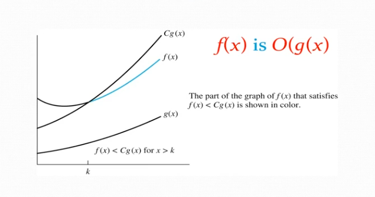

- - -
### The Growth of Functions
- Usually we want to understand how quickly an algorithm can solve a problem as the size of the input grows, but why?
	- It will enable us to:
		- Compare the efficiency of two different algorithms for solving the same problem
		- Determine whether it is practical to use a particular algorithm as the input grows

- - -
### Big-O Notation
**Definition:** Let $f$ and $g$ be functions from the set of integers or the set of real numbers to the set of real number. We say that $f(x) is $O(g(x))$ if there are constants $C$ and $k$ such that
$$|f(x)| \leq C|g(x)|$$
whenever $x>k$ 

- This is read as "$f(x)$ is **big-O** of $g(x)$" or "$g$ **asymptotically** dominates $f$."
- The constants $C$ and $k$ are called **witnesses** to the relationship $f(x)$ is $O(g(x))$. Only one pair of witnesses is necessary.

- - -
### Example 1
Using the definition of Big-O Notation, show that $f(x)=x^2+2x+1$ is $O(x^2)$

### Solution 
Since $x<x^2$ and $1<x^2$ when $x>1$,
$$0\leq x^2+2x+1\leq x^2+2x^2+x^2=4x^2$$
- Can take $C=4$ and $k=1$ as witnesses to show that $f(x)$ is $O(x^2)$

##### Alternative Solution
Alternatively, when $x>2$, we have $2x\leq x^2$ and $1<x^2$.

Hence, $0\leq x^2+2x+1\leq x^2+x^2+x^2=3x^2$ when $x>2$
- Can take $C=3$ and $k=2$ as witnesses instead

- - -
### Example 2
Show that $7x^2$ is $O(x^3)$

### Solution
When $x>7$, $7x^2<x^3$. Take $C=1$ and $k=7$ as witnesses to establish that $7x^2$ is $O(x^3)$.

- - -
### Example 3
Show that $n^2$ is not $O(n)$

### Solution
- Suppose there are constants $C$ and $k$ for which $n^2 \leq Cn$, whenever $n>k$
- Then, by diving both sides of $n^2\leq Cn$ by $n$, then $n\leq C$ must hold for all $n>k$. (This is a contradiction)

- - -
