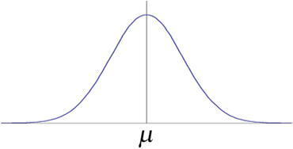
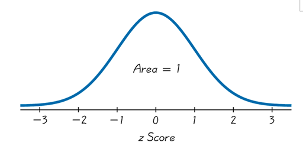

- - -
### Normal Distribution
A random variable, $X$, has a **normal distribution** with mean = $\mu$ and standard deviation = $\sigma$ if the PDF of $X$ is 
$$f(x)=\frac{1}{\sqrt{ 2\pi \sigma }}e^{-\frac{(x-\mu)^2}{2\sigma^2}},~-\infty < x < \infty$$

**Properties:**
- The normal distribution curve is bell-shaped
- The normal distribution curve is unimodal (has only one mode)
- The mean, median, and mode are equal and located at the center of the distribution
- The curve is symmetrical about the mean (left and right sides of center are identical)
- The curve is continuous without any gaps or holes
- The curve has a horizontal asymptote at the horizontal axis (y=0)
    - Theoretically, no matter how far above or below center the curve never meets
- The total area under the normal distribution curve is 1 (or 100%)

The normal distribution is a family of distribution as each normal distribution curve is indexed by the parameters $\mu$ and $\sigma$.

- - -
### Standard Normal Distribution
The **standard normal distribution** is a particular normal distribution curve that has a mean of 0 ($\mu=0$) and a standard deviation of 1 ($\sigma=1$).

- - -
### Probability for a Non-Standard Normal Distribution
1. Convert the $X$ value(s) to corresponding $Z$ value(s) using the formula
$$Z=\frac{X-\mu}{\sigma}$$
2. Use [Table A.3](obsidian://open?vault=Notes&file=Courses%2FODU%20Spring%202024%2FSTAT330%20Intro%20to%20Probability%20%26%20Statistics%2F(M10)%20Normal%20Applications%20and%20Other%20Continuous%20Distributions%2F(M10.1)%20Review%2FResources%2FTable%20A3.pdf) and the $Z$ value(s) to find the area(s) under the standard normal distribution curve to the left
3. Use the area(s) found from Table A.3 to solve the specific problem.

### Limit of a Non-Standard Normal Distribution
1. Identify the probability or percentage given as an area under a standard normal distribution curve. if the area is not an area to the left, use the are given to find an area(s) to the left of an unknown $Z$ value(s)
2. Use [Table A.3](obsidian://open?vault=Notes&file=Courses%2FODU%20Spring%202024%2FSTAT330%20Intro%20to%20Probability%20%26%20Statistics%2F(M9)%20Uniform%20and%20Normal%20Distributions%2F(M9.5)%20Normal%20Distribution%20Applications%2FResources%2FTable%20A3.pdf) and the area(s) to the left to identify the $Z$ value(s)
3. Convert the $Z$ value to corresponding $X$ values using the formula
$$X=\mu+z\sigma$$

