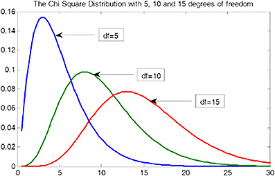
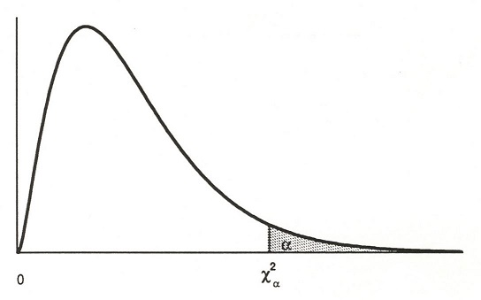

- - -
A random variable has a chi-squared distribution with degrees of freedom (df) equal to $\nu$ (nu) if the probability distribution function (PDF) is $$f(x)=\begin{cases}
cx^{\nu/2-1}e^{-x/2}, & x>0 \\
0, & otherwise

\end{cases}$$
where $c$ is a positive constant and $\nu$ is a positive integer.

$\chi^2$ is used to denote a chi-squared random variable.

### Properties
- A chi-squared random variable can only take on **positive** values
- The shape of the PDF of a chi-squared distribution depends on the parameter $\nu$
- The mean and variance of a chi-squared random variable with $df=\nu$ are $E(\chi^2)=\nu$ and $Var(\chi^2)=2\nu$

Areas to the right under the chi-squared distribution PDF are give in the appendix of our textbook in Table A.5 for specific degrees of freedom, $\nu=1,2,3,\dots,30,40,50,60$. The table gives limits $\chi_{\alpha}^2$ such that $P(\chi^2>\chi_{\alpha}^2)=\alpha$.

