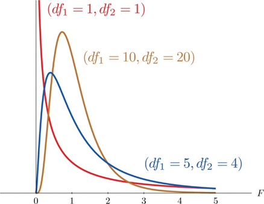

- - -
### F Distribution
**Definition:** A random variable, $F$, has an $F$ distribution with parameters
- $\nu_{1}$ = numerator degrees of freedom
- $\nu_{2}$ = denominator degrees of freedom
if the PDF has the form $$f(x)=\begin{cases}
\frac{cx^{\frac{\nu}{2}-1}}{(1+\frac{\nu_{1}x}{\nu_{2}})^{\frac{\nu_{1}+\nu_{2}}{2}}}, & if~ ~ 0\leq x\leq \infty \\
0, & otherwise
\end{cases}$$
**The Curve**
Here's the curves of $F$ distributions with different degrees of freedom

#### Mean of an $F$ Distribution
If $\nu^2>2$,
$$E(F)=\frac{\nu^2}{\nu^2-2}$$
If $\nu_2$ is large, then the mean is approximately 1.

#### Reciprocal Property of the $F$ Distribution
$$\frac{1}{F(\nu_{1},~\nu_{2})}=F(\nu_{2}, \nu_{1})$$
That is, the reciprocal of an $F$ random variable is an $F$ random variable with the degrees of freedom reversed.
