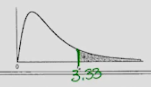

- - -
Before we learn how to use Table A.6, let's ensure we are familiar with the basic properties of the $F$ distribution.

##### F Distribution Properties
- The $F$ distribution relies on **2** separate degrees of freedom. 
- The shape of the distribution depends on the numerator degrees of freedom, $\nu_{1}$, and the denominator degrees of freedom, $\nu_2$.
	- Its shape is similar to the [[(M10.4.1) Chi-Squared Distribution]] in the sense that it is a right-skewed distribution.

- - -
# Table A.6
Here's our table: 
### Usage
Within our body we have **critical values**, or limits such that the area to the right is equal to $\alpha$.

In this table, we only have 2 choices for $\alpha$, either $.05$ or $.01$. 
The first two pages are for $f_{.05}(\nu_{1},\nu_{2})$, and the last two pages are for $f_{.01}(\nu_{1},\nu_{2})$. 
We obtain this $\alpha$ value through the subscript.

Once we have $\alpha$, we use the top row containing $1-9$ to represent our $\nu_{1}$ (numerator) and the left-hand-side column to represent our $\nu_{2}$ (denominator).

- - -
# Examples
<h2 align="center">Areas to the Right</h2>
#### Example 1:
**Problem:** Let $F(5,10)$ denote a random variable having an $F$ distribution with $\nu_1=5$ and $\nu_{2}=10$. 
Determine $P(F(5,10)\geq 3.33)$

**Solution:**
1. Locate $\nu_{1}=5$ and $\nu_{2}=10$ on the table. 
2. The value $3.33$ is at this location, and it represents where our shaded region to the right **begins**. It means that our area to the right, $\alpha$, is $.05$.
	
4. Therefore, $P(F(5,10)\geq 3.33)=.05$

- - -
Let's work it backwards.
#### Example 2:
**Problem:** Let $F(5,10)$ denote a random variable having an $F$ distribution with $\nu_{1}=5$ and $\nu_{2}=10$. 
Determine the limit $a$ so that $P(F(5,10)\geq a)=.01$

**Solution:**
1. Given $\alpha=.01$, locate $\nu_{1}=5$ and $\nu_{2}=10$ on the $f_{.01}(\nu_{1},\nu_{2})$ section of the table.
2. Find the value $5.64$ at this location.
3. Therefore $P(F(5,10)\geq 5.64)=.01$

- - -
<h2 align="center">Areas to the Left</h2>
#### Example 3 (Using Reciprocal Property):
**Problem:** Let $F(4,8)$ denote a random variable having an $F$ distribution with $\nu_{1}=4$ and $\nu_{2}=8$. 
Determine the limit $b$ so that $P(F(4,8)\leq b)=.05$

**Solution:**
1. Since we are looking for an area to the left, use the reciprocal property: $F(\nu_{1},\nu_{2})=\frac{1}{F(\nu_{2},\nu_{1})}$.
2. Flip the values for $\nu_{1}$ and $\nu_{2}$, giving $\nu_{1}=8$ and $\nu_{2}=4$, making the distribution $F(8,4)$.
3. Find the limit $6.04$ at location $\nu_{1}=8$ and $\nu_{2}=4$ on the table.
4. However, $b\neq 6.04$. Apply the reciprocal: $b=\frac{1}{6.04}=0.17$.
5. Therefore, $P(F(4,8)\leq 0.17)=.05$

- - -
#### Example 4 (Another Reciprocal Approach):
**Problem:** Let $F(4,8)$ denote a random variable having an $F$ distribution with $\nu_{1}=4$ and $\nu_{2}=8$.
Determine the limits $a$ and $b$ where $a<b$ and is centrally located so that $P(a\leq F(4,8)\leq b)=.90$

**Solution:**
1. Given that the area in the middle is $.90$, find values at the tails: $1-.90=.10$ and $\frac{.10}{2}=.05$, making both tails equal to $.05$.
2. For $b$, find the right tail using $\nu_{1}=4$ and $\nu_{2}=8$ where $\alpha=.05$, resulting in $b=3.84$.
3. For $a$, find the left tail using the reciprocal: $\nu_{1}=8$ and $\nu_{2}=4$ where $\alpha=.05$, resulting in $a=\frac{1}{6.04}=0.17$.
4. Therefore, $P(.17\leq F(4,8)\leq 3.84)=.90$