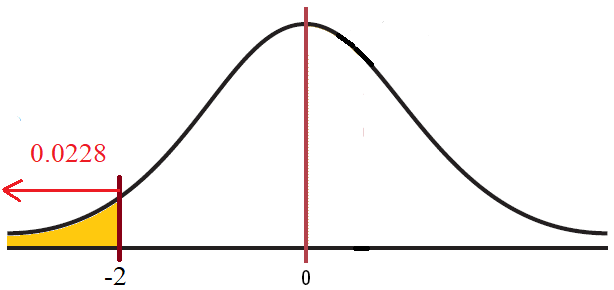
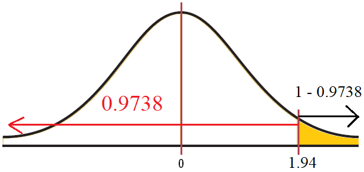

- - -
### Example 1
A certain brand of light bulb has a mean life of 800 hours and a standard deviation of 40 hours. Suppose a random sample of 64 bulbs is taken. Find the probability that the sample mean life is less than 790 hours.

### Solution
The key phrase in this problem is "find the probability that the sample mean..." Here, we are finding a probability for $\overline x$ instead of $X$, therefore, we need to use the central limit theorem to find the $Z$-value.

Start by pulling out the important parameters:
$\mu=800$
$\sigma = 40$
$n = 64$

Then, setup the problem $P(\overline x < 790)=~?$

Next, we'll convert 790 to a $Z$-value:
$$Z=\frac{\overline x - \mu}{\frac{\sigma}{\sqrt{ n }}}=\frac{790-800}{\frac{40}{\sqrt{ 64 }}}=-2$$
This is now a standard normal distribution problem, $P(\overline x < 790)=P(Z< -2)=~?$

Use [[Courses/ODU Spring 2024/STAT330 Intro to Probability & Statistics/(M10) Normal Applications and Other Continuous Distributions/(M10.2) Central Limit Theorem/Resources/Table A3.pdf|Table A3]] to find the area to the left of $-2$.

If a random sample of 64 bulbs is selected, there is a $2.28\%$ chance that their mean life is less than 790 hours.

> [!Note] 
> To solve Example 1, we were able to use a normal distribution even though the problem did not state the lifetime of light bulbs was normally distributed. We can use the normal distribution here because the sample size was at least 30 (specifically $n=64$ here).

- - -
### Example 2
A.C. Nielson reported that children between the ages of 2 and 5 watch an average of 25 hours of television per week. Assume the variable is normally distributed and the standard deviation is 3 hours. If 20 children between the ages of 2 and 5 are randomly selected, find the probability that the mean of the number of hours they watch television will be greater than 26.3.

### Solution
The key phrase in this problem is "find the probability that the mean...". Here, we are finding a probability for $\overline x$ instead of $X$, therefore, we need to use the central limit theorem to find the $Z$-value. 

Start by pulling out the important parameters:
$\mu=25$
$\sigma=3$
$n=20$

Then, setup the problem $P(\overline x > 26.3)=~?$

Next, we'll convert 26.3 to a $Z$-value:
$$Z=\frac{\overline x - \mu}{\frac{\sigma}{\sqrt{ n }}}=\frac{26.3-25}{\frac{3}{\sqrt{ 20 }}}=1.94$$
This is now a standard normal distribution problem, $P(\overline x > 26.3)=P(Z>1.94)=~?$

Use [Table A.3](obsidian://open?vault=Notes&file=Courses%2FODU%20Spring%202024%2FSTAT330%20Intro%20to%20Probability%20%26%20Statistics%2F(M10)%20Normal%20Applications%20and%20Other%20Continuous%20Distributions%2F(M10.2)%20Central%20Limit%20Theorem%2FResources%2FTable%20A3.pdf) to find the area to the left of $1.94$. We find $0.9738$.

We want the area to the right, so we'll take the complement: $1-0.9738=0.0262$

Therefore, if 20 children between the ages of 2 and 5 are randomly selected, there is a $2.62\%$ chance that the mean number of hours they watch television will be greater than 26.3.

> [!Note]
> To solve Example 2, we were able to use a normal distribution even though the problem's sample size was less than 30 (specifically, it was $n=20$). This is because the problem states that the original variable (# of hours of TV watched) was normally distributed.

