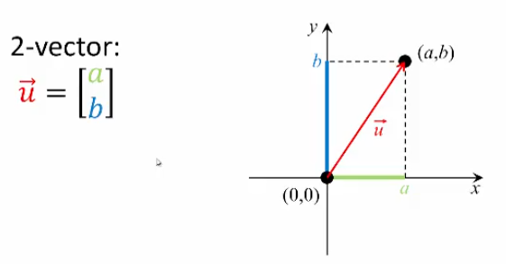
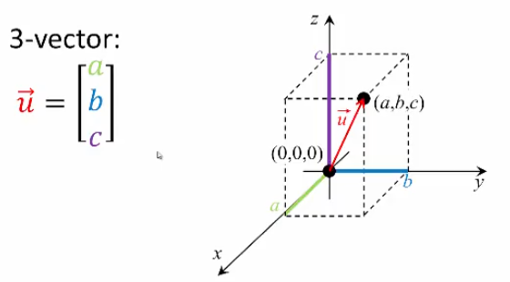
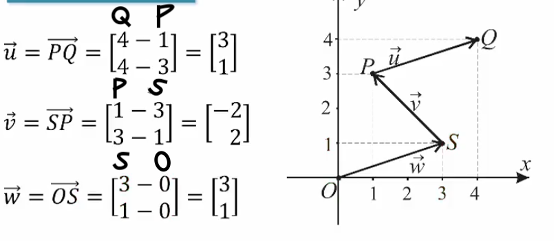

## Vector Definitions & Components

### Vector Definition

- A sequence of $n$ real numbers is called an $n$-vector.
- Each element within a vector is called a _component_

- Such a vector, denoted by $\vec{u} = \begin{bmatrix}a_{1} \\ \vdots \\ a_{n} \end{bmatrix}$ is said to have components $a_{1},\dots,$ and $a_{n}$.

- The set of all $n$-vectors is called the _$n$-space_, and denoted $R^n$.

### 2-Vector ($R^2$)

2-vectors can be represented geometrically as arrows on an $x,y$ plane.

Example:

1. Draw the first component along the _$x$-axis_ and the second component along the _$y$-axis_
2. Plot where the two points meet and label it accordingly (e.g., $(a,b)$)
3. Draw the vector arrow connecting the origin to that point

The set of all 2-vectors, which we call the _2-space_, is denoted by _$R^{2}$_.

### 3-Vector $(R^3)$

Similarly, we can represent 3-vectors as well.

1. Draw the first component along the $x$-axis, the second component along the $y$-axis, and the third component along the $z$-axis
2. Plot where the three points meet and label it accordingly
3. Draw the vector arrow connecting the origin to that point

The set of all 3-vectors, which we call the _3-space_, is denoted by _$R^{3}$_.

### Displacement Vector

- Represents the vector that connects two points in space
- Not all vector arrows start at the origin; we can connect any tail point to a head point

A vector from

- the tail (_initial_ point) $P(x_{1},x_{2},\dots,x_{n})$ to
- the head (_terminal_ point) $Q(y_{1},y_{2},\dots,y_{n})$

can be expressed in component form as

$$
\vec{PQ}=\begin{bmatrix}
y_{1}-x_{1} \\ y_{2} - x_{2} \\ \vdots \\ y_{n} - x_{n}
\end{bmatrix}
$$

- The order matters. **Subtract** _each_ **initial point** _from each_ **terminal point**

#### Example 1.1

#### Example 1.2

Given $P(4,1)$ and $Q(-2,3)$, find $\vec{PQ}$.

**Solution:**

- Remember, $P(x_{1},x_{2},\dots)$ and $Q(y_{1},y_{2},\dots)$
	- $x_{1}=4,~x_{2}=1$
	- $y_{1}=-2,~y_{2}=3$

$$
\vec{PQ}=
\begin{bmatrix}
y_{1}-x_{2} \\ y_{2}-x_{2}
\end{bmatrix}=
\begin{bmatrix}
-2-4 \\ 3-1
\end{bmatrix}=
\begin{bmatrix}
-6 \\ 2
\end{bmatrix}
$$

