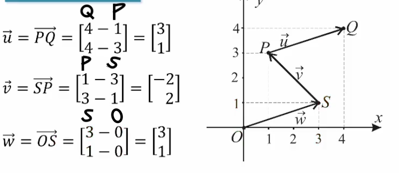
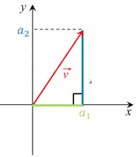
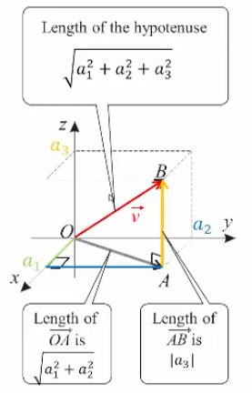

## Vector Length

### Equivalence

Two $n$-vectors $\vec{u}=\begin{bmatrix}a_{1} \\ \vdots \\ a_{n}\end{bmatrix}$ and $\vec{v}=\begin{bmatrix}b_{1} \\ \vdots \\ b_{n}\end{bmatrix}$ are equal if their _corresponding components are equal_ and they are of the _same length_, i.e. $a_{i}=b_{i}$ for $i-1,2,\dots,n$.

#### Revisiting Example 1.1

Looking back at Example 1.1, we'll notice $\vec{u}=\vec{w}$

### Length

The length (or magnitude) of the vector $\vec{v}=\begin{bmatrix}a_{1} \\ a_{2} \\ a_{3} \\ \vdots \\ a_{n}\end{bmatrix}$ is $\mid \mid \vec{v} \mid \mid=\sqrt{ a_{1}^2+a_{2}^2+a_{3}^2+\dots+a_{n}^2 }$

##### Where $n=1$

If $n=1$, then $\mid \mid \vec{v} \mid \mid=\sqrt{ a_{1}^2+a_{2}^2+a_{3}^2+\dots+a_{n}^2}~$ yields $\mid \mid \vec{v} \mid \mid=\sqrt{ a_{1}^2 }=\mid a_{1} \mid$

##### Where $n=2$

If $n=2$, then $\mid \mid \vec{v} \mid \mid=\sqrt{ a_{1}^2+a_{2}^2+a_{3}^2+\dots+a_{n}^2}~$ yields $\mid \mid \vec{v} \mid \mid=\sqrt{ a_{1}^2+a_{2}^2 }$

##### Where $n=3$

If $n=3$, then $\mid \mid \vec{v} \mid \mid=\sqrt{ a_{1}^2+a_{2}^2+a_{3}^2+\dots+a_{n}^2}~$ yields $\mid \mid \vec{v} \mid \mid=\sqrt{ a_{1}^2+a_{2}^2+a_{3}^2 }$

#### Example

Find the length of each vector: $\vec{w}=\begin{bmatrix}0\\0\\6\end{bmatrix}$, $\vec{z}=\begin{bmatrix}4\\-3\end{bmatrix}$, $\vec{u}=\begin{bmatrix}1\\1\\1\\1\end{bmatrix}$, $\vec{v}=\begin{bmatrix}0\\0\\0\\0\\0\end{bmatrix}$.

**Solution:**

$\mid \mid \vec{w} \mid \mid=\sqrt{ 0^2+0^2+6^2 }=\sqrt{ 36 }=6$
$\mid \mid \vec{z} \mid \mid=\sqrt{ 4^2+(-3)^2 }=\sqrt{ 25 }=5$
$\mid \mid \vec{u} \mid \mid=\sqrt{ 1^2+1^2+1^2+1^2 }=\sqrt{ 4 }=2$
$\mid \mid \vec{v} \mid \mid=\sqrt{ 0^2+0^2+0^2+0^2+0^2 }=\sqrt{ 0 }=0$

