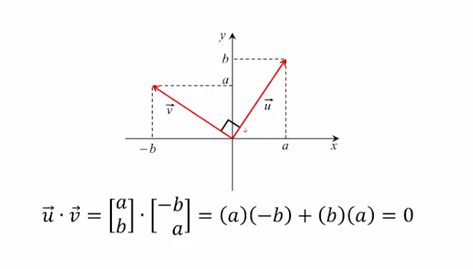
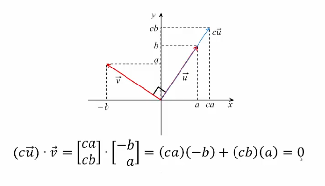

## Vector Properties, Applications, Dot Product

### Vector Properties

#### Theorem 1.1

1. If $\vec{u}$ and $\vec{v}$ are $n$-vectors then $\vec{u}+\vec{v}$ is also an $n$-vector.
	- **Proof:** A sum of two $n$-vectors is _defined_ to be an $n$-vector.

2. $\vec{u}+\vec{v}=\vec{v}+\vec{u}$ for all $n$-vectors $\vec{u}$ and $\vec{v}$
	- **Proof:** From property 1, both sides are $n$-vectors. 
		- Let the $i$-th components of $\vec{u}$ and $\vec{v}$ be $p_{i}$ and $q_{i}$, respectively;
		- Then the $i$-th components of the two sides are equal: $p_{i}+q_{i}=q_{i}+p_{i}$ for all $i=1,\dots,n$.

3. $(\vec{u}+\vec{v})+\vec{w}=\vec{u}+(\vec{v}+\vec{w})$ for all $n$-vectors $\vec{u},\vec{v},$ and $\vec{w}$
	- **Proof:** From property 1, both sides are $n$-vectors.
		- Let the $i$-th components of $\vec{u},\vec{v},$ and $\vec{w}$ be $p_{i},q_{i},$ and $r_{i}$, respectively;
		- Then the $i$-th components of the two sides are equal: $(p_{i}+q_{i})+r_{i}=p_{i}+(q_{i}+r_{i})$ for all $i=1,\dots,n$.

4. There exists an $n$-vector $\vec{z}$ such that $\vec{u}+\vec{z}=\vec{z}+\vec{u}=\vec{u}$ for all $n$-vectors $\vec{u}$.
	- **Proof:** Define an $n$-vector $\vec{z}=\begin{bmatrix}0 \\ \vdots \\ 0\end{bmatrix}$. We call this the _zero vector_ and denote it $\vec{0}$.
		- By definition, both $\vec{u}+\vec{z}$ and $\vec{z}+\vec{u}$ equal $\vec{u}$

5. For every $n$-vector $\vec{u}$, there exists an $n$-vector $\vec{d}$ such that $\vec{u}+\vec{d}=\vec{d}+\vec{u}=\vec{z}$.
	- **Proof:** Define an $n$-vector $\vec{d}=-1\vec{u}$. We call this the _negative of $\vec{u}$_ and denote it $-\vec{u}$.
		- By definition, both $\vec{u}+\vec{d}$ and $\vec{d}+\vec{u}$ equal $\vec{z}=\vec{0}$

6. If $c$ is a real number and $\vec{u}$ is an $n$-vector then $c\vec{u}$ is also an $n$-vector.

7. $c(\vec{u}+\vec{v})=c \vec{u}+c \vec{v}$ for all $n$-vectors $\vec{u},\vec{v},$ and for all real $c$.

8. $(c+d)\vec{u}=c \vec{u}+d \vec{u}$ for all $n$-vectors $\vec{u}$ and for all real $c$ and $d$.

9. $(cd) \vec{u}=c(d \vec{u})$ for all $n$-vectors and for all real $c$ and $d$

10. $1\vec{u}=\vec{u}$ for all $n$-vectors $\vec{u}$

### Linear Combination

A linear combination of $n$-vectors $\vec{u_{1}}, \vec{u_{2}},\dots,\vec{u_{k}}$ is the $n$-vector $c_{1} \vec{u_{1}}+c_{2} \vec{u_{2}}+\dots+c_{k} \vec{u_{k}}$ where $c_{1},c_{2},\dots,c_{k}$ are real numbers.

### Application Examples

#### Example 1

Consider an alloy of the following metals by weight that make up a 4-component vector:

- 9 parts gold
- 2 parts silver
- 11 parts copper
- 2 parts zinc

We can use a vector to represent this:

$$
\vec{u}=
\begin{bmatrix}
9/24 \\
2/24 \\
11/24 \\
2/24
\end{bmatrix}
~ ~ ~ ~ (\mathrm{9~karat~alloy})
$$

#### Example 2

- 21 parts gold
- 2 parts silver
- 1 part copper
- (no zinc)

Similarly,  we can use a vector to represent this:

$$
\vec{v}=
\begin{bmatrix}
21/24 \\
2/24 \\
1/24 \\
0
\end{bmatrix}
~ ~ ~ ~(\mathrm{21~karat~alloy})
$$

#### Example 3

**Problem:** How much of each metal is contained in 600g of the 9 karat alloy?

**Solution:** We can use a _scalar multiple_ to solve this:

$$
600 \vec{u}=600
\begin{bmatrix}
9/24 \\
2/24 \\
11/24 \\
2/24
\end{bmatrix}
=
\begin{bmatrix}
225 \\
50 \\
275 \\
50
\end{bmatrix}
$$

#### Example 4

**Problem:** What alloy do we obtain by mixing equal amounts of the first and the second one?

**Solution:** We can use a _linear combination_ to solve this:

$$
\vec{w}=\frac{1}{2}\vec{u}+\frac{1}{2}\vec{v}=\frac{1}{2}
\begin{bmatrix}
9/24 \\
2/24 \\
11/24 \\
2/24
\end{bmatrix}
+ \frac{1}{2}
\begin{bmatrix}
21/24 \\
2/24 \\
1/24 \\
0
\end{bmatrix}
=
\begin{bmatrix}
15/24 \\
2/24 \\
6/24 \\
1/24
\end{bmatrix}
~ ~ ~ ~(\mathrm{15~karat~gold})
$$

### Dot Product

The dot product of two $n$-vectors $\vec{u}=\begin{bmatrix}a_{1}\\a_{2}\\\vdots\\a_{n}\end{bmatrix}$ and $\vec{v}=\begin{bmatrix}b_{1}\\b_{2}\\\vdots\\b_{n}\end{bmatrix}$ is the _real number_ $\vec{u} \cdot \vec{v}=a_{1}b_{1}+a_{2}b_{2}+\dots+a_{n}b_{n}=\sum_{i=1}^n a_{i}b_{i}$

> [!Note]
> Notice the dot product is **NOT** a vector, it is a _real number_.

#### Dot Product Properties
##### Theorem 1.2

1. $\vec{u} \cdot \vec{u}=\mid \mid \vec{u} \mid \mid ^2$ for all $n$-vectors $\vec{u}$.
	- **Proof:** From the definition of the dot product, $\vec{u} \cdot \vec{u}=a_{1}a_{1}+a_{2}a_{2}+\dots+a_{n}a_{n}=a_{1}^2+a_{2}^2+\dots+a_{n}^2$
		- From the definition of the length of an $n$-vector, $\mid \mid \vec{u} \mid \mid ^2=(\sqrt{ a_{1}^2+a_{2}^2+\dots+a_{n}^2 })=a_{1}^2+a_{2}^2+\dots+a_{n}^2$

2. $\vec{u} \cdot \vec{v}=\vec{v} \cdot \vec{u}$ for all $n$-vectors $\vec{u}$ and $\vec{v}$.

3. $\vec{u} \cdot (\vec{v}+\vec{w})=(\vec{u} \cdot \vec{v})+(\vec{u} \cdot \vec{w})$ for all $n$-vectors $\vec{u},\vec{v},\vec{w}$

4. $(c \vec{u}) \cdot \vec{v}=c(\vec{u} \cdot \vec{v})=\vec{u} \cdot (c \vec{v})$ for all $n$-vectors $\vec{u},\vec{v},$ and real $c$.

#### Orthogonality

Two $n$-vectors $\vec{u}$ and $\vec{v}$ are said to be orthogonal if $\vec{u} \cdot \vec{v}=0$

**Examples:**

The perpendicularity and orthogonality are directly relational.

Assume $\vec{u}$ and $\vec{v}$ are $n$-vectors.

For _two non-zero vectors_ $(\vec{u} \neq \vec{0}, \vec{v} \neq \vec{0})$, $\vec{u}$ and $\vec{v}$ are _orthogonal_ and _perpendicular_.

A _zero vector_ $(\vec{u}=\vec{0})$ is orthogonal to _every_ vector $\vec{v}$,but **NOT** perpendicular to any vector $\vec{v}$.

#### Example

**Problem:** Given the vectors $\vec{u}=\begin{pmatrix}4\\0\\-3\end{pmatrix}$ and $\vec{v}=\begin{pmatrix}1\\7\\6\end{pmatrix}$, calculate the dot product $\vec{u} \cdot \vec{v}$.

**Solution:**

$$\vec{u} \cdot \vec{v}=(4)(1)+(0)(7)+(-3)(6)=4+0-18=-14$$