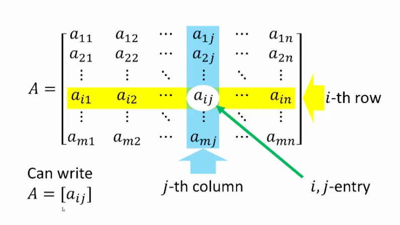

## Matrix Definition & Entries

An $m \times n$ matrix is a rectangular array of real numbers containing $m$ rows and $n$ columns.

### Example

$A=\begin{bmatrix}6&3 \\ 1&7 \\ 0&9 \\ 5&4\end{bmatrix}$

- This is a $4 \times 2$ matrix
- $a_{32}=9$
- $a_{23}$ is undefined (out of bounds)