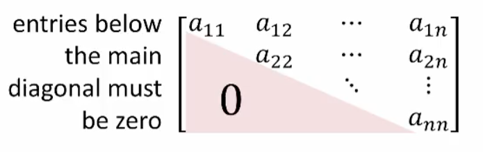
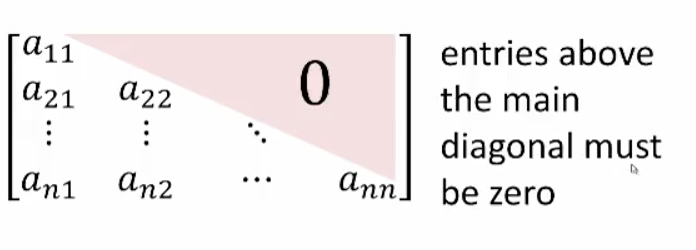
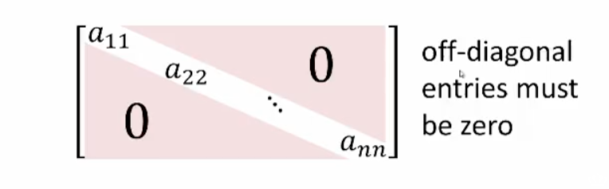

## Special Types of Matrices

### Square Matrices

#### $n \times n$ Matrix

An $n \times n$ matrix $A$ is called a _square matrix_.

The entries $a_{11}, a_{22}, \dots, a_{nn}$ form the main diagonal of the square matrix.

$$\begin{bmatrix}
a_{11}&a_{12}&\dots&a_{1n} \\
a_{21}&a_{22}&\dots&a_{2n} \\
\vdots&\vdots&\ddots&\vdots \\
a_{n1}&a_{n2}&\dots&a_{nn}
\end{bmatrix}$$

#### Upper Triangular Matrix

A square matrix such that $i \gt j \implies a_{ij} = 0$ is called a _upper triangular matrix_.

#### Lower Triangular Matrix

A square matrix such that $i \lt j \implies a_{ij} = 0$ is called a _lower triangular matrix_.

#### Diagonal Matrix

A square matrix such that $i\neq j \implies a_{ij} = 0$ is called a _diagonal matrix_.

#### Scalar Matrix

A diagonal matrix such that $a_{ii}=c$ for all $i$ is called a _scalar matrix_.

Example:

$$
\begin{bmatrix}
\sqrt{ n }&0 \\
0&\sqrt{ n }
\end{bmatrix}, 
\begin{bmatrix}
-3&0&0 \\
0&-3&0 \\
0&0&-3
\end{bmatrix}
$$

#### Identity Matrix

A diagonal matrix such that $a_{ii}=1$ for all $i$ is called an _identity matrix_.

We denote the $n\times n$ identity matrix by $I_{n}$, so that

$$
I_{2}=
\begin{bmatrix}
1&0 \\
0&1
\end{bmatrix}
,
\begin{bmatrix}
1&0&0 \\
0&1&0 \\
0&0&1
\end{bmatrix}
,\mathrm{etc}.
$$

### $3 \times 1$ matrix

Example: $\begin{bmatrix}3 \\ 5 \\7\end{bmatrix}$

### $1 \times 3$ matrix

Example: $\begin{bmatrix}3&2&1\end{bmatrix}$