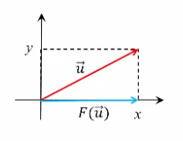
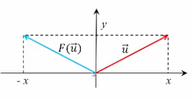
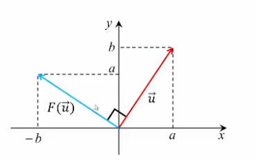
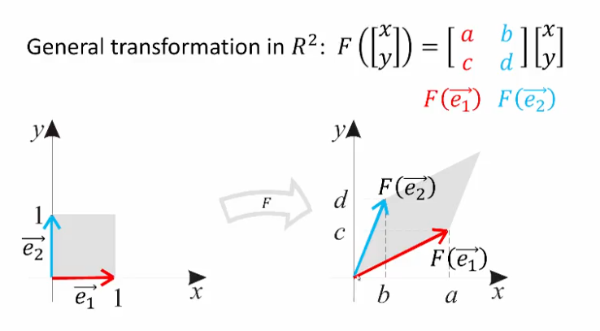
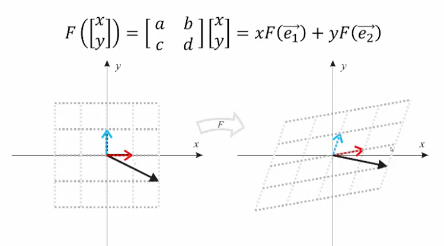
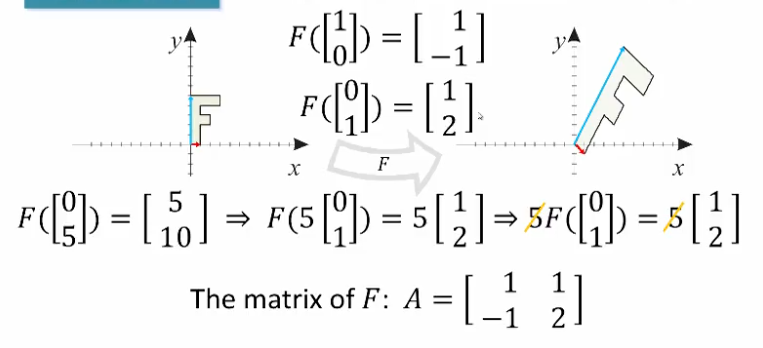

## Examples: Geometry

### Example 1: Projection Onto the $x$-axis

$$F(\begin{bmatrix}x \\ y\end{bmatrix})=\begin{bmatrix}0&0 \\ 0&1\end{bmatrix}\begin{bmatrix}x \\ y\end{bmatrix}=\begin{bmatrix}x \\ 0\end{bmatrix}$$

### Example 2: Projection Onto the $y$-axis

$$F(\begin{bmatrix}x \\ y\end{bmatrix})=\begin{bmatrix}0&0 \\ 0&1\end{bmatrix}\begin{bmatrix}x \\ y\end{bmatrix}=\begin{bmatrix}0 \\ y\end{bmatrix}$$

### Example 3

$$F(\begin{bmatrix}x\\y\end{bmatrix})=k\begin{bmatrix}x \\ y\end{bmatrix}=\begin{bmatrix}k&0 \\ 0&k\end{bmatrix}\begin{bmatrix} x \\ y \end{bmatrix}$$

- Dilation $k>1$
- Contraction $0<k<1$
- Identity $k=1$

### Example 4: Reflection w/ Respect to the $y$-axis

$$F(\begin{bmatrix} x \\ y\end{bmatrix})=\begin{bmatrix} -1&0 \\ 0&1 \end{bmatrix}\begin{bmatrix} x \\ y \end{bmatrix}=\begin{bmatrix} -x \\ y \end{bmatrix}$$

### Example 5: Counterclockwise Rotation by 90 Degrees

$$F(\begin{bmatrix} x \\ y\end{bmatrix})=\begin{bmatrix} 0&-1 \\ 1&0 \end{bmatrix}\begin{bmatrix} x \\ y\end{bmatrix}=\begin{bmatrix} -y \\ x \end{bmatrix}$$

- - -

### General Transformation in $R^2$

- - -

### Example 6: Counterclockwise Rotation by Angle $\alpha$

$$F(\begin{bmatrix}1 \\ 0\end{bmatrix})=\begin{bmatrix} \cos \alpha \\ \sin \alpha \end{bmatrix}$$

$$F(\begin{bmatrix}0 \\ 1\end{bmatrix})=\begin{bmatrix} -\sin \alpha \\ \cos \alpha \end{bmatrix}$$

$$F(\begin{bmatrix} x \\ y\end{bmatrix})=\begin{bmatrix}\cos \alpha&-\sin \alpha \\ \sin \alpha&\cos \alpha\end{bmatrix}\begin{bmatrix} x \\ y\end{bmatrix}$$

### Example 7: Finding a Linear Transformation When Given a Graph

