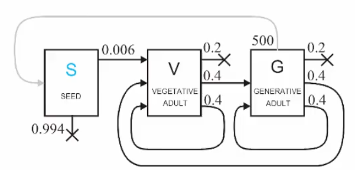

## Example: Population Dynamics

Model for population dynamics of perennial grasses. Three distinct stages:
- **(S)** seed,
- **(V)** vegetative adult plant, and
- **(G)** generative adult (flowering) plant

Transition from one year to the next:

$$\underbrace{\begin{bmatrix}S^{(n+1)}\\V^{(n+1)}\\G^{(n+1)}\end{bmatrix}}_{x^{n+1}}=\underbrace{\begin{bmatrix}0&0&500 \\ .006&.4&.4 \\ 0&.4&.4 \end{bmatrix}}_{M}\underbrace{\begin{bmatrix} S^{(n)} \\ V^{(n)} \\ G^{(n)} \\ \end{bmatrix}}_{x^{(n)}}$$

$$\vec{x^{(2000)}}=\begin{bmatrix}12500 \\ 0 \\ 0\end{bmatrix}$$

$$\vec{x^{(2001)}}=\begin{bmatrix}0&0&500 \\ .006&.4&.4 \\ 0&.4&.4\end{bmatrix}\begin{bmatrix}12500 \\ 0 \\ 0\end{bmatrix}=\begin{bmatrix}0 \\ 75 \\ 0\end{bmatrix}$$

$$\vec{x^{(2002)}}=\begin{bmatrix}0&0&500 \\ .006&.4&.4 \\ 0&.4&.4\end{bmatrix}\begin{bmatrix}0 \\ 75 \\ 0\end{bmatrix}=\begin{bmatrix}0 \\ 30 \\ 30\end{bmatrix}$$

$$\vec{x^{(2003)}}=\begin{bmatrix}0&0&500 \\ .006&.4&.4 \\ 0&.4&.4\end{bmatrix}\begin{bmatrix}0 \\ 30 \\ 30\end{bmatrix}=\begin{bmatrix}15000 \\ 24 \\ 24\end{bmatrix}$$
