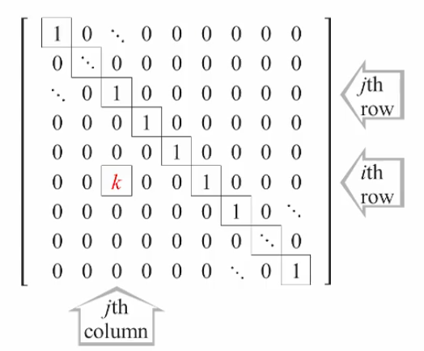
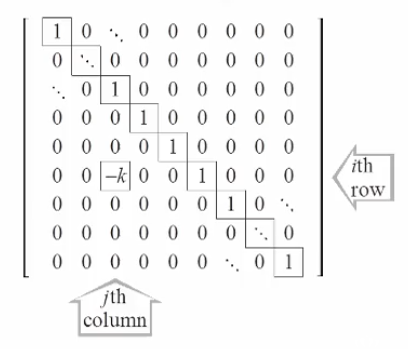
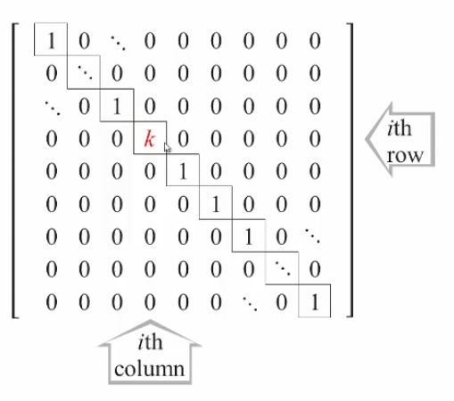
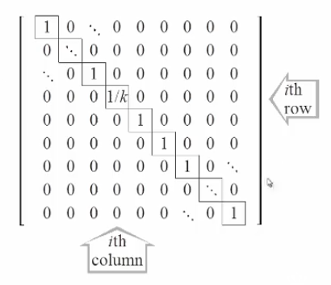
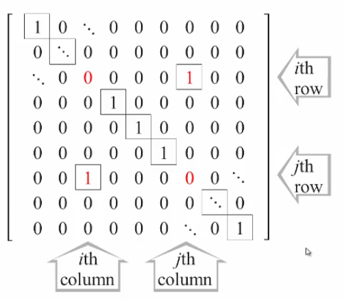

## Introduction

### Elementary Matrices and the Geometry of Linear Systems

#### Theorem 2.2

Let $A$ be an $m \times n$ matrix, $\vec{b}$ be an $m$-vector, and $C$ be a $p \times m$ matrix.

- If $\vec{x}=\vec{s}$ is a solution of the linear system $A \vec{x} = \vec{b}$ then it is also a solution of the system $(CA) \vec{x}=C \vec{b}$
- If there exists an $m \times p$ matrix $B$ such that $BC=I_{m}$ then $\vec{x}=\vec{s}$ is a solution of the linear system $A \vec{x}= \vec{b}$ if and only if it is also a solution of $(CA) \vec{x}=C \vec{b}$

#### Theorem 2.3

For any elementary row operation applied to a matrix $A$ to obtain a matrix $B$, there exists a matrix $E$, called an _elementary matrix_ such that post-multiplying it by $A$ yields the same $B$ (i.e., $EA=B$)

Furthermore, each elementary row operation can be reversed by performing another elementary row operation

### Elementary Operations

#### First Operation

$row_{i}+k~row_{j} \to row_{i}$

##### Reversed

This can be reversed as $row_{i} - k~row_{j} \to row_{i}$

#### Second Operation

$k~row_{i} \to row_{i}$

##### Reversed

This can be reversed as $\left( \frac{1}{k} \right) row_{i} \to row_{i}$

#### Third Operation

$row_{i} \leftrightarrow row_{j}$

##### Reversed

This can be reversed as $row_{i} \leftrightarrow row_{j}$

### Row Equivalence

- If $A$ is row equivalent to $B$, then $B$ is also row equivalent to $A$
- Consequently, we can simply refer to $A$ and $B$ being _row equivalent_

#### Corollary 2.4

Linear system with row equivalent augmented matrices have identical solution sets
