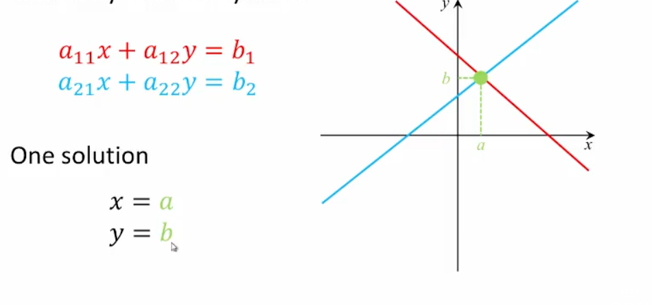
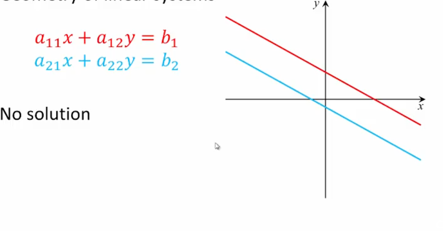
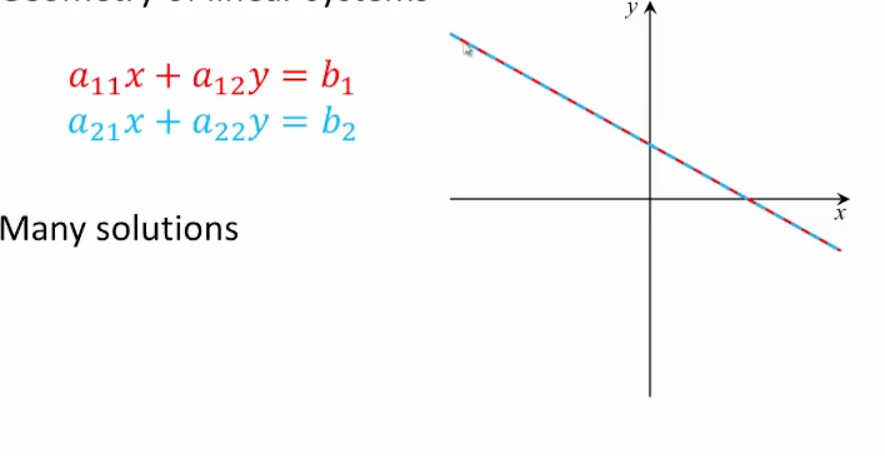

## Geometry of Linear Systems

$A \to [ ] \to [ ] \to [ ] \to [ ] \to [ ] \to [ ] \to B$ (r.r.e.f.)

$(\to)$ A sequence of elementary row operations

$A \to [ ] \to [ ] \to [ ] \to [ ] \to [ ] \to [ ] \to c$ (r.r.e.f.)

$(\to)$ A different sequence of elementary row operations

### Theorem 2.5

Any $m \times n$ matrix $A$ is row equivalent to a _unique_ matrix in r.r.e.f.

### Geometry of Linear Systems

Useful 3D visualizations [here](http://www.math.odu.edu/~bogacki/math316/sys3d/)

### Homogeneous Linear System

**Homogeneous Linear System:** a linear system whose RHS equals $\vec{0}$

Every homogenous system $A \vec{x}=\vec{0}$ has at least one solution $\vec{x}=\vec{0}-$ the _trivial solution_
Some homogenous systems may also have _nontrivial solutions_ $\vec{x} \neq \vec{0}$

#### Theorem 2.6

If a homogenous system of $m$ linear equations in $n$ unknowns has only the trivial solution then $m \geq n$

#### Theorem 2.7

Let $A$ be an $m \times n$ matrix and let $\vec{b}$ be an $m$-vector. If $\vec{p}$ is a solution of the system $A \vec{x}= \vec{b}$ then every solution of $\vec{s}$ of that system can be expressed as $\vec{s}=\vec{p}+\vec{g}$ where $\vec{g}$ is some solution of the homogenous system $A \vec{x}=\vec{0}$

#### Theorem 2.8

Given an $n \times n$ matrix $A$, the following three statements are equivalent:

A. $A$ is row equivalent to $I_{n}$
B. For every $n$-vector $\vec{b}$, the system $A \vec{x}= \vec{b}$ has a unique solution
C. The system $A \vec{x}= \vec{0}$ has only the trivial solution

$A \implies B \quad B \implies C \quad C \implies A$

