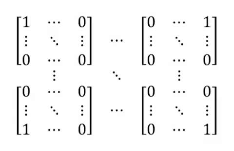

## Definition, Examples

### Basis and Dimension

An indexed set of vectors $\{\vec{u_{1}},\dots,\vec{u_{k}}\}$ in a vector space $V$ is called a **basis** for $V$ _if and only if_:

1. $\vec{u_{1}},\dots,\vec{u_{k}}$ _span_ $V$ and
2. $\vec{u_{1}},\dots,\vec{u_{k}}$ are _linearly independent_

### Example 1 (Standard Basis)

Is the set of vectors $\vec{e_{1}}=\begin{bmatrix}1 \\ 0 \\ \vdots \\ 0\end{bmatrix},~ \vec{e_{2}}=\begin{bmatrix}0 \\ 1 \\ \vdots \\ 0\end{bmatrix},~ \dots,~\vec{e_{n}}=\begin{bmatrix}0 \\ 0 \\ \vdots \\ 1\end{bmatrix}$ a _basis_ for $V$?

#### Solution

The given vector space is $R^n$

**Condition 1:** Does the set _span_ $R^n$?

We can express the set as a linear combination:

$\begin{bmatrix}x_{1} \\ x_{2} \\ \vdots \\ x_{n}\end{bmatrix}=x_{1} \begin{bmatrix}1 \\ 0 \\ \vdots \\ 0\end{bmatrix}-x_{2} \begin{bmatrix}0 \\ 1 \\ \vdots \\ 0\end{bmatrix}+\dots+x_{n} \begin{bmatrix}0 \\ 0 \\ \vdots \\ 1\end{bmatrix}$

Therefore, yes, $\vec{e_{1}},\vec{e_{2}},\dots,\vec{e_{n}}$ span $R^n$

**Condition 2:** Is the set _linearly independent_?

All coefficients must be 0 for this condition to hold true:

$\begin{bmatrix}0 \\ 0 \\ \vdots \\ 0\end{bmatrix}=x_{1} \begin{bmatrix}1 \\ 0 \\ \vdots \\ 0\end{bmatrix}+x_{2} \begin{bmatrix}0 \\ 1 \\ \vdots \\ 0\end{bmatrix}+\dots+x_{n} \begin{bmatrix}0 \\ 0 \\ \vdots \\ 1\end{bmatrix} \implies x_{1} = \dots = x_{n} = 0$

This set is linearly independent.

Thus, this set forms what we call the **standard basis** for $R^n$

### Example 2

Given the set of vectors $\vec{u}=\begin{bmatrix}1 \\ 0 \\ 1\end{bmatrix},~ \vec{v}=\begin{bmatrix}0 \\ 1 \\ -1\end{bmatrix},~ \vec{w}=\begin{bmatrix}1 \\ 1 \\ 1\end{bmatrix}$ that span $R^3$, determine whether or not they are linearly independent.

#### Solution

**Condition 1:** Does the set span $R^3$?

The problem already tells us the set spans $R^3$, so condition 1 holds.

**Condition 2:** Is the set linearly independent?

All coefficients must be 0:

$c_{1} \begin{bmatrix}1 \\ 0 \\ 1\end{bmatrix} + c_{2} \begin{bmatrix}0 \\ 1 \\ -1\end{bmatrix} + c_{3} \begin{bmatrix} 1 \\ 1 \\ 1\end{bmatrix}= \begin{bmatrix}0 \\ 0 \\ 0\end{bmatrix}$

Augmented matrix:

$\begin{bmatrix}1&0&1&|&0 \\ 0&1&1&|&0 \\ 1&-1&1&|&0\end{bmatrix}$

r.r.e.f.:

$\begin{bmatrix}1&0&0&|&0 \\ 0&1&0&|&0 \\ 0&0&1&|&0\end{bmatrix}$

Therefore, $c_{1} \begin{bmatrix}1 \\ 0 \\ 1\end{bmatrix} + c_{2} \begin{bmatrix}0 \\ 1 \\ -1\end{bmatrix} + c_{3} \begin{bmatrix} 1 \\ 1 \\ 1\end{bmatrix}= \begin{bmatrix}0 \\ 0 \\ 0\end{bmatrix}$ requires $c_{1}=c_{2}=c_{3}=0$

Thus, the 3 vectors are linearly independent. Additionally, since we know they span $R^3$, they also form a basis for $R^3$

### Example 3

Given the linearly _dependent_ set of vectors, $\begin{bmatrix}1 \\ -1 \\ 2 \\ 1\end{bmatrix},~ \begin{bmatrix}1 \\ 2 \\ -3 \\ 0\end{bmatrix},~ \begin{bmatrix}3 \\ 3 \\ -4 \\ 1\end{bmatrix}$, determine whether or not they form a basis for $R^4$

#### Solution

Remember, to form a basis, the set must be linearly independent. Here, we are told that the vectors are _dependent_, meaning the set does not form a basis for $R^4$

### Example 4

The vectors $\begin{bmatrix}1 \\ 2 \\ 1 \\ 0\end{bmatrix},~ \begin{bmatrix}0 \\ 1 \\ 2 \\ 1\end{bmatrix},~ \begin{bmatrix}1 \\ 1 \\ 0 \\ -1\end{bmatrix}$ are linearly independent, but it can be shown they do _not_ span $R^4$. Do they form a basis?

#### Solution

No, similar to the previous example, condition 2 does not hold since we're told the set does not span $R^4$

### Example 5 (Standard Basis)

Consider $1,t,t^2,\dots,t^n$. Does this set form a basis?

#### Solution

**Condition 1:** Does the set span $P_{n}$?

Every vector in $P_{n}$ can be expressed as a linear combination of $1,t,t^2,\dots,t^n$:

$c_{0}(1) + c_{1}t + c_{2}t^2+\dots+c_{n}t^n$

Therefore, the vectors span $P_{n}$

**Condition 2:** Is the set linearly independent?

$c_{0}(1) + c_{1}t + c_{2}t^2+\dots+c_{n}t^n=0$

$=c_{0}=c_{1}=c_{2}=\dots c_{n}=0$

Therefore, the vectors are linearly independent.

Thus, the vectors form a _standard_ basis for $P_{n}$

### Special Cases

#### $M_{mn}$ Standard Basis

- $M_{mn}$ standard basis:

#### No Basis (Empty Set)

- $V=\{\vec{0}\}$ - No basis (our basis is an empty set)
