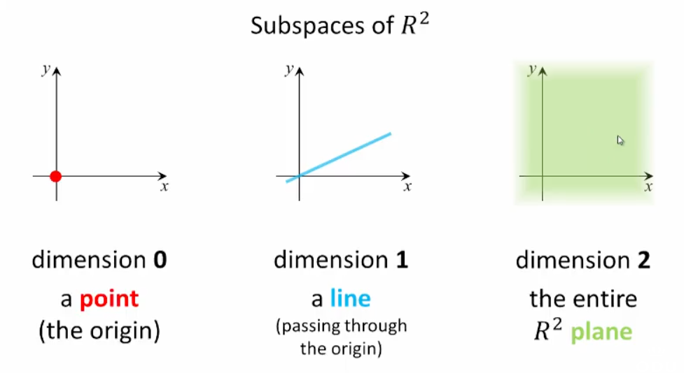
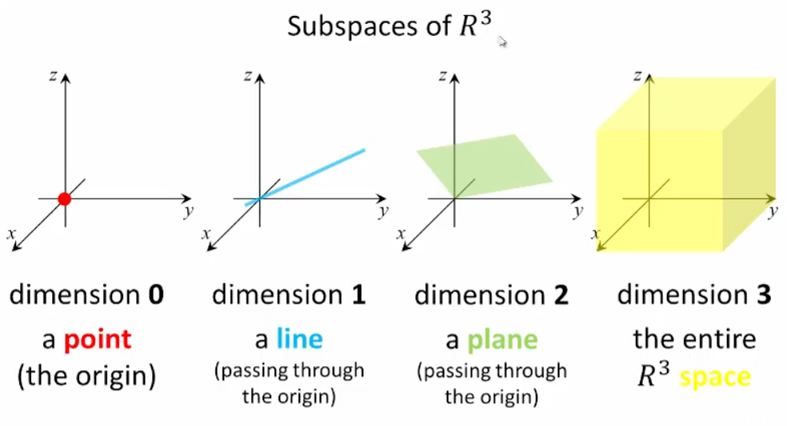

## Properties, Dimension of a Space

### Theorem 4.13

If $S=\{\vec{v_{1}},\dots,\vec{v_{m}}\}$ spans a vector space $V$ and $T=\{\vec{u_{1}},\dots,\vec{u_{n}}\}$ is linearly independent in $V$ then

1. It is possible to obtain a basis $S'$ from $S$ by deleting some of its vectors if necessary, and
2. It is possible to obtain a basis $T'$ from $T$ by adding some vectors to the set if necessary

### Example 1 (Demonstrating Part 1 of Theorem 4.13)

Find a basis for the space spanned by $S=\{ \begin{bmatrix}1 \\ 2 \\3\end{bmatrix}, \begin{bmatrix}-1 \\ -2 \\ -3\end{bmatrix}, \begin{bmatrix}0 \\ 1 \\ 1\end{bmatrix}, \begin{bmatrix}1 \\ 1 \\2\end{bmatrix}\}$, where each vector is respectively $\vec{v_{1}},\vec{v_{2}},\vec{v_{3}},\vec{v_{4}}$.

#### Solution

**Step 1:** Determine the homogenous system:

$c_{1} \begin{bmatrix}1 \\ 2 \\ 3\end{bmatrix}+c_{2} \begin{bmatrix}-1 \\ -2 \\ -3\end{bmatrix}+ c_{3} \begin{bmatrix}0 \\ 1 \\ 1\end{bmatrix}+c_{4} \begin{bmatrix}1 \\ 1 \\ 2\end{bmatrix}=\begin{bmatrix}0 \\ 0 \\ 0\end{bmatrix}$

**Step 2:** Determine the augmented matrix:

$\begin{bmatrix}1&-1&0&1&|&0 \\ 2&-2&1&1&|&0 \\ 3&-3&1&2&|&0\end{bmatrix}$

**Step 3:** Convert to r.r.e.f.:

$\begin{bmatrix}\boxed{1}&-1&0&1&|&0 \\ 0&0&\boxed{1}&-1&|&0 \\ 0&\underbrace{0}_{c_{2}}&0&\underbrace{0}_{c_{4}}&|&0\end{bmatrix}$

$c_{2}$ and $c_{4}$ do not contain leading entries, so they are arbitrary.

**Step 4:** Express as a linear combination

First, let's try $c_{2}=1$ and $c_{4}=0$:

$c_{1} \begin{bmatrix}1 \\ 2 \\ 3\end{bmatrix}+1 \begin{bmatrix}-1 \\ -2 \\ -3\end{bmatrix}+c_{3} \begin{bmatrix}0 \\ 1 \\ 1\end{bmatrix}+0 \begin{bmatrix}1 \\ 1 \\ 2\end{bmatrix}= \begin{bmatrix}0 \\ 0 \\ 0\end{bmatrix}$

Here, we can express $\vec{v_{2}}$ as a linear combination of $\vec{v_{1}}$ and $\vec{v_{3}}$

Next, let's try $c_{2}=0$ and $c_{4}=1$:

$c_{1} \begin{bmatrix}1 \\ 2 \\ 3\end{bmatrix}+0 \begin{bmatrix}-1 \\ -2 \\ -3\end{bmatrix}+c_{3} \begin{bmatrix}0 \\ 1 \\ 1\end{bmatrix}+1 \begin{bmatrix}1 \\ 1 \\ 2\end{bmatrix}= \begin{bmatrix}0 \\ 0 \\ 0\end{bmatrix}$

Now, $\vec{v_{4}}$  can be expressed as a linear combination of $\vec{v_{1}}$ and $\vec{v_{3}}$

Since $\vec{v_{2}}=a_{1} \vec{v_{1}}+ a_{3} \vec{v_{3}}$ and $\vec{v_{4}}=b_{1} \vec{v_{1}}+b_{3} \vec{v_{3}}$, we can write

$c_{1} \vec{v_{1}}+ c_{2} \vec{v_{2}}+c_{3} \vec{v_{3}} + c_{4} \vec{v_{4}}$

$=c_{1} \vec{v_{1}}+c_{2} (a_{1} \vec{v_{1}}+a_{3} \vec{v_{3}}) + c_{3} \vec{v_{3}}+c_{4}(b_{1} \vec{v_{1}}+b_{3} \vec{v_{3}})$

$=(c_{1}+c_{2} a_{1} + c_{4} b_{1}) \vec{v_{1}}+(c_{2} a_{3} + c_{3} + c_{4} b_{3})\vec{v_{3}}$

We only care about $\vec{v_{1}}$ and $\vec{v_{3}}$ as $\vec{v_{2}}$ and $\vec{v_{4}}$ are redundant (meaning we delete $\vec{v_{2}}$ and $\vec{v_{4}}$ moving forward)

Therefore, $\text{span} \{\vec{v_{1}}, \vec{v_{2}}, \vec{v_{3}}, \vec{v_{4}}\}= \text{span} \{\vec{v_{1}},\vec{v_{3}}\}$ 

**Step 5:** Determining if the set is L.I.

Both sets span the same space:

$\{\underbrace{\begin{bmatrix}1 \\ 2 \\ 3\end{bmatrix}}_{\vec{v_{1}}}, \quad, \underbrace{\begin{bmatrix}0 \\ 1 \\ 1\end{bmatrix}}_{\vec{v_{3}}},~ \quad\}$

The second set is L.I.

**Step 6:** Is the new set a basis?

$\{\begin{bmatrix}1 \\ 2 \\ 3\end{bmatrix}, \begin{bmatrix}0 \\ 1 \\ 1\end{bmatrix}\}$ is a basis for $\text{span}S$

### Example 2 (Demonstrating Part 2 of Theorem 4.13)

Find a basis for $R^4$ that contains the vectors $\underbrace{\begin{bmatrix}1 \\ 1 \\ 0 \\ 3\end{bmatrix}}_{\vec{u_{1}}},\underbrace{\begin{bmatrix}0 \\ 2 \\ 0 \\ 5\end{bmatrix}}_{\vec{u_{2}}}$

#### Solution

**Step 1:** Append the standard basis for $R^4$ to the list (add 4 vectors):

$\underbrace{\begin{bmatrix}1 \\ 1 \\ 0 \\ 3\end{bmatrix}}_{\vec{u_{1}}},\underbrace{\begin{bmatrix}0 \\ 2 \\ 0 \\ 5\end{bmatrix}}_{\vec{u_{2}}}, \underbrace{\begin{bmatrix}1 \\ 0 \\ 0 \\ 0\end{bmatrix}}_{\vec{u_{3}}},\underbrace{\begin{bmatrix}0 \\ 1 \\ 0 \\ 0\end{bmatrix}}_{\vec{u_{4}}}, \underbrace{\begin{bmatrix}0 \\ 0 \\ 1 \\ 0\end{bmatrix}}_{\vec{u_{5}}}, \underbrace{\begin{bmatrix}0 \\ 0 \\ 0 \\ 1\end{bmatrix}}_{\vec{u_{6}}}$

**Step 2:** Form the appropriate augmented matrix:

$\begin{bmatrix}1&0&1&0&0&0&|&0 \\ 1&2&0&1&0&0&|&0 \\ 0&0&0&0&1&0&|&0 \\ 3&5&0&0&0&1&|&0\end{bmatrix}$

**Step 3:** Calculate the r.r.e.f.:

$\begin{bmatrix}\boxed{1}&0&0&-5&0&2&|&0 \\ 0& \boxed{1} &0&3&0&-1&|&0 \\ 0&0& \boxed{1} &5&0&-2&|&0 \\ 0&0&0&0& \boxed{1} &0&|&0\end{bmatrix}$

- Columns 1, 2, 3, and 5 are leading columns
- Columns 4 and 6 are non-leading (redundant)

**Step 4:** Remove redundant vectors (correlating to the non-leading columns):

$\underbrace{\begin{bmatrix}1 \\ 1 \\ 0 \\ 3\end{bmatrix}}_{\vec{u_{1}}},\underbrace{\begin{bmatrix}0 \\ 2 \\ 0 \\ 5\end{bmatrix}}_{\vec{u_{2}}}, \underbrace{\begin{bmatrix}1 \\ 0 \\ 0 \\ 0\end{bmatrix}}_{\vec{u_{3}}}, \underbrace{\begin{bmatrix}0 \\ 0 \\ 1 \\ 0\end{bmatrix}}_{\vec{u_{5}}}$

Therefore, the desired basis in $R^4$ containing the given vectors is found.

### Theorem 4.14

If $\vec{u_{1}},\dots,\vec{u_{m}}$ span a vector space $V$ _AND_ $\vec{v_{1}},\dots,\vec{v_{n}}$ are linearly independent in $V$ _then_ $m \geq n$

### Theorem 4.15 **IMPORTANT**

If the sets $B=\{\vec{u_{1}},\dots,\vec{u_{m}}\}$ and $C=\{\vec{v_{1}},\dots,\vec{v_{n}}\}$ are both bases for a vector space $V$ then $m=n$

### Dimension

The number of vectors in any basis for a vector space $V$ is called the _dimension_ of $V$ and is denoted by $\text{dim}~V$

- $\text{dim}~R^n=n$ 
- $\text{dim}~P_{n}=n+1$
- $\text{dim}~M_{mn}=mn$

### Theorem 4.16 **SHORTCUT**

If you know the dimension of the vector space $V$ (e.g., $n$), you can quickly determine if a set is a basis by checking if the number of vectors in the set _EQUALS_ the dimension value. If it is _NOT EQUAL_, the set is not a basis. If they _are_ equal:

Let $S=\{\vec{u_{1}},\dots,\vec{u_{n}}\}$ be a set of vectors in a vector space $V$ with $\text{dim}~ V=n$. 

Then

(a) If $S$ spans $V$ then $S$ is linearly independent, and
(b) If $S$ is linearly independent then $S$ spans $V$

Part (a) follows from Theorem 4.13 (1): it is possible to obtain a basis from any set that spans $V$ by _deleting_ some of its vectors if necessary
- In this case, we won't delete any vectors to obtain the basis (the basis would have $<n$ vectors). We will keep the entire set as our basis.

Part (b) follows from Theorem 4.13 (2): it is possible to obtain a basis from any set that is _L.I._ in $V$ by adding some vectors to the set if necessary
- As stated above, the number of vectors must equal $n$, so we won't add any vectors

### Theorem 4.17

Let $V$ be a finite-dimensional vector space with a subspace $W$

(a) $\text{dim}~W \leq \text{dim}~V$
(b) If $\text{dim}~W= \text{dim}~V$ then $W=V$

### Subspaces of $R^2$

