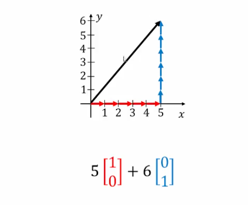
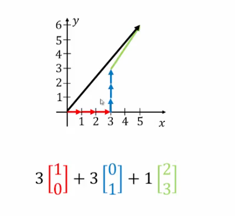
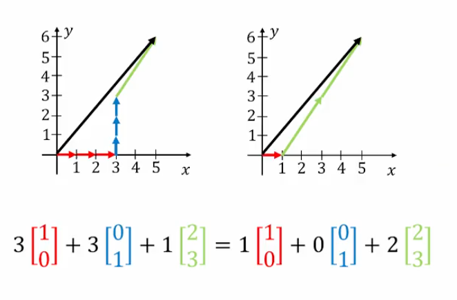

## Coordinates: Definition, Examples

### Preface

#### Theorem 4.18

Let $S=\{\vec{u_{1}},\dots,\vec{u_{k}}\}$ be an indexed set of vectors in a vector space $V$.

$S$ is a _basis_ for $V$ **if and only if** _every_ vector in $V$ can be expressed as a linear combination of vectors in $S$ in a unique way

### Illustrating This Idea

#### First Combination: Basis Vectors

There is _no_ other way to combine these basis vectors.

#### Second Combination: Span Vectors (Not Basis)

- Since we have 3 vectors, which exceeds $R^2$, the set spans but is _not_ a basis of $R^2$ 
	- Remember, _basis_ comes from _uniqueness_

#### Third Combination: Span Vectors V2

- The vectors can also be expressed in this way. We can draw the conclusion that there is _no_ unique way to represent a particular vector (there are many ways)

### Coordinates

If $\vec{v}$ is a vector in a vector space $V$ and $S=\{\vec{u_{1}},\vec{u_{2}},\dots,\vec{u_{k}}\}$ is a basis for $V$ then the _coordinate vector_ of $\vec{v}$ with respect to $S$ is the $k$-vector

$$
[\vec{v}]_{s}=
\begin{bmatrix}
c_{1} \\
c_{2} \\
\vdots \\
c_{k}
\end{bmatrix}
$$

where $\vec{v}=c_{1} \vec{u_{1}}+ c_{2} \vec{u_{2}} + \dots + c_{k} \vec{u_{k}}$

### Example 1

Given $\vec{v}=\begin{bmatrix}3 \\ 0 \\ 1\end{bmatrix}$ and the basis $T=\{\begin{bmatrix}1 \\ 0 \\ 1\end{bmatrix}, \begin{bmatrix}0 \\ 1 \\ -1\end{bmatrix}, \begin{bmatrix}1 \\ 1 \\ 1\end{bmatrix}\}$, find the coordinate vector, $[\vec{v}]_{T}$.

#### Solution

$$
c_{1} 
\begin{bmatrix}
1 \\ 0 \\ 1
\end{bmatrix}
+ c_{2}
+
\begin{bmatrix}
0 \\ 1 \\ -1
\end{bmatrix}
+ c_{3}
\begin{bmatrix}
1 \\ 1 \\ 1
\end{bmatrix}
$$

$$
3 
\begin{bmatrix}
1 \\ 0 \\ 1
\end{bmatrix}
+ 0 
\begin{bmatrix}
0 \\ 1 \\ -1
\end{bmatrix}
+ 1
\begin{bmatrix}
1 \\ 1 \\ 1
\end{bmatrix}
$$

$$
= 
\begin{bmatrix}
3 \\
0 \\
1
\end{bmatrix}
$$

Augmented matrix:

$$
\begin{bmatrix}
1&0&1&|&3 \\
0&1&1&|&0 \\
1&-1&1&|&1
\end{bmatrix}
$$

r.r.e.f.:

$$
\begin{bmatrix}
\boxed{1}&0&0&|&5 \\
0& \boxed{1} &0&|&2 \\
0&0& \boxed{1} &|&-2
\end{bmatrix}
$$

This shows we have a unique solution:

$$
[\vec{v}]_{T} = 
\begin{bmatrix}
5 \\
2 \\
-2
\end{bmatrix}
$$

Why was the solution unique? We have to trust the assumption that $T$ is a basis.

**Check**: $5 \begin{bmatrix}1 \\ 0 \\ 1\end{bmatrix} + 2 \begin{bmatrix}0 \\ 1 \\ -1\end{bmatrix} -2 \begin{bmatrix} 1 \\ 1 \\ 1\end{bmatrix}= \begin{bmatrix}3 \\ 0 \\ 1\end{bmatrix}$

### Example 2

Given the following basis for $P_{2}$: $S=\{2t,-1+2t^2,t-t^2\}$, find the coordinate vector of $\vec{u}=-3-4t+6t^2$ with respect to $S$.

#### Solution

$$
c_{1}(2t)+c_{2}(-1+2t)^2+c_{3}(t-t^2)=-3-4t+6t^2
$$

$$
-c_{2} +(2c_{1} + c_{3})t+(2c_{2}-c_{3})t^2=-3-4t+6t^2
$$

The two polynomials being equal for all $t$ requires that coefficients corresponding to like powers on both sides must equal

$$
\quad -c_{2} \quad = -3
$$

$$
2c_{1} \quad + c_{3} = -4
$$

$$
\quad 2c_{2} \quad -c_{3} = 6
$$

Augmented matrix:

$$
\begin{bmatrix}
0&-1&0&|&-3 \\
2&0&1&|&-4 \\
0&2&-1&|&6
\end{bmatrix}
$$

r.r.e.f.:

$$
\begin{bmatrix}
\boxed{1} &0&0&|&-2 \\
0& \boxed{1} &0&|&3 \\
0&0& \boxed{1} &|&0
\end{bmatrix}
$$

Therefore,

$$
[\vec{u}]_{S}=\begin{bmatrix}-2 \\ 3 \\ 0\end{bmatrix}
$$

**Check:** $-2(2t)+3(-1+2t^2)+0(t-t^2)=-3-4t+6t^2$

### Example 3

Given $[\vec{w}]_{T}=\begin{bmatrix}6 \\ -2 \\ 1\end{bmatrix}$ and the basis $T=\{\begin{bmatrix}1 \\ 0 \\ 1\end{bmatrix}, \begin{bmatrix}0 \\ 1 \\ -1\end{bmatrix},\begin{bmatrix}1 \\ 1 \\ 1\end{bmatrix}\}$, find $\vec{w}$.

#### Solution

**Note:** Here, we are given the coordinate vector and we need to find the corresponding vector. This means our operation will be much easier.

$$
\vec{w}=6
\begin{bmatrix}
1 \\ 0 \\ 1
\end{bmatrix}
-2
\begin{bmatrix}
0 \\ 1 \\ -1
\end{bmatrix}
+1
\begin{bmatrix}
1 \\ 1 \\ 1
\end{bmatrix}
=
\begin{bmatrix}
7 \\
-1 \\
9
\end{bmatrix}
$$

### Example 4

For $S=\{\begin{bmatrix}1&0 \\ 0&0\end{bmatrix}, \begin{bmatrix}1&1 \\ 0&0\end{bmatrix}, \begin{bmatrix}1&1 \\ 1&0\end{bmatrix}, \begin{bmatrix}1&1 \\ 1&1\end{bmatrix}\}$, find $\vec{u}$ in $M_{22}$ such that $[\vec{u}]_{S}=\begin{bmatrix}7 \\ -5 \\ 4 \\ -1\end{bmatrix}$

#### Solution

$$
\vec{u}=7
\begin{bmatrix}
1&0 \\ 0&0
\end{bmatrix}
-5
\begin{bmatrix}
1&1 \\
0&0
\end{bmatrix}
+4
\begin{bmatrix}
1&1 \\
1&0
\end{bmatrix}
-1
\begin{bmatrix}
1&1 \\
1&1
\end{bmatrix}
=
\begin{bmatrix}
5&-2 \\
3&-1
\end{bmatrix}
$$