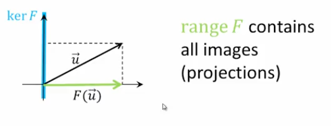

## Kernel and Range: Definitions, Examples

### Definition

Let $F:V \to W$ be a linear transformation. Then

a. the _kernel_ of $F$ is the subset of $V$ containing all vectors whose image is the zero vector:
- $\text{ker}F = \{\vec{v}~|~F(\vec{v})=\vec{0}\}$

b. the _range_ of $F$ is the subset of $W$ containing all images of vectors in $V$:
- $\text{range}F=\{\vec{w}~|~F(\vec{v})=\vec{w}\}$

### Theorem 5.3

If $F:V \to W$ is a linear transformation then

a. $\text{ker}F$ is a subspace of $V$
b. $\text{range}F$ is a subspace of $W$

### Example 1

Projection onto the $x$-axis $\quad F(\begin{bmatrix}x \\ y\end{bmatrix})=\begin{bmatrix}x \\ 0\end{bmatrix}$:

#### Kernel

#### Range

### Example 2

Determine the kernel and range of $F(\begin{bmatrix}x \\ y\end{bmatrix})=2 \begin{bmatrix}x \\ y\end{bmatrix}$

**Solution**

$\text{ker}F=\{\begin{bmatrix}0 \\ 0\end{bmatrix}\}$ 

- This is the only vector than doubles into the zero vector

$\text{range}F=R^2$ 

- Any vector within the entire $R^2$ plane can be the result of the transformation

### Example 3

Determine the kernel and range of $F(\begin{bmatrix}x \\ y\end{bmatrix})=\begin{bmatrix}0 \\ 0\end{bmatrix}$

**Solution**

$\text{ker}F=R^2$

- In this case, every vector in $R^2$ maps to $\begin{bmatrix}0 \\ 0\end{bmatrix}$

$\text{range}F=\{\begin{bmatrix}0 \\ 0\end{bmatrix}\}$

- The set of all possible outputs is simply $\begin{bmatrix}0 \\ 0\end{bmatrix}$

### Example 4

Determine whether or not the vectors are in the respective kernel and range of $F(\begin{bmatrix}x \\ y\end{bmatrix})=\begin{bmatrix}x \\ x\end{bmatrix}$

a. Is $\begin{bmatrix}1 \\ 1\end{bmatrix}$ in $\text{ker}F$?

b. Is $\begin{bmatrix}0 \\ 3\end{bmatrix}$ in $\text{ker}F$?

c. Is $\begin{bmatrix}1 \\ 1\end{bmatrix}$ in $\text{range}F$?

d. Is $\begin{bmatrix}0 \\ 3\end{bmatrix}$ in $\text{range}F$?

**Solution**

a. Is $\begin{bmatrix}1 \\ 1\end{bmatrix}$ in $\text{ker}F$?

$F(\begin{bmatrix}x \\ y\end{bmatrix})=F(\begin{bmatrix}1 \\ 1\end{bmatrix})=\begin{bmatrix}x \\ x\end{bmatrix}=\begin{bmatrix}1 \\ 1\end{bmatrix} \neq \begin{bmatrix} 0 \\ 0\end{bmatrix}$, so no

b. Is $\begin{bmatrix}0 \\ 3\end{bmatrix}$ in $\text{ker}F$?

$F(\begin{bmatrix}x \\ y\end{bmatrix})=F(\begin{bmatrix}0 \\ 3\end{bmatrix})=\begin{bmatrix}x \\ x\end{bmatrix}=\begin{bmatrix}0 \\ 0\end{bmatrix}$, so yes

c. Is $\begin{bmatrix}1 \\ 1\end{bmatrix}$ in $\text{range}F$?

$\begin{bmatrix}x \\ x\end{bmatrix}= \begin{bmatrix}1 \\ 1\end{bmatrix}$ is consistent (y can be arbitrary in this case), so yes

d. Is $\begin{bmatrix}1 \\ 1\end{bmatrix}$ in $\text{range}F$?

$\begin{bmatrix}x \\ x\end{bmatrix}= \begin{bmatrix}0 \\ 3\end{bmatrix}$ is inconsistent (we can split this vector into 2 scalar equations: $x=0$, $x=3$), so no
