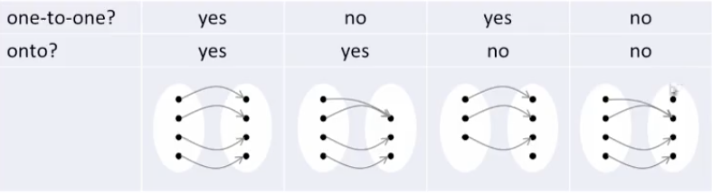
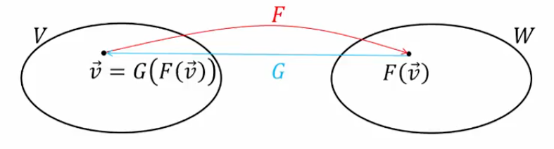
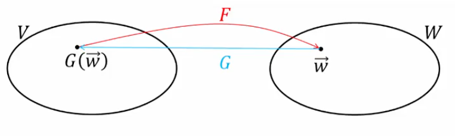

## One-to-one, Onto

### Example 1

Recall

$$
F(a_{0}+a_{1}t+a_{2}t^2+a_{3}t^3+a_{4}t^4)=\begin{bmatrix}a_{0}+2a_{2} & 0 \\ a_{0} - 4a_{4} & a_{2}+2a_{4}\end{bmatrix}
$$

We can determine the kernel and range:

**Kernel**

$\text{ker}F$ contains all vectors in $P_{4}$ whose image is $\begin{bmatrix}0 & 0 \\ 0 & 0\end{bmatrix}$

$$
\begin{bmatrix}
a_{0}+2a_{2} & 0 \\ a_{0} - 4a_{4} & a_{2}+2a_{4}
\end{bmatrix}
=
\begin{bmatrix}
0 & 0 \\ 0 & 0
\end{bmatrix}
$$

Scalar Form: For two matrices to be equal, their corresponding entries must equal:

- $a_{0}+2a_{2} = 0$
- $0 = 0$
- $a_{0}-4a_{4} = 0$
- $a_{2}+2a_{4} = 0$

Because all RHS values are 0 (homogenous system), we can use the coefficient matrix instead of the augmented matrix:

$$
\begin{bmatrix}
1&0&2&0&0 \\ 0&0&0&0&0 \\ 1&0&0&0&-4 \\ 0&0&1&0&2
\end{bmatrix}
$$

r.r.e.f.:

$$
\begin{bmatrix}
\boxed{1}&0&0&0&-4 \\ 0&0& \boxed{1} &0&2 \\ 0&0&0&0&0 \\ 0&0&0&0&0
\end{bmatrix}
$$

- $a_{0}-4a_{4} \implies a_{0} = 4a_{4}$
- $a_{1}=\text{arb}$
- $a_{2}+2a_{4} \implies a_{2} = -2a_{4}$
- $a_{3}=\text{arb}$
- $a_{4}=\text{arb}$

$a_{0}+a_{1}t+a_{2}t^2+a_{3}t^3+a_{4}t^4$
$=4a_{4}+a_{1}t-2a_{4}t^2+a_{3}t^3+a_{4}t^4$
$=a_{1}(t)+a_{3}(t^3)+a_{4}(4-2t^2+t^4)$

Vectors $t,t^3,4-2t^2+t^4$ are L.I. and span $\text{ker}F$. Therefore, they form a basis for $\text{ker}F$.

**Range**

$$
\begin{bmatrix}
a_{0}+2a_{2} & 0 \\ a_{0} - 4a_{4} & a_{2}+2a_{4}
\end{bmatrix}
$$

$$
=a_{0}
\begin{bmatrix}
1&0 \\ 1&0
\end{bmatrix}
+a_{1}
\begin{bmatrix}
0&0 \\ 0&0
\end{bmatrix}
+a_{2}
\begin{bmatrix}
2&0 \\ 0&1
\end{bmatrix}
+a_{3}
\begin{bmatrix}
0&0 \\ 0&0
\end{bmatrix}
+a_{4}
\begin{bmatrix}
0&0 \\ -4&2
\end{bmatrix}
$$

where we can represent each term as $\vec{u}_{1}$ - $\vec{u_{5}}$

Therefore, $\vec{u_{1}},\vec{u_{2}},\vec{u_{3}},\vec{u_{4}},\vec{u_{5}}$ span $\text{range}F$

We could also recall our steps from finding the kernel and notice that $\vec{u_{2}},\vec{u_{4}},\vec{u_{5}}$ can be expressed as linear combinations of $\vec{u_{1}},\vec{u_{3}}$.

$\vec{u_{1}},\vec{u_{3}}$ span $\text{range}F$ and are L.I., therefore they form a basis for $\text{range}F$

### Theorem 4.13

A basis for $\text{range}F$ can be obtained from $\vec{u_{1}},\vec{u_{2}},\vec{u_{3}},\vec{u_{4}},\vec{u_{5}}$ by possibly deleting some vectors.

### One-to-one vs. Onto

Let $F:V \to W$ be a linear transformation

- If $F(\vec{u})=F(\vec{v}) \implies \vec{u}=\vec{v}$ then the transformation $F$ is said to be _one-to-one_

- If $\text{range}F=W$ then $F$ is said to be _onto_ $W$

### Theorem 5.4

A linear transformation $F$ is one-to-one _if and only if_ $\text{ker}F=\{\vec{0}\}$

### Example 2

Is $G:P_{3} \to P_{2}$ defined by $G(p)=p'$ one-to-one or onto?

**Solution**

$G$ is onto $P_{2}$ because every polynomial in $P_{2}$ is a derivative of some $p$ in $P_{3}$

$G$ is not one-to-one
- e.g., $G$ applied to both $p_{1}(t)=t^3$ and $p_{2}(t)=t^3+2$ yields $p'_{1} = p'_{2}(t)=3t^2$

### Example 3

Is $F:R \to R^2$ defined by $F(x)=\begin{bmatrix}\frac{x}{2} \\ \frac{x}{2}\end{bmatrix}$ one-to-one or onto?

**Solution**

$F$ is not onto $R^2$
- e.g., $\begin{bmatrix}1 \\ 2\end{bmatrix}$ is not in $\text{range}F$

$F$ is one-to-one by _Theorem 5.4_
- Setting $\begin{bmatrix}\frac{x}{2} \\ \frac{x}{2}\end{bmatrix}=\begin{bmatrix}0 \\ 0\end{bmatrix}$ requires $x=0$ therefore $\text{ker}F=\{0\}$

### Example 4

Is $F:V \to R^n$ defined by $F(\vec{u})=[\vec{u}]_{S}$ where $S$ is a basis for $V$ one-to-one or onto?

**Solution**

$F$ is onto $R^n$
- Every $n$-vector $[\vec{u}]_{S}$ corresponds to a linear combination $\vec{u}$ in $V=\text{span}S$

$F$ is one-to-one by _Theorem 5.4_
- Setting $[\vec{u}]_{S} = \vec{0}$ requires $\vec{u}=\vec{0}$ therefore $\text{ker}F=\{\vec{0}\}$

### Invertible

A linear transformation $F: V \to W$ is said to be _invertible_ if a transformation $G:W \to V$ exists such that 

$G(F(\vec{v}))=\vec{v}$ for all $\vec{v} \in V$

and

$F(G(\vec{w}))=\vec{w}$ for all $\vec{w} \in W$

### Theorem 5.5

If a linear transformation $F$ is invertible then its inverse is also a linear transformation

### Theorem 5.6

If a linear transformation $F$ is invertible then it has a unique inverse, denoted $F^{-1}$

### Theorem 5.7

Let $F:V \to W$ be a linear transformation.

$F$ is invertible _if and only if_ $F$ is one-to-one _AND_ onto

### Additional Examples of Invertible Transformations

- Dilation/contraction: $F: R^n \to R^n,~F(\vec{x})=c \vec{x}$ with a nonzero $c$ has the inverse $F^{-1}(\vec{x})=\frac{1}{c} \vec{x}$
- Rotation by angle $\alpha$ in $R^2$ has the inverse corresponding to rotation by $- \alpha$
- Any reflection transformations in $R^2$ or $R^3$ defined so far also serve as their own inverse

### Example 5

Given a basis $S=\{\vec{u_{1}},\dots,\vec{u_{n}}\}$ for the vector space $V$, $F:V \to R^n$ defined by $F(\vec{u})=[\vec{u}]_{S}$ has the inverse $F^{-1}\begin{bmatrix}a_{1} \\ \vdots \\ a_{n}\end{bmatrix}=a_{1} \vec{u_{1}}+\dots+ a_{n} \vec{u_{n}}$

Given the vector in $R^n$, we can simply form the linear combination using the components as coefficients.

