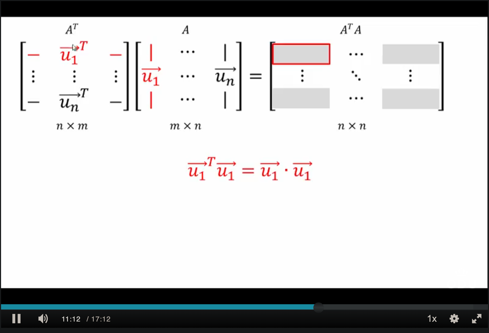
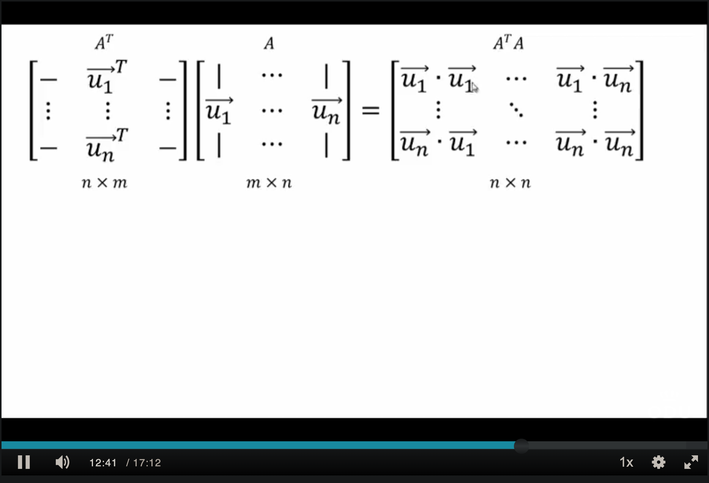

## Properties, Orthogonal Matrices

### Properties: Theories & Examples

#### Theorem 6.1

1. If $S=\{\vec{u_{1}},\dots,\vec{u_{k}}\}$ is an _orthogonal_ set and its vector are _all nonzero_ then $S$ is linearly independent
2. If $S=\{\vec{u_{1}},\dots,\vec{u_{k}}\}$ is an _orthonormal_ set then it is linearly independent

#### Theorem 6.2

If $S=\{\vec{u_{1}},\dots,\vec{u_{k}}\}$ is an _orthogonal basis_ for a subspace $V$ and $R^n$ then any vector $\vec{v}$ in $V$ satisfies

$$
[\vec{v}]_{S}=\begin{bmatrix}\frac{\vec{v} \cdot   \vec{u_{1}}}{\vec{u_{1}} \cdot  \vec{u_{1}}} \\ \vdots \\ \frac{\vec{v} \cdot  \vec{u_{k}}}{\vec{u_{k}} \cdot u_{k}}\end{bmatrix}
$$

$$
[\vec{v}]_{S}=\begin{bmatrix}\vec{v} \cdot   \vec{u_{1}} \\ \vdots \\ \vec{v} \cdot  \vec{u_{k}}\end{bmatrix}
$$

#### Example 6.5

Find $[\vec{v}]_{s_{1}}$ for $\vec{v}=\begin{bmatrix}4 \\ 0 \\ 1\end{bmatrix}$ and $S_{1}=\{\begin{bmatrix}1 \\ 2 \\ 1\end{bmatrix}, \begin{bmatrix}-2 \\ 1 \\ 0\end{bmatrix},\begin{bmatrix}1 \\ 2 \\ -5\end{bmatrix}\}$

> [!Note]
> Recall from Example 6.1 that this set is _orthogonal_, and because of this, by Theorem 6.1, this set is linearly independent. 
>
 Also by Theorem 4.16, this set is a basis for _$R^3$_.

##### Solution

Theorem 6.2: 
$$
[\vec{v}]_{S_{1}}=\begin{bmatrix}\frac{\vec{v} \cdot \vec{u_{1}}}{\vec{u_{1}} \cdot  \vec{u_{1}}} \\ \frac{\vec{v} \cdot \vec{u_{2}}}{\vec{u_{2}} \cdot \vec{u_{2}}} \\ \frac{\vec{v} \cdot  \vec{u_{3}}}{\vec{u_{3}} \cdot u_{3}}\end{bmatrix}
$$

Where $\vec{v}=\begin{bmatrix}4 \\ 0 \\ 1\end{bmatrix}$ and $S_{1}=\{\begin{bmatrix}1 \\ 2 \\ 1\end{bmatrix}, \begin{bmatrix}-2 \\ 1 \\ 0\end{bmatrix},\begin{bmatrix}1 \\ 2 \\ -5\end{bmatrix}\}$

$$
=
\begin{bmatrix}
\frac{4+0+1}{(1^2 + 2^2 + 1^2) = 1+4+1} \\
\frac{-8+0+0}{-4 + 1 + 0} \\
\frac{4+0-5}{1+4+25}
\end{bmatrix}
$$

$$
=
\begin{bmatrix}
\frac{5}{6} \\
-\frac{8}{5} \\
- \frac{1}{30}
\end{bmatrix}
$$

#### Additional Examples

#### Theorem 6.3

The columns of $A$ are orthogonal if and only if $A^TA=I$

#### Theorem 6.4

Let $A$ be an $m \times n$ matrix with _orthonormal_ (where $S$ is _orthogonal_ and $\mid \mid \vec{u_{i}} \mid \mid=1$) columns.

1. $(A \vec{u}) \cdot (A \vec{v})=\vec{u} \cdot \vec{v}$ for all $n$-vectors $\vec{u}$ and $\vec{v}$
2. $\mid \mid A \vec{u} \mid \mid = \mid \mid \vec{u} \mid \mid$

### Orthogonal Matrix

#### Definition

An $n \times n$ matrix $A$ is said to be _orthogonal_ if $A^T = A^{-1}$

> [!Note]
> In an orthogonal matrix, column vectors must be _orthonormal_ (_NOT_ just orthogonal)

