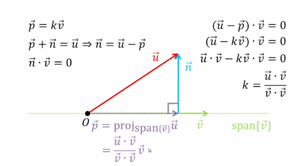
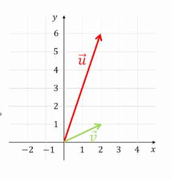
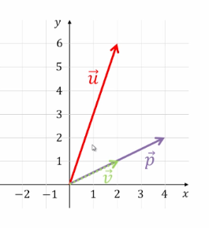
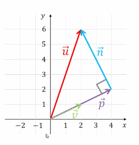

## Orthogonal Projections & Orthogonal Compliments: Introduction, Angle Between Vectors

In calculus, we commonly said we project $\vec{u}$ onto $\vec{v}$, but now we'll say we _project $\vec{u}$ onto $\text{span}\{\vec{v}\}$_

### Example 1

Find the orthogonal projection of $\vec{u}=\begin{bmatrix}2 \\ 6\end{bmatrix}, \vec{v} = \begin{bmatrix} 2 \\ 1\end{bmatrix}$

#### Solution

$\vec{p}=\text{proj}_{\text{span}\{\vec{v}\}}\vec{u}=\frac{\vec{u} \cdot \vec{v}}{\vec{v} \cdot \vec{v}}\vec{v}=\frac{4+6}{4+1} \begin{bmatrix}2 \\ 1\end{bmatrix}=\frac{10}{5} \begin{bmatrix}2 \\ 1\end{bmatrix}=2 \begin{bmatrix}2 \\ 1\end{bmatrix}=\begin{bmatrix}4 \\ 2\end{bmatrix}$

$\vec{n}=\vec{u} - \vec{p}=\begin{bmatrix}-2 \\ 4\end{bmatrix}$

### Standard $\cos$ Formula

Recall from calculus, $\cos \alpha = \frac{\vec{u} \cdot \vec{v}}{\mid \mid \vec{u} \mid \mid \mid \mid \vec{v} \mid \mid}$ (where $\mid \mid$ represents the length of the vectors)

#### Theorem 6.6

**Cauchy-Schwarz Inequality:** $| \vec{u} \cdot \vec{v} | ~ \leq ~ \mid \mid \vec{u} \mid \mid \mid \mid \vec{v} \mid \mid$

#### Theorem 6.7

**Triangle Inequality:** $\mid \mid \vec{u} + \vec{v} \mid \mid ~ \leq ~ \mid \mid \vec{u} \mid \mid + \mid \mid \vec{v} \mid \mid$

### Example 2

Suppose we are searching a system for keywords:

**Query** $\quad \quad$ **Document 1** $\quad$**Document 2**

$\begin{bmatrix}\text{banana} \\ \text{dill} \\ \text{eggplant}\end{bmatrix} \quad \begin{bmatrix}\text{banana} \\ \text{eggplant}\end{bmatrix} \quad \begin{bmatrix}\text{apple} \\ \text{banana} \\ \text{celery} \\ \text{dill} \\ \text{eggplant} \\ \text{fig}\end{bmatrix}$

We can measure the document similarity through measuring the angle between related vectors.

First, we can pad each vectors' missing keywords with 0s:

$\vec{u} =\begin{bmatrix}0 \\ 1 \\ 0 \\ 1 \\ 1 \\0\end{bmatrix} \quad \vec{v}=\begin{bmatrix}0 \\ 1 \\ 0 \\ 0 \\ 1 \\ 0\end{bmatrix} \quad \vec{w}=\begin{bmatrix}1 \\ 1 \\ 1 \\ 1 \\ 1 \\ 1\end{bmatrix}$

Now, let's calculate the $\cos$ between the angles of the query vector $\vec{u}$ and both documents $\vec{v}$ and $\vec{w}$:

$\cos \alpha = \frac{\vec{u} \cdot \vec{v}}{\mid \mid \vec{u} \mid \mid \mid \mid \vec{v} \mid \mid} = \frac{2}{\sqrt{ 3 }\sqrt{ 2 }}=0.816$ (Document 1)

$\cos \beta = \frac{\vec{u} \cdot \vec{w}}{\mid \mid \vec{u} \mid \mid \mid \mid \vec{w} \mid \mid}= \frac{3}{\sqrt{ 3 }\sqrt{ 6 }} = 0.707$ (Document 2)

Thus, Document 1 matches the query _more_ than Document 2 does.

### Example 3

Find the angle between vectors $\vec{u}=\begin{bmatrix}1 \\ 0 \\ 2 \\ -1\end{bmatrix}$ and $\begin{bmatrix}0 \\ 1 \\ -1 \\ 1\end{bmatrix}$

#### Solution

$\cos \alpha = \frac{\vec{u} \cdot \vec{v}}{\mid \mid \vec{u} \mid \mid \mid \mid \vec{v} \mid \mid} = \frac{-3}{\sqrt{ 6 }\sqrt{ 3 }} =-\frac{\sqrt{ 2 }}{2}=\theta=135 \degree$, which is obtuse
