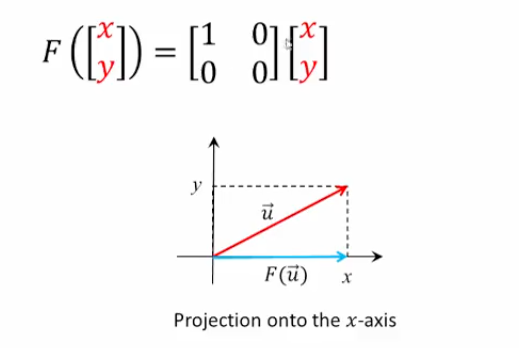
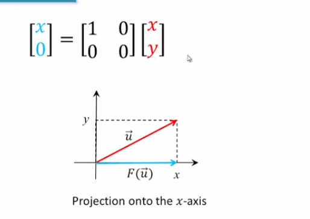
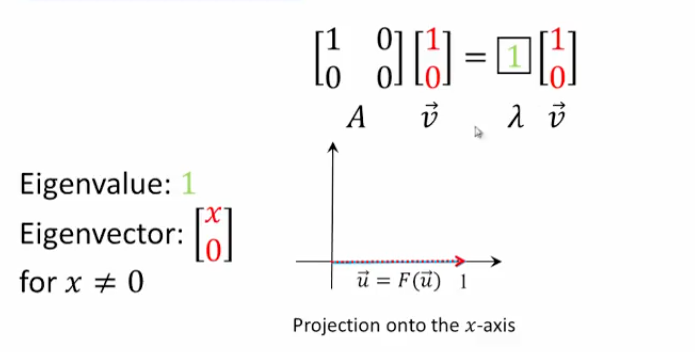
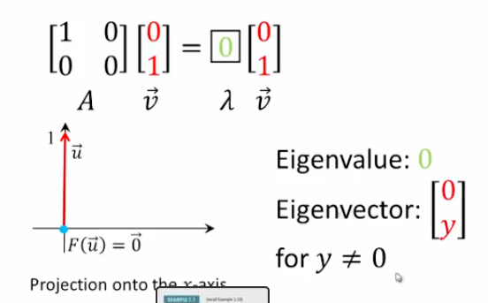
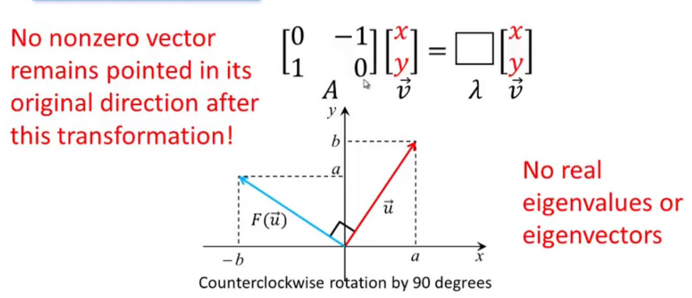

## Introduction, Geometry

### Definition

Let $A$ be an $n \times n$ matrix. A nonzero vector $\vec{v}$ is called an _eigenvector_ of $A$ if $A \vec{v}= \lambda \vec{v}$ for some scalar $\lambda$, which is called an _eigenvalue_ associated with the eigenvector $\vec{v}$

### Example 1

Recall

Now, we can apply what we just discussed:

### Example 2

