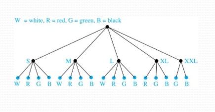

# Basics of Counting

## Basic Counting Principles: The Product Rule

**The Product Rule:** A procedure can be broken down into a sequence of two tasks. There are $n_1$ ways to do the first task and $n_2$ ways to do the second task. Then there are $n_1 \times n_2$ ways to do the procedure.

#### Examples

**Problem 1:** How many bit strings of length 7 are there?

**Solution:** Since each of the 7 bits is either a 0 or a 1, the answer is $2^7=128$

**Problem 2:** How many different license plates can be made if each plate contains a sequence of three uppercase English letters followed by 3 digits?

**Solution:** By the product rule, there are $26 \times 26 \times 25 \times 10 \times 10 \times 10=17,576,000$ difference possible license plates.

### Counting Functions

#### Examples

**Counting Functions:** How many functions are there from a set with $m$ elements to a set with $n$ elements?

**Solution:** Since a function represents a choice of one of the $n$ elements of the codomain for each of the $m$ elements in the domain, the product rule tells us that there are $n \times n \dots \times n = n^m$ such functions

**Counting One-to-One Functions:** How many one-to-one functions are there from a set with $m$ elements to one with $n$ elements $(m \leq n)$?

**Solution:** Suppose the elements in the domain are $a_1,a_2,\dots,a_m$. There are $n$ ways to choose the value of $a_1$ and $n-1$ ways to choose $a_2$, etc. The product rule tells us that there are $n(n-1)(n-2) \dots (n-m+1)$ such functions

### Telephone Numbering Plan

**Problem:** The North American Numbering Plan (NANP) specifies that a telephone number consists of 10 digits, with a 3-digit area code, a 3-digit office code, and a 4-digit station code. There are some restrictions on the digits.
- Let $X$ denote a digit from 0 through 9
- Let $N$ denote a digit from 2 through 9
- Let $Y$ denote a digit that is 0 or 1
- In the old plan (from the 1960s), the format was NYX-NNX-XXX
- In the new plan, the format is NXX-NXX-XXXX

How many different telephone numbers are possible under the old plan and the new plan?

**Solution:** Use the Product Rule:
- There are $8 \times 2 \times 10=160$ area codes with the format NYX
- There are $8 \times 10 \times 10=800$ area codes with the format NXX
- There are $8 \times 8 \times 10=640$ office codes with the format NNX
- There are $10 \times 10 \times 10 \times 10=10,000$ station codes with the format XXXX

Number of old plan telephone numbers: $160 \times 640 \times 10,000=1,024,000,000$
Number of new plan telephone numbers: $800 \times 800 \times 10,000=6,400,000,000$

### Counting Subsets of a Finite Set

**Counting Subsets of a Finite Set:** Use the product rule to show that the number of different subsets of a finite set $S$ is $2^{|S|}$

**Solution:** When the elements of $S$ are listed in an arbitrary order, there is a one-to-one correspondence between subsets of $S$ and bit strings of length $|S|$. When the $i^{th}$ element is in the subset, the bit string has a 1 in the $i^{th}$ position and a 0 otherwise.

By the product rule, there are $2^{|S|}$ such bit strings, and therefore $2^{|S|}$ subsets.

### Product Rule in Terms of Sets

- If $A_1,A_2,\dots,A_m$ are finite sets, then the number of elements in the Cartesian product of these sets is the product of the number of elements of each set.

- The ask of choosing an element in the Cartesian product $A_1 \times A_2 \times \dots \times A_m$ is done by choosing an element in $A_1$, an element in $A_2, \dots,$ and an element in $A_m$

- By the product rule, it follows that: $|A_1 \times A_2 \times \dots \times A_m|=|A_1| \times |A_2| \times \dots \times |A_m|$

### DNA and Genomes

- A **gene** is a segment of DNA molecules that encode a particular protein and the entirety of genetic information of an organism is called its **genome**.

- DNA molecule consist of two strands of blocks known as nucleotides. Each nucleotide is composed of bases: adenine (A), cytosine (C), guanine (G), or thymine (T).

- The DNA of bacteria has between $10^5$ and $10^7$ links (one of the four bases). Mammals have between $10^8$ and $10^{10}$ links. So, by the product rule, there are at least $(4^{10})^{5}$ difference sequences of bases in the DNA of bacteria and $(4^{10})^{8}$ different sequences of bases in the DNA of mammals.

- The human genome includes approximately 23,000 genes, each with 1,000 or more links

- Biologists, mathematicians, and computer scientists all work on determining the DNA sequence (genome) of different organisms

## Basic Counting Principles: The Sum Rule

**The Sum Rule:** If a task can be done in either one of $n_1$ ways or in one of $n_2$ ways, where none of the set of $n_1$ ways is the same as any of the $n_2$ ways, then there are $n_1+n_2$ ways to do the task.

**Example:** The mathematicians department much choose either a student or a faculty member as a representative for a university committee. How many choices are there for this representative if there are 37 members of the mathematicians faculty and 83 mathematics majors and no one is both a faculty member and a student?

**Solution:** By the sum rule, it follows that there are $37+83=120$ possible ways to pick a representative

### The Sum Rule in Terms of Sets

- The sum rule can be phrased in terms of sets: $|A \cup B|=|A|+|B|$ as long as $A$ and $B$ are disjoint sets
- Or more generally, $|A_1 \cup A_2 \cup \dots \cup A_m=|A_1|+|A_2|+ \dots + |A_m|$ when $A_i \cap A_j = \emptyset$ for all $i,j$
- The case where the sets have elements in common will be discussed later on when we consider the subtraction rule

## Combining the Sum and Product Rule

#### Basic Example

**Problem:** Suppose statement labels in a programming language can be either a single letter or a letter followed by a digit. Find the number of possible labels.

**Solution:** Use the product rule: $26+26 \times 10 = 286$

### Complex Example: Counting Passwords

**Problem:** Each user on a computer system has a password, which is six to eight characters long, where each character is an uppercase letter or a digit. Each password must contain at least one digit. How many possible passwords are there?

**Solution:** Let $P$ be the total number of passwords, and let $P_6,P_7,$ and $P_8$ be the passwords of length 6, 7, and 8.
- By the sum rule, $P=P_6+P_7+P_8$
- To find each of $P_6,P_7,$ and $P_8$, we find the number of passwords of the specified length composed of letters and digits and subtract the number composed only of letters. We find that:

$$P_6=36^6-26^6=2,176,782,336-308,915,776=1,867,866,560$$
$$P_7=36^7-26^7=78,364,164,096-8,031,810,176=70,332,353,920$$
$$P_8=36^8-26^8=2,821,109,907,456-208,827,064,576=2,612,282,842,880$$

Consequently, $P=P_6+P_7+P_8=2,684,483,063,360$

### Internet Addresses

Version 4 of the Internet Protocol (IPv4) uses 32 bits

- Class **A** Addresses: used for the largest networks, a 0, followed by a 7-digit netID and a 24-bit hostID
- Class **B** Addresses: used for the medium-sized networks, a 10, followed by a 14-bit netID and a 16-bit hostID
- Class **C** Addresses: used for the smallest networks, a 110, followed by a 21-bit netID and an 8-bit hostID
  - Neither Class D nor Class E addresses are assigned as the address of a computer on the internet. Only Classes A, B, and C are available.
  - 1111111 is not available as the netID of a Class A network
  - HostIDs consisting of all 0s and all 1s are not available in any network

#### Counting Internet Addresses

**Problem:** How many different IPv4 addresses are available for computers on the internet?

**Solution:** Use both the sum and the product rule. Let $x$ be the number of available addresses, and let $x_A, x_B,$ and $x_C$ denote the number of addresses for the respective classes
- To find $x_A$: 
  $$2^7-1=127 \mathrm{~ ~netIDs}$$
  $$2^{24}-2=16,777,214 \mathrm{~ ~hostIDs}$$
  $$x_A=127 \times 16,777,214=2,130,706,178$$
- To find $x_B$: 
  $$2^{14}=16,384 \mathrm{~ ~netIDs}$$
  $$2^{16}-2=16,534 \mathrm{~ ~hostIDs}$$
  $$x_B=16,384 \times 16,534=1,073,709,056$$
- To find $x_C$: 
  $$2^{21}=2,087,152 \mathrm{~ ~netIDs}$$
  $$2^{8}-2=254 \mathrm{~ ~hostIDs}$$
  $$x_C=2,097,152 \times 254=532,676,608$$
- Hence, the total number of available IPv4 addresses is
  $$x=x_A+x_B+x_C$$
  $$=2,130,706,178+1,073,709,056+532,676,608$$
  $$=3,737,091,842$$

> [!note]
> 
> This total is not enough today. The newer IPv6 protocol solves the problem of too few addresses

## Basic Counting Principles: Subtraction Rule

**Subtraction Rule:** If a task can be done either in one of $n_1$ ways or in one of $n_2$ ways when the total number of ways to do the task is $n_1+n_2$ minus the number of ways to do the task that are common to the two different ways.

It is also known as the _principle of inclusion-exclusion_:

$$|A \cup B|=|A|+|B|-|A \cap B|$$

### Counting Bit Strings

**Problem:** How many bit strings of length 8 either start with a 1 bit or end with the two bits 00?

**Solution:** Use the subtraction rule:
- Number of bit strings of length 8 that start with a 1 bit: $2^7=128$
- Number of bit strings of length 8 that end with bits 00: $2^6=64$
- Number of bit strings of length eight that start with a 1 bit and end with bits 00: $2^5=32$

Hence, the answer is $128+64-32=160$

## Basic Counting Principles: Division Rule

**Division Rule:** There are $n/d$ ways to do a task if it can be done using a procedure that can be carried out in $n$ ways, and for every way $w$, exactly $d$ of the $n$ ways correspond to way $w$.

- Restated in terms of sets: If the finite set $A$ is the union of $n$ pairwise disjoin subsets each with $d$ elements, then $n=\frac{|A|}{d}$
- In terms of functions: If $f$ is a function from $A$ to $B$, where both are finite sets, and for every value $y \in B$ there are exactly $d$ values $x \in A$ such that $f(x)=y$, then $|B|=\frac{|A|}{d}$

#### Example

**Problem:** How many ways are there to seat four people around a circular table, where two seatings are considered the same when each person has the same left and right neighbor?

**Solution:** Number the sets around the table from 1 to 4 proceeding clockwise. There are four ways to select the person for set 1, 3 for set 2, 2, for seat 3, and one way for seat 4. Thus, there are $4! =24$ ways to order the four people. However, since two seatings are the same when each person has the same left and right neighbor, for every choice for seat 1, we get the same seating.

Thus, by the division rule, there are $\frac{24}{4}=6$ different seating arrangements

## Tree Diagrams

**Tree Diagrams:** We can solve many counting problems through the use of tree diagrams, where a branch represents a possible choice and the leaves represent possible outcomes

#### Example

**Problem:** Suppose that "I Love Discrete Math" T-shirts come in five different sizes: S, M, L, XL, and XXL. Each size comes in four colors (white, red, green, and black), except XL, which only comes in red, green, and black, and XXL, which only comes in green and black. What is the minimum number of T-shirts that the campus book store needs to stock to have one of each size and color available?

**Solution:** Construct the appropriate tree diagram:

Therefore, the store must stock 17 T-shirts.
