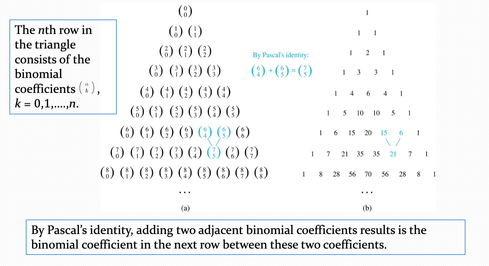

## Binomial Coefficients and Identities

### Powers of Binomial Expressions

**Definition:** A **binomial** expression is the sum of two terms, such as $x+y$. (More generally, these terms can be products of constants and variables.)

For instance, we can use counting principles to find the coefficients in the expansion of $(x+y)^n$ where $n$ is a positive integer.
- To illustrate this idea, we first look at the process of expanding $(x+y)^2$.
- $(x+y)(x+y)(x+y)$ expands into a sum of terms that are the product of a term from each of the three sums.
- Terms of the form $x^3,x^2y,xy^2$, and $y^3$ rise. The questions is _what are the coefficients?_
  - **$x^3$**: To obtain $x^3$, an $x$ must be chosen from two of the sums. There is only one way to do this, so the coefficient of $x^3$ is 1.
  - **$x^2$**: To obtain $x^2y$, an $x$ must be chosen from two of the sums and a $y$ from the other. There are $3 \choose 2$ ways to do this, so the coefficient of $x^2y$ is 3.
  - **$xy^2$** To obtain $xy^2$, an $x$ must be chosen from one of the sums and a $y$ from the other two. There are $3 \choose 1$ ways to do this, so the coefficient of $xy^2$ is 3.
  - **$y^3$**: To obtain $y^3$, a $y$ must be chosen from each of the sums. There is only one way to do this, so the coefficient of $y^3$ is 1.

Thus, we have used a counting argument to show that $(x+y)^3=x^3+3x^2y+3xy^2+y^3$.

Next, we'll represent the binomial theorem, which gives the coefficients of the terms in the expansion of $(x+y)n$.

### Binomial Theorem

**Binomial Theorem:** Let $x$ and $y$ be variables, and $n$ be a non-negative integer. Then,

$$(x+y)^n=\sum_{j=0}^n {n \choose j}x^{n-j}y^j={n \choose 0}x^n+{n \choose 1}x^{n-1}y+ \dots+{n \choose n-1}xy^{n-1}+{n \choose n}y^n $$

**Proof:** We used combinational reasoning. The terms in the expansion of $(x+y)^n$ are of the form $x^{n-j}y^j$ for $j=0,1,2, \dots, n$. To form the term $x^{n-j}y^j$, it is necessary to choose $n-j$ amount of $x$ from the $n$ sums. Therefore, the coefficient of $x^{n-j}y^j$ is ${n \choose n-j }$ which equals ${n \choose j}$.

#### Example

**Problem:** What is the coefficient of $x^{12}y^{12}$ in the expansion of $(2x-3y)^25$?

**Solution:** We view the expression as $(2x+(-3y))^25$. By the binomial theorem,

$$(2x+(-3y))^25=\sum_{j=0}^{25} {25 \choose j}(2x)^{25-j}(-3y)^j$$

Consequently, the coefficient of $x^{12}y^{13}$ of the expansion is obtained when $j=13$

$${25 \choose 13}2^{12}(-3)^{13}=-\frac{25!}{13!12!}2^{12}3^{13}$$

### A Useful Identity

**Corollary 1:** With $n \geq 0$,

$$\sum_{k-0}^n{n \choose k}=2^n$$

**Proof (Using Binomial Theorem):** Using the binomial theorem, we can use $x=1$ and $y=1$ to see

$$2^n=(1+1)^n=\sum_{k-0}^n {n \choose k}1^k 1^{n-k}=\sum_{k-0}^n {n \choose k}$$

**Proof (Combinatorial):** Consider the subsets of a set with $n$ elements. There are ${n \choose 0}$ subsets with zero elements, ${n \choose 1}$ with one element, ${n \choose 2}$ with two elements, $\dots$, and ${n \choose n}$ with $n$ elements. Therefore, the total is

$$\sum_{k-0}^n {n \choose k}$$

Since we know that a set with $n$ elements has $2^n$ subsets, we conclude that

$$\sum_{k-0}^n {n \choose k}=2^n$$

### Pascal's Identity

**Pascal's Identity:** If $n$ and $k$ are integers with $n \geq k \geq 0$, then

$${n+1 \choose k}={n \choose k-1}+{n \choose k}$$

**Proof (Combinatorial):** Let $T$ be a set where $|T| = n+1,~a \in T$, and $S=T-\{a\}$. There are ${n+1 \choose k}$ subsets of $T$ containing $k$ elements. Each of these subsets either:

- Contains $a$ with $k-1$ other elements, or
- Contains $k$ elements of $S$ and not $a$

There are

- ${n \choose k-1}$ subsets of $k$ elements that contain $a$ since there are ${n \choose k-1}$ subsets of $k-1$ elements of $S$

and

- ${n \choose k}$ subsets of $k$ elements of $T$ that do not contain $a$ because there are ${n \choose k}$  subsets of $k$ elements of $S$.

Hence,

${n+1 \choose k}={n \choose k-1}+{n \choose k}$

#### Pascal's Triangle

