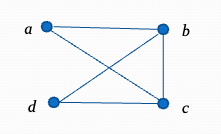
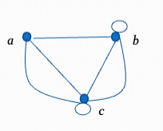
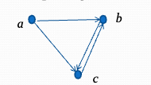
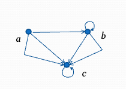
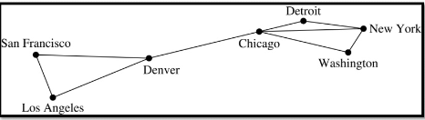
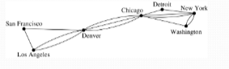
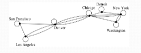
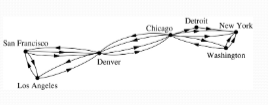
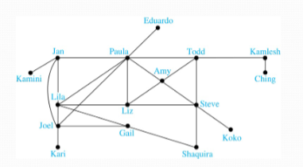
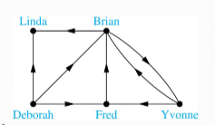

## Graphs

**Definition:** A graph $G=(V,E)$ consists of a non-empty set $V$ of _vertices_ (or _nodes_) and a set $E$ of _edges_. Each edge has either one or two vertices associated with it, called its _endpoints_. An edge is said to _connect_ to its endpoints.

**Example:** Here's a graph with 4 vertices and 5 edges

**Remarks:**
- The graphs we study here are unrelated to graphs of function studied in [[(M3.3.1c) Graphs of Functions]].
- We have a lot of freedom when we draw a picture of a graph. All that matters it he connections made by the edges, no the particular geometry depicted. For example, the lengths of edges, whether edges cross, how vertices are depicted and so on, do not matter.
- A graph with an infinite vertex set is called an _infinite graph_. A graph with a finite vertex set is called a _finite graph_. In this course, we'll be restricting our attention to _finite graphs_.

### Some Terminology: Pt. I

- In a _simple graph_, each edge connects two different vertices and no two edges connect the sample pair of vertices.
- _Multigraphs_ may have multiple edges connecting the same two vertices. When $m$ different edges connect the vertices $u$ and $v$, we say that $\{u,v\}$ is an edge of _multiplicity $m$_.
- An edge that connects a vertex to itself is called a _loop_.
- A _pseudograph_ may include loops, as well as multiple edges connecting the same pair of vertices.

**Example:** This pseudograph has both multiple edges and a loop

> [!note]
> 
> There is no standard terminology for graph theory. So, it is crucial to understand the terminology being used whenever reading material about graphs.

### Directed Graphs

**Definition:** A _directed graph_ (or _digraph_) $G=(V,E)$ consists of a non-empty set $V$ of _vertices_ (or _nodes_) and a set $E$ of _directed edges_ (or _arcs_). Each edge is associated with an ordered pair of vertices. The directed edge associated with the ordered pair $(u,v)$ is said to _start a u and end at v_.

**Remark:**
- Graphs where the endpoints of an edge are not ordered are said to be _undirected graphs_.

### Some Terminology: Pt. II

#### Directed Graph

A _simple directed graph_ has no loops and no multiple edges.

**Example:** Here's a directed graph with three vertices and four edges

#### Directed Multigraph

A _directed multigraph_ may have multiple directed edges. When there are $m$ directed edges from the vertex $u$ to the vertex $u$, we say that $(u,v)$ is an edge of _multiplicity $m$_

**Example:** In this directed multigraph, the multiplicity of $(a,b)$ is $1$ and the multiplicity of $(b,c)$ is $2$

## Graph Models: Computer Networks

### Graph Models

When we build a graph model, we use the appropriate type of graph to capture the important features of the application.

We illustrate this process using graph models of different types of computer networks. In all these graph models, the vertices represent data center and the edges represent communication links.

#### Example 1 (Simple Graph)

- To model a computer network where we are only concerned whether two data centers are connected by a communication link, we used a simple graph. This is the appropriate type of graph when we only care whether two data centers are directly linked (not how many links there may be) and all communication links work in both directions.

#### Example 2 (Multigraph)

- To model a computer network where we care about the number of links between data centers, we might use a multigraph.

#### Example 3 (Pseudograph)

- To model a computer network with diagnostic links at data centers, we use a pseudograph, as loops are needed.

#### Example 4 (Directed Multigraph)

- To model a network with multiple one-way links, we use a directed multigraph. Note that we could use a directed graph without multiple edges if we only care whether there is at least one link from a data center to another data center.

### Graph Terminology: Summary

- To understand the structure of a graph and to build a graph model, we ask
  - Are the edges of the graph undirected or directed? (or both)?
  - If the edges are undirected, are multiple edges present that connect the same pair of vertices? If the edges are directed, are multiple directed edges present?
  - Are loops present?

| Types                 | Edges                   | Multiple Edges Allowed? | Loops Allowed? |
| --------------------- | ----------------------- | ----------------------- | -------------- |
| Simple Graph          | Undirected              | No                      | No             |
| Multigraph            | Undirected              | Yes                     | No             |
| Pseudograph           | Undirected              | Yes                     | Yes            |
| Simple Directed Graph | Directed                | No                      | No             |
| Directed Multigraph   | Directed                | Yes                     | Yes            |
| Mixed Graph           | Directed and Undirected | Yes                     | Yes            |

#### Other Applications of Graphs

Graph theory can be used in models of
- Social networks
- Communication networks
- Information networks
- Software design
- Transportation networks
- Biological networks

It's a challenge to find a subject to which graph theory has not yet been applied.

Let's see how a social network might use graph theory...

## Graph Models: Social Networks

- Graphs can be used to model social structures based on different kinds of relationships between people or groups.

- In a _social network_, vertices represent individuals or organizations and edges represent relationships between them.

- Useful graph models of social networks include:
  - _Friendship Graphs_ - undirected graphs where two people are connected if they are friends (in the real world, on Facebook, or in a particular virtual word, and so on.)
  - _Collaboration Graphs_ - undirected graphs where two people are connected if they collaborate in a specific way.
  - _Influence Graph_ - directed graphs where there is an edge from one person to another if the first person can influence the second person

#### Example 1 (Friendship Graph)

**Example:** A friendship graph where two people are connected if they are Facebook friends

#### Example 2 (Friendship Graph)

**Example:** A influence graph

