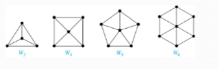
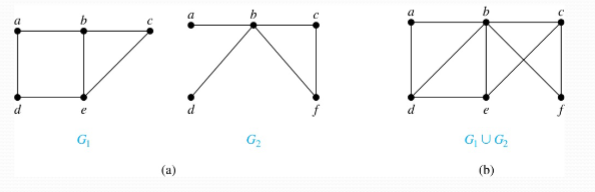

## Graph Terminology and Special Types of Graphs

### Basic Terminology

**Definition 1:** Two vertices $u,v$ is an undirected graph $G$ are called _adjacent_ (or _neighbors_) in $G$ if there is an edge $e$ between $u$ and $v$. Such an edge $e$ is called _incident_ with the vertices $u$ and $v$ and $e$ is said to _connect_ $u$ and $v$.

**Definition 2:** The set of all neighbors of a vertex $v$ of $G=(V,E)$, denoted by $N(v)$, is called the _neighborhood_ of $v$. If $A$ is a subset of $V$, we denote by $N(A)$ the set of all vertices in $G$ that are adjacent to at least one vertex in $A$. So, $N(A)=\cup_{v \in A}N(v)$.

**Definition 3:** The _degree_ of a vertex in an _undirected_ graph is the number of edges incident with it, except that a loop at a vertex contributes two to the degree of that vertex. The degree of the vertex $v$ is denoted by $deg(v)$.

### Degrees and Neighborhoods

#### Example

**Problem:** What are the degrees and neighborhoods of the vertices in the graphs $G$ and $H$?

**Solution:** 

$G:$    $deg(a)=2,$
	$deg(b)=deg(c)=deg(f)=4,$
	$deg(d)=1,$
	$deg(e)=3,$
	$deg(g)=0$
	
	$N(a)=\{b,f\},$
	$N(b)=\{a,c,e,f\},$
	$N(c)=\{b,d,e,f\},$
	$N(d)=\{c\},$
	$N(e)=\{b,c,f\},$
	$N(f)=\{a,b,c,e\},$
	$N(g)=\emptyset$

$H$:     $deg(a)=4,$
	$deg(b)=deg(e)=6,$
	$deg(c)=1,$
	$deg(d)=5$

	$N(a)=\{b,d,e\}$
	$N(b)=\{a,b,c,d,e\},$
	$N(c)=\{b\},$
	$N(d)=\{a,b,e\},$
	$N(e)=\{a,b,d\}$

### Degrees of Vertices

**Theorem 1 (Handshaking Theorem):** If $G=(V,E)$ is an undirected graph with $m$ edges, then

$$2m=\sum_{v \in V}deg(v)$$

**Proof:** Each edge contributes twice to the degree count of all vertices. Hence, both the left-hand and right-hand sides of this equation equal twice the number of edges.

#### Handshaking Theorem Examples

##### Example 1

**Problem:** How many edges are there in a graph with 10 vertices of degree six?

**Solution:** Since the sum of the degrees of the vertices is $6\ \times 10 = 60$, the handshaking theorem tells us that $2m=60$. So, the number of edges $m=30$.

##### Example 2

**Problem:** If a graph has 5 vertices, can each vertex have degree 3?

**Solution:** This is not possible by the handshaking theorem because the sum of the degrees of the vertices $3 \times 5=15$ is odd.

### Degrees of Vertices (Continued)

**Theorem 2:** An undirected graph has an even number of vertices of odd degree

**Proof:** Let $V_{1}$ be the vertices of even degree and $V_{2}$ be the vertices of odd degree in an undirected graph $G=(V,E)$ with $m$ edges. Then

$$2m=\sum_{v \in V}deg(v)=\sum_{v \in V}deg(v)+\sum_{v \in V_{2}}deg(v)$$

### Directed Graphs

Recall the definition of a directed graph.

**Definition:** 

A directed graph $G=(V,E)$ consists of $V$, a non-empty set of _vertices_ (or _nodes_), and $T$, a set of _directed edges_ or _arcs_. Each edge is an ordered pair of vertices. The directed edge $(u,v)$ is said to start at $u$ and end at $v$.

Let $(u,v)$ be an edge in $G$. Then, $u$ is the **initial vertex** of this edge and is **adjacent** to $v$ and $v$ us the **terminal** (or _end_) _vertex_ of this edge and is _adjacent from $u$_. The initial and terminal vertices of a loop are the same.

The _in-degree_ of a vertex $v$, denoted by $deg^-(v)$, is the number of edges which terminate at $v$. The _out-degree_ of $v$, denoted by $deg^+(v)$, is the number of edges with $v$ as their initial vertex. Note that a loop at a vertex contributes 1 to both the in-degree and the out-degree of the vertex.

**Theorem 3:** Let $G=(V,E)$ be a graph with directed edges. Then:

$$|E|=\sum_{v \in V}deg^-(v)=\sum_{v \in V}deg^+(v)$$

**Proof:** The first sum counts the number of outgoing edges over all vertices and the second sum counts the number of incoming edges over all vertices. It follows that both sums equal the number of edges in the graph.

### Special Types of Simple Graphs: Complete Graphs

A _complete graph_ on $n$ vertices, denoted by $K_{n}$, is the simple graph that contains exactly one edge between each pair of distinct vertices.

### Special Types of Graphs: Cycles and Wheels

A _cycle_ $C_{n}$ for $n\geq 3$ consists of $n$ vertices $v_{1},v_{2},\dots,v_{n}$, and edges $\{v_{1},v_{2}\},\{v_{2},v_{3}\},\dots,\{v_{n-1},v_{n}\},\{v_{n},v_{1}\}$.

A _wheel_ $W_{n}$ is obtained by adding an additional vertex to a cycle $C_{n}$ for $n\geq 3$ and connecting this new vertex to each of the $n$ vertices in $C_{n}$ by new edges.

### Special Types of Graphs: $n$-Cubes

An $n$-dimensional hypercube, or $n$-cube, $Q_{n}$, is a graph with $2^n$ vertices representing all bit strings of length $n$, where there is an edge between two vertices that differ in exactly one bit position.

### Special Types of Graphs and Computer Network Architecture

Various special graphs play an important role in the design of computer networks.

- Some local area networks use a _star topology_, which is a complete bipartite graph $K_{1,n}$, as shown in (a). All devices are connected to a central control device.
- Other local networks are based on a _ring topology_, where each device is connected to exactly two others using $C_{n}$, as illustrated in (b). Messages may be sent around the ring.
- Others, as illustrate in (c), use a $W_{n}$-based topology, combining the features of a star topology and a ring topology.
- Various special graphs also play in role in parallel processing where processors need to be interconnected as one processor may need the output generated by another.
	- The $n$-dimensional hypercube, or $n$-cube, $Q_{n}$, is a common way to connect processors in parallel, e.g. Intel Hypercube.
	- Another common method is the _mesh_ network

### Bipartite Graphs

**Definition:** A simple graph $G$ is bipartite if $V$ can be partitioned in to two disjoin subsets $V_{1}$ and $V_{2}$ such that every edge connects a vertex in $V_{1}$ and a vertex in $V_{2}$. In other words, there are no edges which connect two vertices in $V_{1}$ or $V_{2}$.

It's quite simple to show that an equivalent definition of a bipartite graph is a graph where it is possible to color the vertices red or blue so that no two adjacent vertices are the same color.

#### Examples

##### Example 1

**Problem:** Show that $C_{6}$ is bipartite.

**Solution:** We can partition the vertex set into $V_{1}=\{v_{1},v_{2},v_{3}\}$ and $V_{2}=\{v_{2},v_{4},v_{6}\}$ so that every edge of $C_{6}$ connects are vertex in $V_{1}$ and $V_{2}$.

##### Example 2

**Problem:** Show that $C_{3}$ is not bipartite.

**Solution:** If we divide the vertex set of $C_{3}$ into two non-empty sets, one of the two must contain two vertices. But in $C_{3}$, every vertex is connected to every other vertex. Therefore, the two vertices in the same partition are connected. Hence, $C_{3}$ is not bipartite.

### Complete Bipartite Graphs

**Definition:** A _complete bipartite_ graph $K_{m,n}$ is a graph that has its vertex set partitioned into two subsets $V_{1}$ of size $m$ and $V_{2}$ of size $n$ such that there is an edge from every vertex in $V_{1}$ to every vertex in $V_{2}$.

**Example:** Here are four complete bipartite graphs:

### New Graphs from Old

**Definition:** A subgraph of a graph $G=(V,E)$ is a graph $H=(W,F)$, where $W \subset V$ and $F \subset E$. A subgraph $H$ of $G$ is a proper subgraph of $G$ if $H \neq G$.

**Example:**

Here is $K_{5}$ and one of its subgraphs:

**Definition:** Let $G=(V,E)$ be a simple graph. The _subgraph induced_ by a subset $W$ of the vertex set $V$ is the graph $(W,F)$, where the edge set $F$ contains an edge in $E$ if and only if both endpoints are in $W$.

**Example:**

Here is $K_{5}$ and the subgraph induced by $W=\{a,b,c,e\}$:

**Definition:** The _union_ of two simple graphs $G_{1}=(V_{1},E_{1})$ and $G_{2}=(V_{2},E_{2})$ is the simple graph with vertex set $V_{1} \cup V_{2}$ and edge set $E_{1} \cup E_{2}$. The union of $G_{1}$ and $G_{2}$ is denoted by $G_{1}\cup G_{2}$.

**Example:**

### Bipartite Graphs and Matchings

Bipartite graphs are used to model applications that involve matching the elements of one set to elements in another, for example:

**Job Assignments** - Vertices represent the jobs and the employees, and edges link employees with those jobs they have been trained to do. A common goal is to match jobs to employees so that the most jobs are done.

**Marriage** - Vertices represent the men and the women and edges link a man and a woman if they are an acceptable spouse. We may wish to find the largest number of possible marriages.

