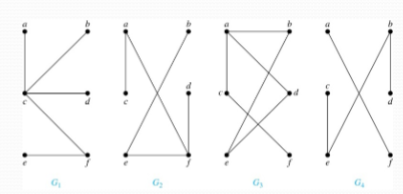
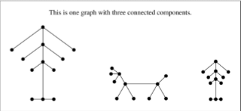
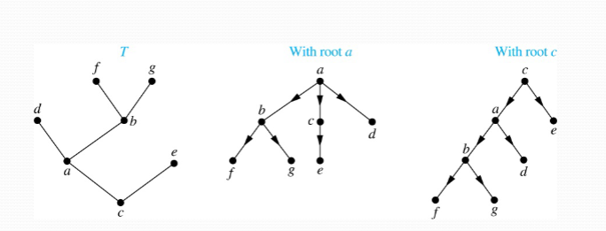
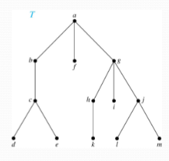
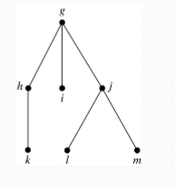
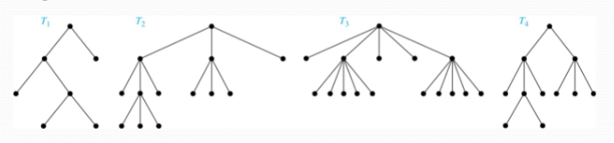
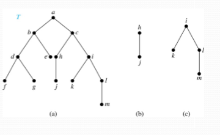
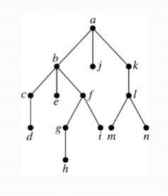
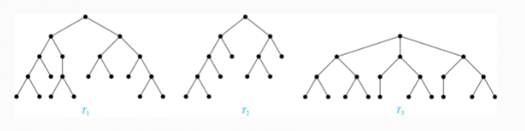

## Introduction to Trees

### Trees

**Definition:** A _tree_ is a connected undirected graph with no simple circuits.

**Example:** Which of these graphs are trees?

**Solution:** $G_{1}$ and $G_{2}$ are trees - both are connected and have no simple circuits. Because $e,b,a,d,e$ is a simple circuit, $G_{3}$ is not a tree. $G_{4}$ is not a tree because it is not connected.

**Theorem 1 - Unique Path Theorem:** An undirected graph is a tree if and only if there is a unique simple path between any two of its vertices.

### Forests

**Definition:** A _forest_ is a set of disconnected trees. It is like a collection of trees, where each component is a tree.

### Applications of Trees

- Trees have various applications across disciplines like computer science, chemistry, and more. For example:
    - **Chemistry**: Counting different structures of compounds.
    - **Computer Science**: Organizing file systems in hierarchical structures.

### Rooted Trees

**Definition:** A _rooted tree_ is a tree in which one vertex has been designated as the _root_ and every edge is directed away from the root. An unrooted tree is converted into different rooted trees when different vertices are chosen as the root.

#### Terminology: 

**Parent, Child, Siblings:** If $v$ is a vertex of a rooted tree other than the root, the _parent_ of $v$ is the unique vertex $u$ such that there is a directed edge from $u$ to $v$. When $u$ is a parent of $v$, $v$ is called a _child_ of $u$. Vertices with the same parent are called _siblings_.

**Ancestors & Descendants:** The _ancestors_ of a vertex are the vertices in the path from the root to this vertex, excluding the vertex itself and including the root. The _descendants_ of a vertex $v$ are those vertices that have $v$ as an ancestor.

**Leaf & Internal Vertices:** A vertex of a rooted tree with no children is called a _leaf_. Vertices that have children are called _internal_ vertices.

**Subtree:** If $a$ is a vertex in a tree, the _subtree_ with $a$ as its root is the subgraph of the tree consisting of $a$ and its descendants and all edges incident to these descendants.

#### Example

**Problem:** In the rooted tree $T$ (with root $a$):
1. Find the parent of $c$, the children of $g$, the siblings of $h$, the ancestors of $e$, and the descendants of $b$.
2. Find all internal vertices and all leaves.
3. What is the subtree rooted at $g$?

**Solution:**

1. The parent of $c$ is $b$. The children of $g$ are $h, i,$ and $j$. The siblings of $h$ are $i$ and $j$. The ancestors of $e$ are $c,b$, and $a$. The descendants of $b$ are $c,d$, and $e$.
2. The internal vertices are $a,b,c,g,h$, and $j$. The leaves are $d,e,f,i,k,l$, and $m$.
3. We display the subtree rooted at $g$.

### $m$-ary Rooted Trees

**Definition:** A rooted tree is called an $m$-ary tree if every internal vertex has no more than $m$ children. The tree is called a _full_ $m$-ary tree if every internal vertex has exactly $m$ children. An $m$-ary tree with $m=2$ is called a _binary_ tree.

**Example:** Are the following rooted trees full $m$-ary trees for some positive integer $m$?

**Solution:** $T_{1}$ is a full binary tree because each of its internal vertices has two children. $T_{2}$ is a full $3$-ary tree because each of its internal vertices has three children. In $T_{3}$, each internal vertex has five children, so this is a full $5$-ary tree. $T_{4}$ is not a full $m$-ary tree for any $m$ because some of its internal vertices has two children and others have three children.

### Ordered Rooted Trees

**Definition:** An _ordered rooted tree_ is a rooted tree where the children of each internal vertex are ordered. 
- We draw ordered rooted trees so that the children of each internal vertex are shown in order from left to right.

#### Binary Tree

**Definition:** A _binary tree_ is an ordered rooted tree where each internal vertex has at most two children. If an internal vertex of a binary tree has two children, the first is called the _left child_ and the second is the _right child_. The tree rooted at the left child of a vertex is called the _left subtree_ of this vertex, and three rooted at the right child of a vertex is called the _right subtree_ of this vertex.

**Example:** Consider the binary tree $T$ and answer the following:
1. What are the left and right children of $d$?
2. What are the left and right subtrees of $c$?

**Solution:**
1. The left child of $d$ is $f$ and the right child is $g$
2. The left and right subtrees of $c$ are displayed in (b) and (c) above

### Properties of Trees

**Theorem 2:** A tree with $n$ vertices has $n-1$ edges.

### Counting Vertices in Full $m$-ary Trees

**Theorem 3:** A full $m$-ary tree with $i$ internal vertices has $n=mi+1$ vertices.

**Theorem 4:** A full $m$-ary tree with
1. $n$ vertices has $i=\frac{n-1}{m}$ internal vertices and $l=\frac{[(m-1)n+1]}{m}$ leaves,
2. $i$ internal vertices has $n=mi+1$ vertices and $l=(m-1)i+1$ leaves,
3. $l$ leaves has $n=\frac{ml-1}{m-1}$ vertices and $i=\frac{l-1}{m-1}$ internal vertices

### Level of Vertices and Height of Trees

When working with trees, we often want to have rooted trees where the subtrees at each vertex contain paths of approximately the same length.

To make this idea precise, we need some definitions:

**Level:** The _level_ of a vertex $v$ in a rooted tree is the length of the unique paths from the root to this vertex.

**Height:** The _height_ of a rooted tree is the maximum of the levels of the vertices.

#### Example

**Problem:**
1. Find the level of each vertex in the tree below.
2. What is the height of the tree?

**Solution:**
1. 
- The root $a$ is at level 0. 
- Vertices $b,j$, and $k$ are at level 1. 
- Vertices $c,e,f$, and $l$ are at level 2. 
- Vertices $d,g,i,m$, and $n$ are at level 3. 
- Vertex $h$ is at level 4.

2. The height of the tree is 4 since 4 is the largest level of any vertex.

### Balanced $m$-ary Trees

**Definition:** A rooted $m$-ary tree of height $h$ is _balanced_ if all leaves are at levels $h$ or $h-1$.

**Example:** Which of the rooted trees shown below is balanced?

**Solution:** $T_{1}$ and $T_{3}$ are balanced, but $T_{2}$ isn't because it has leaves at levels 2, 3, and 4.

### The Bound for the Number of Leaves in an $m$-ary Tree

**Theorem 5:** There are at most $m^h$ leaves in an $m$-ary tree of height $h$.

**Corollary:** If an $m$-ary tree of height $h$ has $l$ leaves, then $h\geq=\lceil \log_{m}l \rceil$. If the $m$-ary tree is full and balanced, then $h=\lceil \log_{m}l \rceil$