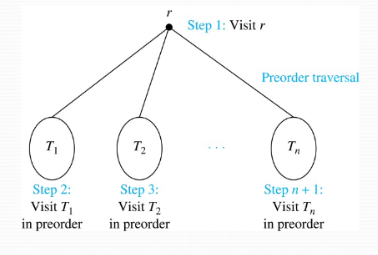
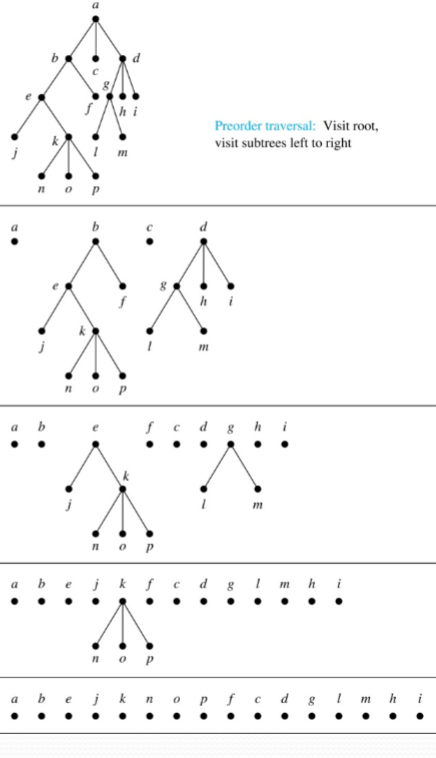
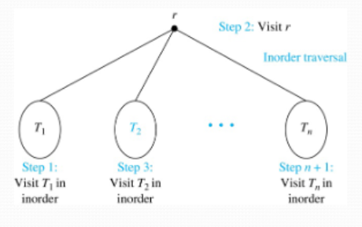
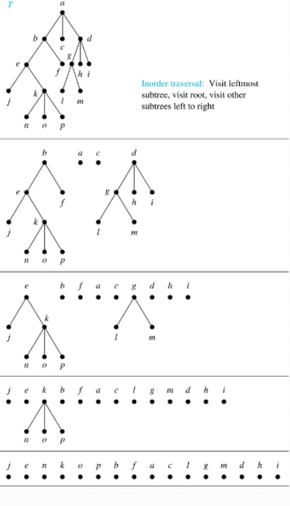
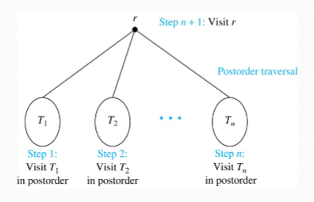
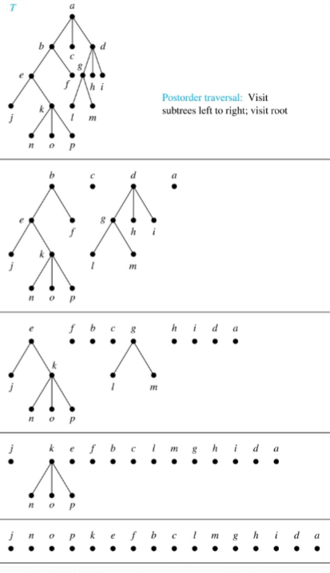
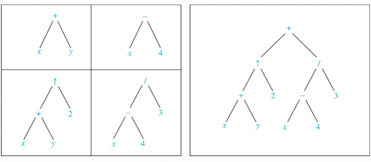
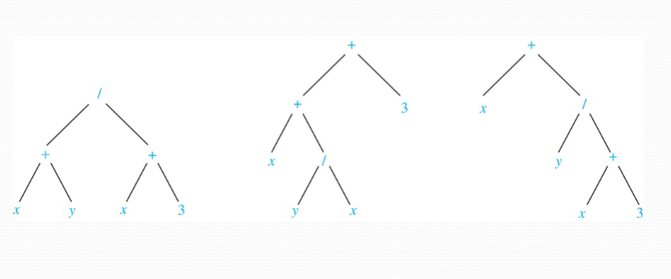
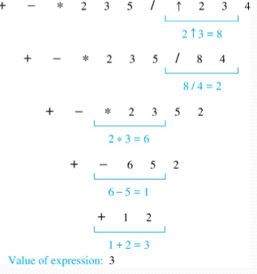
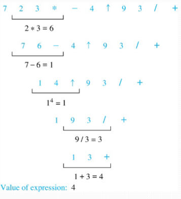

## Tree Traversal

_Traversals_ refer to the procedures for systematically visiting every vertex of an ordered tree. The three most commonly used traversals are _preorder traversal_, _inorder traversal_, and _postorder traversal_.

### Preorder Traversal

**Definition:** Let $T$ be an ordered rooted tree with root $r$. If $T$ consists of only $r$, then $r$ is the _preorder traversal_ of $T$. Otherwise, suppose that $T_{1},T_{2},\dots,T_{n}$ are the subtrees of $r$ from left to right in $T$. The preorder traversal begins by visiting $r$, and continues traversing $T_{1}$ in preorder, then $T_{2}$ in preorder, and so on, until $T_{n}$ is traversed in preorder.



Pseudocode w/ illustration:

```pseudo
\begin{algorithm}
\caption{Preorder Traversal}
\begin{algorithmic}
  \Procedure{Preorder}{$T$}
    \State $r \gets$ root of $T$
    \State list $r$
    \For{each child $c$ of $r$ from left to right}
      \State $T(c) \gets$ subtree with $c$ as root
      \State \Call{Preorder}{$T(c)$}
    \EndFor
  \EndProcedure
\end{algorithmic}
\end{algorithm}
```



### Inorder Traversal

**Definition:** Let $T$ be an ordered rooted tree with root $r$. If $T$ consists only of $r$, then $r$ is the _inorder traversal_ of $T$. Otherwise, suppose that $T_{1},T_{2},\dots,T_{n}$ are the subtrees of $r$ from left to right in $T$. The inorder traversal begins by traversing $T_{1}$ in inorder, then visiting $r$, and continues by traversing $T_{2}$ in inorder, and so on until $T_{n}$ is traversed in inorder.



Pseudocode w/ illustration:

```pseudo
\begin{algorithm}
\caption{Inorder Traversal}
\begin{algorithmic}
  \Procedure{Inorder}{$T$}
    \State $r \gets$ root of $T$
    \If{$r$ is a leaf}
      \State list $r$
    \Else
      \State $l \gets$ first child of $r$ from left to right
      \State $T(l) \gets$ subtree with $l$ as its root
      \State \Call{Inorder}{$T(l)$}
      \State list $r$
      \For{each child $c$ of $r$ from left to right}
        \State $T(c) \gets$ subtree with $c$ as root
        \State \Call{Inorder}{$T(c)$}
      \EndFor
    \EndIf
  \EndProcedure
\end{algorithmic}
\end{algorithm}

```



### Postorder Traversal

**Definition:** Let $T$ be an ordered rooted tree with root $r$. If $T$ consists only of $r$, then $r$ is the _postorder traversal_ of $T$. Otherwise, suppose that $T_{1},T_{2},\dots,T_{n}$ are the subtrees of $r$ from left to right in $T$. The postorder traversal begins by traversing $T_{1}$ in postorder, then $T_{2}$ in postorder, and so on, after $T_{n}$ is traversed in postorder, $r$ is then visited.



Pseudocode w/ illustration:

```pseudo
\begin{algorithm}
\caption{Postorder Traversal}
\begin{algorithmic}
  \Procedure{Postordered}{$T$}
    \State $r \gets$ root of $T$
    \For{each child $c$ of $r$ from left to right}
      \State $T(c) \gets$ subtree with $c$ as root
      \State \Call{Postordered}{$T(c)$}
    \EndFor
    \State list $r$
  \EndProcedure
\end{algorithmic}
\end{algorithm}

```




### Expression Trees

Complex expressions can be represented using ordered rooted trees.

Consider the expression $((x+y)\uparrow 2)+\left( \frac{x-4}{3} \right)$.
- A binary tree for the expression can be built from the bottom up, as is illustrated below:



### Infix Notation

An inorder traversal of the tree representing an expression produces the original expression when parentheses are included except for unary operations, which now immediately follow their operands.

We can illustrate why parentheses are needed with an example that displays three trees that all yield the same infix representation:



### Prefix Notation

When we traverse the rooted tree representation of an expression in preorder, we obtain the _prefix_ form of the expression. Expressions in prefix form are said to be in _Polish notation_, named after the Polish logician Jan Lukasiewicz.

Operators precede their operands in the prefix form of an expression. Parentheses are not needed as the representation is unambiguous.

The prefix form of $((x+y)\uparrow 2)+\left( \frac{x-4}{3} \right)$ is $+~\uparrow~+~x~y~2~/~-~x~4~3$.

Prefix expressions are evaluated by working from right to left. When we encounter an operator, we perform the corresponding operation with the two operations to the right.

**Example:** Here, we show the steps used to evaluate a particular prefix expression:



### Postfix Notation

We obtain the _postfix_ form of an expression by traversing its binary trees in postorder. Expressions written in postfix form are said to be in _reverse Polish notation_.

Parentheses are not needed as the postfix form is unambiguous.

For instance, $x~y~+~2~\uparrow~x~4~-~3~/~+$ is the postfix form of $((x+y)\uparrow2)+\left( \frac{x-4}{3} \right)$.

A binary operator follows its two operands. So, to evaluate an expression, one works from left, carrying out an operation represented by an operator on its preceding operands.

**Example:** Here, we show the steps used to evaluate a particular postfix expression:




