## Spanning Trees

### Spanning Trees

**Definition:** Let $G$ be a simple graph. A spanning tree of $G$ is a subgraph of $G$ that is a tree containing every vertex of $G$.

**Theorem:** A simple graph is connected if and only if it has a spanning tree.

#### Example

**Problem:** Find the spanning tree of this simple graph:

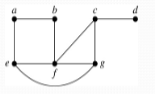

**Solution:** The graph is connected, but is not a tree because it contain simple circuits.

(a) Remove the edge $\{a,e\}$:

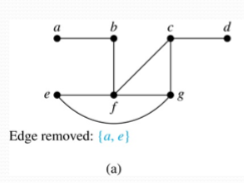

Now, one simple circuit is gone, but the remaining subgraph still has a simple circuit. 

(b) Remove the edge $\{e,f\}$: 


(c) Finally, remove the edge $\{c,g\}$:

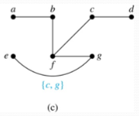

Now, we have a simple graph with no simple circuits. Thus, it is a spanning tree because it contains every vertex of the original graph.

### Depth-First Search

To build a spanning tree using depth-first search in a connected, simple graph, start by choosing any vertex as the root. The steps are then:
1. Form a path starting at this vertex by successively adding vertices and edges, where each new edge is incident with the last vertex in the path and a vertex not already in the path. Continue adding vertices and edges to this path as long as possible.
2. If the path goes through all vertices of the graph, the tree consisting of this path is a spanning tree.
3. Otherwise, move back to the next to the last vertex in the path, and if possible, form a new path starting at this vertex and passing through vertices not already visited. If this cannot be done, move back another vertex in the path.
4. Repeat this procedure until all vertices are included in the spanning tree.

#### Example

**Example:** Use depth-first search to find a spanning tree of this graph:

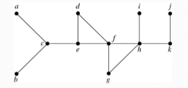

**Solution:** 

(a) We start arbitrarily with vertex $f$. 

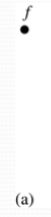

(b) We build a path by successively adding an edge that connects the last vertex added to the path and a vertex not already in the path, as long as this is possible. 

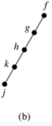

The result is a path that connects $f,g,h,k,$ and  $j$. 

Next, we return to $k$, but find no new vertices to add. 

(c) So, we return to $h$ and add the path with one edge that connects $h$ and $i$. 

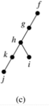

(d) We next return to $f$, and add the path connecting $f,d,e,c,$ and $a$. 

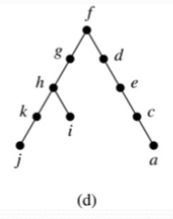

(e) Finally, we return to $c$ and add the path connecting $c$ and $b$. 

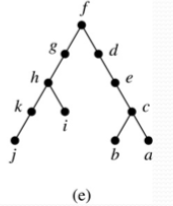

All vertices have been added.

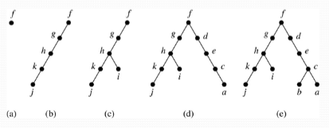

### Depth-First Search Continued

#### Tree Edges

The edges selected by depth-first search of a graph are called _tree edges_. All other edges of the graph must connect a vertex to an ancestor or descendant of the vertex in the graph. These are called _back edges_.

In the following figure, the tree edges are shown with heavy blue lines, and the back edges are the two thin black lines:

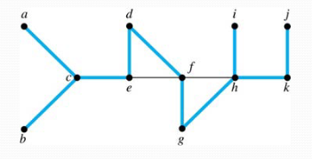

#### DFS Algorithm

Let's use pseudocode to specify DFS. In this recursive algorithm, after adding an edge connecting a vertex $v$ to the vertex $w$, we finish exploring $w$ before we return to $v$ to continue exploring from $v$.


```pseudo
\begin{algorithm}
\caption{Depth-First Search}
\begin{algorithmic}
  \Procedure{DFS}{$G$} \Comment{G: connected graph with vertices \(v_1, v_2, \dots, v_n\)}
    \State \(T \gets\) tree consisting only of the vertex \(v_1\)
    \State \Call{Visit}{$v_1$}
  \EndProcedure
  
  \Procedure{Visit}{$v$} \Comment{v: vertex of G}
    \For{each vertex \(w\) adjacent to \(v\) and not yet in \(T\)}
      \State Add vertex \(w\) and edge \(\{v,w\}\) to \(T\)
      \State \Call{Visit}{$w$}
    \EndFor
  \EndProcedure
\end{algorithmic}
\end{algorithm}
```

### Breadth-First Search

We can construct a spanning tree using _breadth-first search_. 

1. We first arbitrarily choose a root from the vertices of the graph.
2. We add all of the edges incident to this vertex and other endpoint of each of these edges. We say that these are the vertices at level 1.
3. For each vertex added at the previous level, we add each edge incident to this vertex, as long as it does not produce a simple circuit. The new vertices we find are the vertices at the next level.
4. We continue in this manner until all the vertices have been added and we have a spanning tree.

#### DFS in Directed Graphs

Both depth-first search and breadth-first search can be easily modified to run on a directed graph. But the result is not necessarily a spanning tree, but a spanning forest.

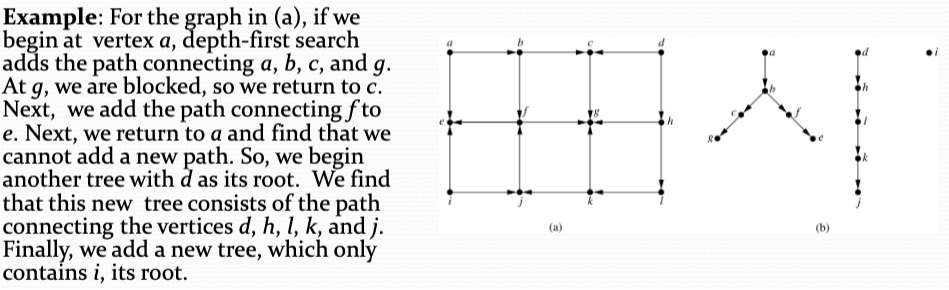

#### Example

**Problem:** Use breadth-first search to find a spanning tree for this graph:

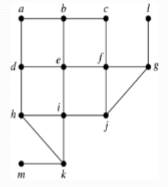

**Solution:** 

(a) We arbitrarily choose vertex $e$ as the root.


(b) We then add the edges from $e$ to $b,d,f,$ and $i$. 

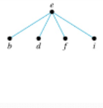

These four vertices make up level 1 in the tree.

(c) Next, we add the edges from $b$ to $a$ and $c$, the edges $d$ to $h$, the edges from $f$ to $j$ and $g$, and the edge from $i$ to $k$.

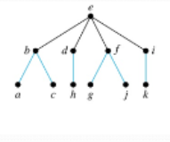

The endpoints of these edges not at level 1 are at level 2.

(d) Next, add edges from these vertices to adjacent vertices not already in the graph.

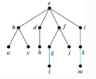

We added edges from $g$ to $l$ and $k$ to $m$. 

We see that level 3 is made up of the vertices $l$ and $m$. This is the last level because there are no new vertices to find.

#### Algorithm

We can use pseudocode to describe breadth-first search:

```pseudo
\begin{algorithm}
\caption{Breadth-First Search}
\begin{algorithmic}
  \Procedure{BFS}{$G$} \Comment{G: connected graph with vertices \(v_1, v_2, \dots, v_n\)}
    \State \(T \gets\) tree consisting only of the vertex \(v_1\)
    \State \(L \gets\) empty list with \(v_1\)
    \State put \(v_1\) in the list \(L\) of unprocessed vertices
    \While{\(L\) is not empty}
      \State remove the first vertex, \(v\), from \(L\)
      \For{each neighbor \(w\) of \(v\)}
        \If{\(w\) is not in \(L\) and not in \(T\)}
          \State add \(w\) to the end of the list \(L\)
          \State add \(w\) and edge \(\{v,w\}\) to \(T\)
        \EndIf
      \EndFor
    \EndWhile
  \EndProcedure
\end{algorithmic}
\end{algorithm}
```
