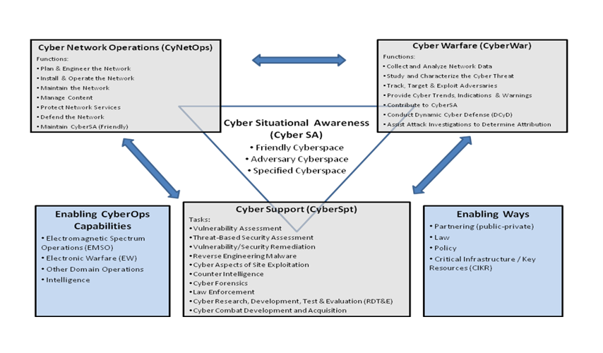

### Cyber Operation Components

There are **4** main components of a cyber operation:
1. Cyber Situational Awareness (CyberSA)
2. Cyber Network Operations (CyberNetOps)
3. Cyberwarfare (CyberWar)
4. Cyber Support (CyberSpt)

These components do not have to follow a specific order.

