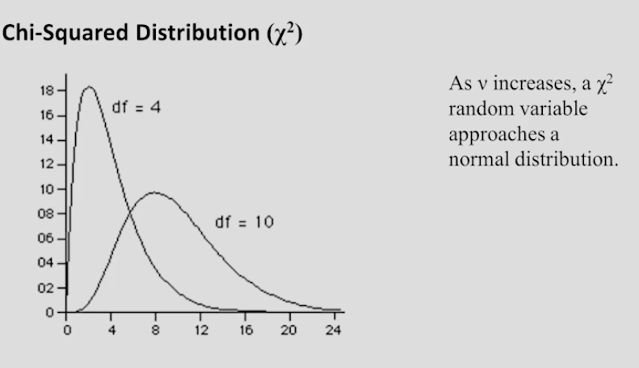

## Using Table A.5

Let's see how we can use [Table A.5](Table%20A5%20-%20Critical%20Values%20of%20the%20Chi%20Squared%20Distribution.pdf) to find probabilities and limits for a chi-squared random variable.

Remember, we stated that a $\chi^2$ random variable can only take non-negative values and its shape depends on our degrees of freedom, $\nu$.

It is important to note that for both distributions $df=4$ and $df=10$, the area under the curve is still 1. 

Here's Table A.5:
Notice that the vertical column gives us different values for degrees of freedom and the horizontal rows represent different values for $\alpha$ (alpha). $\alpha$ is the shaded region within our curve.

Let's see how the table works in action.

## Examples

### Areas to the Right

#### Example 1: 

Let $\chi^2$ denote a random variable that has a chi-squared distribution with 8 degrees of freedom. 

Determine $P(\chi^2\geq 13.362)$.

#### Solution

If we attempt to look for $13.362$ on the first page (739) within $\nu$ column 8, we don't see it. Therefore, we need to search through the next page. 

We find $13.362$ at $\nu$ column 8 with $\alpha$ row $0.10$, meaning the probability that our chi-squared distribution is greater than or equal to $13.362$ is $.10$ or $10\%$.

#### Example 2: 

Let $\chi^2$ denote a random variable that has a chi-squared distribution with 8 degrees of freedom.

Determine $P(3.490\leq \chi^2\leq 13.362)$

#### Solution:

In this case, we still have 8 degrees of freedom, but we want to find the area in between values $3.490$ and $13.362$. 

In our previous solution, we found $.10$ is the small area to the right of $13.362$. We can use the table with this in mind to find the other value, $3.490$.

We notice $3.490$ is found at $\nu=8$ and $\alpha=0.90$. Now we know that the area from $3.490$ to $\infty$ is $0.90$. Since we want to stop at $13.362$, we must take the difference.

$P(3.490\leq \chi^2\leq 13.362)=0.90-0.10=0.80$ or $80\%$

This time, let's work backwards to find the limit of the variable.

#### Example 3:

Let $\chi^2$ denote a random variable that has a chi-squared distribution with 8 degrees of freedom.

Determine the limit $\chi_{0.01}^2$

#### Solution:

It is important to understand that $0.01$ is our area to the right.

Then, we can simply find the column where $\nu=8$ and the row where $\alpha=0.01$. This leads us to the limit $20.090$.

Thus, $\chi_{0.01}^2=20.090$

#### Example 4: 

Let $\chi^2$ denote a random variable that has a chi-squared distribution with 8 degrees of freedom.

Determine the limit $a$ so that $P(\chi^2\geq a)=0.02$

#### Solution:
This time around, we want to find the limit where $\nu=8$ and $a=0.02$. After locating this position, we'll find the limit value of $18.168$.

Therefore, $P(\chi^2\geq 18.168)=0.02$

- - -
### Areas to the Left

#### Example 5: 

Let $\chi^2$ denote a random variable that has a chi-squared distribution with 8 degrees of freedom.

Determine the limit $b$ so that $P(\chi^2\leq b)=0.02$

#### Solution:

We're looking for an area to the left, $b$, such that the area to the left is $0.02$. Just like with a normal distribution, we'll need to take the complement to get our $\alpha$ value.

$1-0.02=0.98$

$\nu=8$ and $\alpha=0.98$ contains the value $2.032$

Thus, $P(\chi^2\leq 2.032)=0.02$

#### Example 6:

Let $\chi^2$ denote a random variable that has a chi-squared distribution with 8 degrees of freedom.

Determine the limits $a$ and $b$ so that $P(a\leq \chi^2\leq b)=0.90$ is centrally located.
#### Solution:

Centrally located means that $0.90$ is in the middle of our curve, and the additional $0.10$/$10\%$ is split in half in both of our tails (_0.05_    **0.90**    _0.05_). We need to look for the limit $0.90+0.05=0.95$ when we have a freedom of 8.

On the table, we'll find $2.733$. Therefore, $a=2.733$. 

For $b$, we can use $\nu=8$ and $\alpha=0.05$, which gives us $b=15.507$.

We can conclude that $P(2.733\leq \chi^2\leq 15.507)=0.90$.

