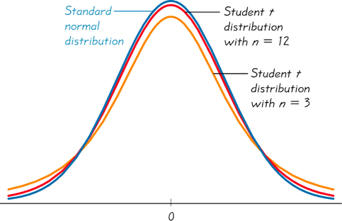

## Using Table A.4

Similar to the standard normal distribution curve, the $t$ distribution curve is bell-shaped, symmetric, and centered at 0.

We learned that the $t$ distribution has a standard deviation larger than 1. 

The shape of a $t$ distribution is dependent on the degrees of freedom, $\nu=n-1$. For instance, if we have a $t$ distribution with $n=12$, $\nu$ would be $11$.

As $\nu$ increases, a $t$ distribution approaches the standard normal distribution.

Here's Table A.4: 
The critical values of the $t$ distribution are given in the body of the table. This means they're limits of the $t$ distribution such that the $\alpha$ is equivalent to the area to the right.

Once again, our column gives us our degree of freedom $\nu$. However, we need to remember that because we are dealing with $t$ distributions, our degree of freedom is $n-1$.

Let's use it for some simple examples:

## Examples

### Area to the Right

#### Example 1:

Let $T$ have a $t$ distribution with 15 degrees of freedom.

Determine $P(T\geq 2.249)$

#### Solution:

At $\nu=15$ on the second page, we find our value $2.249$ at $\alpha=0.02$.

Therefore, $P(T\geq 2.249)=0.02$

- - -

#### Example 2:

Let $T$ have a $t$ distribution with 15 degrees of freedom.

Determine $P(T\geq 2.131)$

#### Solution:

At $\nu=15$ on the first page, we find our value $2.131$ at $\alpha=0.025$

Therefore, $P(T\geq 2.131)=0.025$

> [!note]
> Because we are looking for an area to the right, we can access the $\alpha$ value directly as it is.

- - -

#### Example 3:

Let $T$ have a $t$ distribution with 15 degrees of freedom.

Determine the limit $t_{0.01}$

#### Solution:

Remember, the subscript tells us our area to the right, meaning $\alpha=0.01$.

At $\nu=15$ and $\alpha=0.01$, we find the value $2.602$.

Therefore, $t_{0.01}=2.602$

- - -

Here's a problem similar to Example 3:

#### Example 4:

Let $T$ have a $t$ distribution with 15 degrees of freedom. 

Determine the limit $t_{0}$ so that $P(T\geq t_{0})=0.05$

#### Solution

At $\nu=15$ and $\alpha=0.05$, we find $1.753$.

Thus, $t_{0}=1.753$

- - -
### Areas to the Left

#### Example 5:

Let $T$ have a t distribution with 22 degrees of freedom.

Determine $P(T\leq 3.119)$
#### Solution:

First, we need to find the $\alpha$ value at $\nu=22$ where $3.119$ is located. We should find $0.0025$. Now, since we're dealing with an area to the left, we need to take the complement, giving us $1-0.0025=0.9975$

Therefore, $P(T\leq 3.119)=0.9975$

- - -

#### Example 6:

Let $T$ have a $t$ distribution with 15 degrees of freedom. 

Determine the limit $t_{0}$ so that $P(T\leq t_{0})=0.10$

#### Solution:

This time we need to find $t_{0}$ such that the area to the left is $0.10$. Since the table doesn't work with negatives, we can again apply the property of symmetry. Because we know the curve is symmetric, the left and right tails are identical. Thus, both tails are $0.10$. 

First, we need to locate the value at $\nu=15$ and $\alpha=0.10$. We should find $1.341$. However, we're searching for an area to the left, so we need to use the property of symmetry again to make this value negative.

Therefore, $t_{0}=-1.341$

- - -

#### Example 7:

Let $T$ have a $t$ distribution with 15 degrees of freedom.

Determine the limit $t_{0}$ so that $P(-t_{0}\leq T\leq t_{0})=0.95$

#### Solution:

In this case, our centrally located area between $-t_{0}$ and $t_{0}$ is $0.95$.

Since the area is $0.95$, both of our tails are $\frac{0.05}{2}=.025$. This also means $\alpha=.025$

At $\nu=15$ and $\alpha=.025$ in the table, we find the value $2.131$. Applying the property of symmetry once again, we know that if $t_{0}=2.131$, then $-t_{0}=-2.131$.

Therefore, $P(-2.131\leq T\leq 2.131)=0.95$

