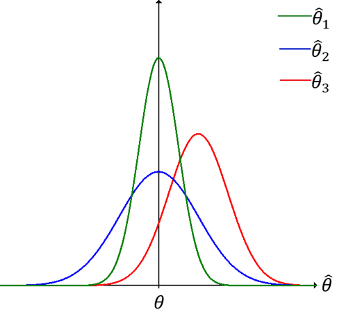

## Variance of a Point Estimator

If $\hat{\theta}_{1}$ and $\hat{\theta}_{2}$ are both unbiased estimators of $\theta$, which one of these two statistics should we use to estimate $\theta$? We should use the one with the **smallest variance**.

We should choose to use the unbiased estimator whose sampling distribution has the smallest variance.

If $\sigma^2 \hat{\theta}_{1}<\sigma^2\hat{\theta}_{2}$, we say $\hat{\theta}_{1}$ is a more efficient estimator of $\theta$ than $\hat{\theta}_{2}$. Among all possible unbiased estimators of an unknown parameter, $\theta$, the most efficient estimator of $\theta$ is the statistic that has the smallest variance.

This figure shows the sampling distributions of 3 different estimators, $\hat{\theta}_{1}, \hat{\theta}_{2}$, and $\hat{\theta}_{3}$, of the unknown parameter $\theta$. Analyzing the figure, we can determine:

- $\hat{\theta}_{1}$ and $\hat{\theta}_{2}$ are unbiased estimators of $\theta$, since both distributions are centered at $\theta$.
- $\hat{\theta}_{3}$ is a biased estimator of $\theta$, since is distribution is centered above $\theta$.
- $\hat{\theta}_{1}$ has a smaller variance than $\hat{\theta}_{2}$, therefore $\hat{\theta}_{1}$ is more efficient.

Based on the figure above, our choice to estimate $\theta$ would be $\hat{\theta}_{1}$.

For normal populations, we can show that both the sample mean, $\overline x$, and the sample median $\tilde{x}$, are unbiased estimators of the population mean, $\mu$. The variance of $\overline x$ is smaller than the variance of $\tilde{x}$. Thus, both estimates $\overline x$ and $\tilde{x}$ will, on average, equal the population mean, $\mu$, but $\overline x$ is more likely to be closer to $\mu$ for a given sample, and thus $\overline x$ is more efficient than $\tilde{x}$.

### Example

**Problem:** Let $x_{1},x_{2},x_{3}$ be iid random variables with $E(x_{i})=\mu$ and $Var(x_{i})=\sigma^2$. Also, let
$$\hat{\theta}_{1}=\frac{1}{2}x_{1}+\frac{1}{4}x_{2}+\frac{1}{4}x_{3}$$

and

$$\hat{\theta}_{2}=\frac{1}{3}x_{1}+\frac{1}{3}x_{2}+\frac{1}{3}x_{3}$$

**a)** Show that $\hat{\theta}_{1}$ and $\hat{\theta}_{2}$ are both unbiased estimators of $\mu$.
**b)** Which of these estimators is more efficient?

**Solution:**

**a)**
$E(\hat{\theta}_{1})=E(\frac{1}{2}x_{1}+\frac{1}{4}x_{2}+\frac{1}{4}x_{3})$
$=\frac{1}{2}E(x_{1})+\frac{1}{4}E(x_{2})+\frac{1}{4}E(x_{3})$
$=\frac{1}{2}\mu+\frac{1}{4}\mu+\frac{1}{4}\mu$
$= \mu$

$E(\hat{\theta}_{2})=E(\frac{1}{3}x_{1}+\frac{1}{3}x_{2}+\frac{1}{3}x_{3})$
$=\frac{1}{3}E(x_{1})+\frac{1}{3}E(x_{2})+\frac{1}{3}E(x_{3})$
$=\frac{1}{3}\mu+\frac{1}{3}\mu+\frac{1}{3}\mu$
$= \mu$

Both $\hat{\theta}_{1}$ and $\hat{\theta}_{2}$ are unbiased estimators of $\mu$.

**b)**
$Var(\hat{\theta}_{1})=Var(\frac{1}{3}x_{1}+\frac{1}{3}x_{2}+\frac{1}{3}x_{3})$
$=(\frac{1}{3})^2Var(x_{1})+(\frac{1}{3})^2Var(x_{2})+(\frac{1}{3})^2Var(x_{3})$
$= (\frac{1}{9})\sigma^2+(\frac{1}{9})\sigma^2+(\frac{1}{9})\sigma^2$
$= \frac{1}{3}\sigma^2$

Since $\frac{3}{8}>\frac{1}{3},\sigma_{\hat{\theta}_{1}}^2>\sigma_{\hat{\theta}_{2}}^2$ and $\hat{\theta}_{2}$ is the more efficient estimator.