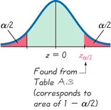
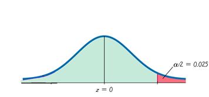
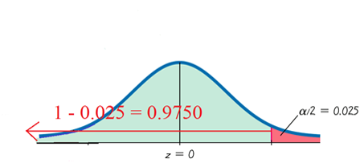

## Confidence Level of Critical Values

### Confidence Level

A **confidence level** is the probability that the confidence interval actually does contain the population parameter, assuming that the estimation process is repeated a large number of times. A confidence level is often expressed as a percentage value. 

**Common levels of confidence include $90\%$, $95\%$, or $99\%$.**

Alpha, $\alpha$, is probability that the confidence interval does not contain the population parameter and is the complement of the confidence level. If the confidence level is $90\%$, then $\alpha=1-0.90=0.10=10\%$.

So, 

$$\alpha=1-\mathrm{Confidence~Level}$$

Therefore,

$$90\% \mathrm{~Confidence} \to \alpha = 1 - 0.90 = 0.10 = 10\%$$
$$95\% \mathrm{~Confidence} \to \alpha = 1 - 0.95 = 0.05 = 5\%$$
$$90\% \mathrm{~Confidence} \to \alpha = 1 - 0.90 = 0.01 = 1\%$$

### Critical Value

A **critical value** is a number that separates sample statistics that are likely to occur from those that are unlikely to occur in the sampling distribution. The number $Z_{\frac{\alpha}{2}}$ is a specific critical value that is a Z-value with the property that it separates an area of $\frac{\alpha}{2}$ in the right tail of the standard normal distribution.

To Find $Z_{\frac{\alpha}{2}}$:
1. Use the given confidence level to calculate $\alpha$
2. Divide $\alpha$ by 2
3. Draw the standard normal distribution curve and designate the quantity of $\frac{\alpha}{2}$ as the area in the right tail
4. Calculate the area to the left of $Z_{\frac{\alpha}{2}}$ as $1-\frac{\alpha}{2}$
5. Use the area to the left and [[Table A3 - Areas under the Normal Curve 1.pdf|Table A3]] to look up the corresponding Z-value

The subscript $\frac{a}{2}$ is simply a reminder that the Z-value separates an area of $\frac{\alpha}{2}$ in the right tail of the standard normal distribution.

## Examples

#### Example 1

**Problem:** Find $Z_{\frac{\alpha}{2}}$ for a $95\%$ confidence interval.

**Solution:**

1. $\alpha=1-\mathrm{Confidence~Level}=1-0.95=0.05$
2. $\frac{\alpha}{2}=\frac{0.05}{2}=0.025$
3. Draw the standard normal distribution curve:

4. The area to the left is the complement of the area to the right, therefore our area to the left is $1-\frac{\alpha}{2}=1-0.025=0.975$

5. Look for the closest value to $0.9750$ inside [[Table A3 - Areas under the Normal Curve 1.pdf|Table A3]], which leads to an exact match. The Z-value at this position is $1.96$.

Therefore, the $Z_{\frac{\alpha}{2}}$ for a $95\%$ confidence interval is $1.96$
#### Example 2

**Problem:** Find $Z_{\frac{\alpha}{2}}$ for a $99\%$ confidence interval.

**Solution:**

1. $\alpha=1-\mathrm{Confidence~Level}=1-0.99=0.01$
2. $\frac{\alpha}{2}=\frac{0.01}{2}=0.005$
3. Draw the sketch...
4. The area to the left is the complement: $1-\frac{\alpha}{2}=1-0.005=0.9950$
5. Look for the closest value to $0.9950$ in [[Table A3 - Areas under the Normal Curve 1.pdf|Table A3]]. We find $0.9949$ and $0.9951$ that are both 1 away. Therefore, we'll take the mean of the two: $\frac{2.57+2.59}{2}=2.575$

Therefore, the $Z_{\frac{\alpha}{2}}$ for a $99\%$ confidence level is $2.575$

#### Example 3

**Problem:** Find $Z_{\frac{\alpha}{2}}$ for a $90\%$ confidence interval.

**Solution:**

1. $1-0.90=0.10$
2. $\frac{\alpha}{2}=\frac{0.10}{2}=0.05$
3. $1-\frac{\alpha}{2}=1-0.05=0.9500$
4. $\frac{1.64+1.65}{2}=1.645$

Therefore, the $Z_{\frac{\alpha}{2}}$ for a $90\%$ confidence level is $1.645$