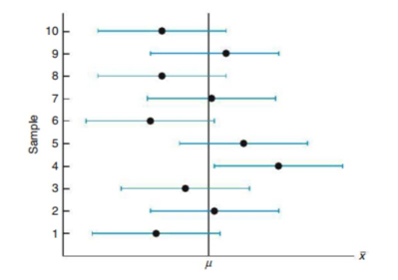

## Confidence Interval for Mean - Sigma Known

#### Notation:

| Sign                   | Meaning                                                                                                                   |
| ---------------------- | ------------------------------------------------------------------------------------------------------------------------- |
| $n$                    | Sample Size                                                                                                               |
| $\mu$                  | Population Mean (unknown population parameter)                                                                            |
| $\alpha$               | Population Standard Deviation (known)                                                                                     |
| $\overline x$          | Sample Mean                                                                                                               |
| $Z_{\frac{\alpha}{2}}$ | $Z$-value separating an area of $\frac{\alpha}{2}$ in the right tail of the standard normal distribution (critical value) |
#### Population Proportion Confidence Interval:

##### Requirements:

1. The sample is a random sample
2. The value of the population standard deviation $\sigma$ is _known_
3. Either or both of the following conditions are satisfied: 
	a) The population is normally distributed
	b) The sample size is greater than 30, $n>30$

#### Confidence Interval for $\mu$ when $\sigma$ is known:

The sample mean, $\overline x$, is the most efficient estimator of the population mean. Recall from the [[(M10.2.2) Central Limit Theorem]], the sampling distribution of $\overline x$ is approximately normally distributed with a mean $\mu_{\overline x}=\mu$ and standard deviation $\sigma_{\overline x}=\frac{\sigma}{\sqrt{ n }}$. Using our definition for $Z_{\frac{\alpha}{2}}$, we can say

$$P(-Z_{\frac{\alpha}{2}}<Z<Z_{\frac{\alpha}{2}})=1-\alpha$$

where $Z=\frac{\overline x - \mu}{\frac{\sigma}{\sqrt{ n }}}$ from the Central Limit Theorem.

Hence,

$$P(-Z_{\frac{\alpha}{2}}<\frac{\overline x - \mu}{\frac{\sigma}{\sqrt{ n }}}<Z_{\frac{\alpha}{2}})=1-\alpha$$

Which is algebraically equivalent to 

$$P(\overline x-Z_{\frac{\alpha}{2}}\frac{\sigma}{\sqrt{ n }}<\mu<\overline x+Z_{\frac{\alpha}{2}}\frac{\sigma}{\sqrt{ n }})=1-\alpha$$

- - -

**Definition:** If $\overline x$ is the mean of the random sample of size $n$ from a population with known variance $\sigma^2$, a $100(1-\alpha)\%$  confidence interval for $\mu$ is given by

$$\overline x-Z_{\frac{\alpha}{2}}(\frac{\sigma}{\sqrt{ n }})<\mu<\overline x+Z_{\frac{\alpha}{2}}(\frac{\sigma}{\sqrt{ n }})$$

where $Z_{\frac{\alpha}{2}}$ is the Z-value with an area of $\frac{\alpha}{2}$ to the right.

Hence, we have defined $\hat{\theta}_{L}$ and $\hat{\theta}_{U}$ as

$$\hat{\theta}_{L}=\overline x-Z_{\frac{\alpha}{2}}(\frac{\sigma}{\sqrt{ n }})$$

$$\hat{\theta}_{U}=\overline x+Z_{\frac{\alpha}{2}}(\frac{\sigma}{\sqrt{ n }})$$

This interval only applies if $n$ is larger than 30 or our population of interest is normally distributed. If a small sample is taken ($n<30$) from a non-normal population, we cannot use this confidence interval.

Remember that _different samples_ yield _different values_ for x-bar and thus difference confidence intervals. Assume 10 different samples of the same size are taken from a population with mean $\mu$ and the $95\%$ confidence interval for $\mu$ is computed for each sample. The 10 intervals are each represented in the figure below.

- The dots at the center of each interval represents that value of a sample mean for a particular sample. 

- Each interval is of equal width because we have held the population standard deviation, sample size, and confidence level the same. 

- Notice. that 9 our of 10 intervals actually capture the true value of the population mean. 

- We can interpret the confidence level as if many different samples are selected $95\%$ of the corresponding confidence intervals will actually contain the true value of the population mean. 

- The other $5\%$ ($\alpha$) will have made an error by not capturing the true value. 

- Since we do not know the true value of $\mu$, we never know which intervals captured the true value and which do not. 

- Therefore, we only know that we are $95\%$ confident in our interval.