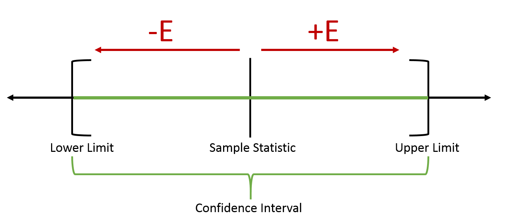

## Interpretation and Margin of Error

As previously stated, different samples will yield different vales for $\overline x$ and thus different confidence intervals. Also, different confidence levels will yield different confidence intervals for the same sample.

### Example

**Problem:** The average Zinc concentration recovered from a sample of measurements taken in 36 different locations in a river is found to be 2.6 grams per milliliter. Find the $95\%$ and $99\%$ confidence intervals for the mean Zinc concentration in the river. Assume the population standard deviation is 0.3 grams per milliliter.

**Solution:** 

$n=36$
$\overline x=2.6$ grams per milliliter
$\sigma=0.3$ grams per milliliter

$95\%\mathrm{~Confidence~Interval}: Z_{\frac{\alpha}{2}}=1.96$:

$$\overline x-Z_{\frac{\alpha}{2}}(\frac{\sigma}{\sqrt{ n }})<\mu<\overline x + Z_{\frac{\alpha}{2}}(\frac{\sigma}{\sqrt{ n }})$$

$$2.6-1.96(\frac{0.3}{\sqrt{ 36 }})<\mu<2.6+1.96(\frac{0.3}{\sqrt{ 36 }})$$

$$2.50<\mu<2.70$$

$99\%\mathrm{~Confidence~Interval}: Z_{\frac{\alpha}{2}}=1.96:$

$$\overline x-Z_{\frac{\alpha}{2}}(\frac{\sigma}{\sqrt{ n }})<\mu<\overline x + Z_{\frac{\alpha}{2}}(\frac{\sigma}{\sqrt{ n }})$$

$$2.6-1.96(\frac{0.3}{\sqrt{ 36 }})<\mu<2.6+1.96(\frac{0.3}{\sqrt{ 36 }})$$

$$2.47<\mu<2.73$$

- - -

Notice that the $99\%$ confidence interval is longer. It takes a longer confidence interval to estimate $\mu$ with a higher degree of confidence.

The length or width of a confidence interval is determined by the margin of error:

$$E=Z_{\frac{\alpha}{2}}(\frac{\sigma}{\sqrt{ n }})$$

**Theorem:** If $\overline x$ is used as an estimate of $\mu$, we can be $100(1-\alpha)\%$ confident that the error will not exceed $Z_{\frac{\alpha}{2}}(\frac{\sigma}{\sqrt{ n }})$.

- - -

Generally, for any confidence interval built using a sample statistic to estimate an unknown population parameter, the following figure illustrates the relationship between the margin of error.

The margin of error can be denoted as $E$ or $e$. We'll use the former.