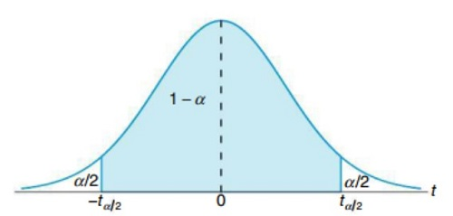

## $t$ Critical Values

Remember the following definitions:

- A **confidence level** is the probability that the confidence interval actually does contain the population parameter, assuming that the estimation process is repeated a large number of times.
- **Alpha $(\alpha)$** is the probability that the confidence interval does not contain the population parameter and is the complement of the confidence level.
- A **critical value** is a number that separates sample statistics that are likely to occur from those that are unlikely to occur in the sampling distribution

**Common Confidence Levels are $90\%, 95\%$, or $99\%$ and $\alpha=1-\mathrm{Confidence~Level}$**

$90\%\mathrm{~Confidence}\to a=1-0.90=0.10=10\%$\
$95\%\mathrm{~Confidence}\to a=1-0.95=0.05=5\%$\
$99\%\mathrm{~Confidence}\to a=1-0.99=0.01=1\%$

The number $t_{\frac{\alpha}{2}}$ is a specific critical value that is a $T$-value with the property that it separates an area of $\frac{\alpha}{2}$ in the right tail of a $t$ distribution with $\nu=n-1$ degrees of freedom.

To find $t_{\frac{\alpha}{2}}$:
1. Use the given confidence level to calculate $\alpha$
2. Divide $\alpha$ by 2
3. Calculate the degrees of freedom, $\nu=n-1$
4. Use the area to the right of $\frac{\alpha}{2},\nu,$ and [Table A.4](./Resources/Table%20A4%20-%20Critical%20Values%20of%20the%20t%20Distribution.pdf) to look up the corresponding $t$ critical value

### Example

**Problem:** Find $t_{\frac{\alpha}{2}}$ for a $95\%$ confidence interval and a sample size of $12$

**Solution:**
1. $\alpha=1=\mathrm{Confidence~Level}=1-0.95=0.05$
. $\frac{\alpha}{2}=\frac{0.05}{2}=0.025$
3. $\nu=n-1=12-1=11$
4. At $\nu=11$ and $\alpha=0.025$ on [Table A.4](./Resources/Table%20A4%20-%20Critical%20Values%20of%20the%20t%20Distribution.pdf), we find the value $2.201$

Therefore, $t_{\frac{\alpha}{2}}=2.201$
