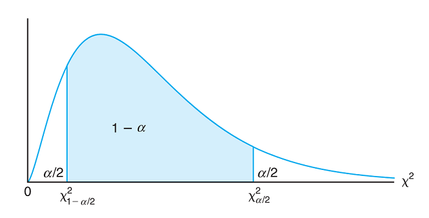

## Chi-Squared Critical Values

Remember the following definitions:

- A **confidence level** is the probability that the confidence interval actually does contain the population parameter, assuming that the estimation process is repeated a large number of times.
- **Alpha $(\alpha)$** is the probability that the confidence interval does not contain the population parameter and is the complement of the confidence level.
- A **critical value** is a number that separates sample statistics that are likely to occur from those that are unlikely to occur in the sampling distribution.

**Common Confidence Levels are $90\%,95\%$, or $99\%$ and $\alpha=1-\mathrm{~Confidence~Level}$**

$90\% \mathrm{~Confidence}\to \alpha=1-0.90=0.10=10\%$
$95\% \mathrm{~Confidence}\to \alpha=1-0.95=0.05=5\%$
$99\% \mathrm{~Confidence}\to \alpha=1-0.99=0.01=1\%$

The number $\chi^2_{1-\frac{\alpha}{2}}$ is a specific critical value that is a $\chi^2$-value with the property that it separates an area of $1-\frac{\alpha}{2}$ in the right tail of a chi-squared distribution with $\nu$ degrees of freedom.

The number $\chi^2_{\frac{\alpha}{2}}$ is a specific critical value that is a $\chi^2$-value with the property that it separates an area of $\frac{\alpha}{2}$ in the right tail of a chi-squared distribution with $\nu$ degrees of freedom.

#### Finding $\chi^2_{1-\frac{\alpha}{2}}$:

1. Use the given confidence level to calculate $\alpha$
2. Compute $1-\frac{\alpha}{2}$
3. Calculate $\nu$ based on the problem
4. Use the area to the right of $1-\frac{\alpha}{2},\nu$, and [Table A.5](./Resources/Table_A5.pdf) to look up the corresponding $\chi^2$ critical value

#### Finding $\chi^2_{\frac{\alpha}{2}}$:

1. Use the given confidence level to calculate $\alpha$
2. Compute $\frac{\alpha}{2}$
3. Calculate $\nu$ based on the problem
4. Use the area to the right of $\frac{\alpha}{2},\nu$, and [Table A.5](./Resources/Table_A5.pdf) to look up the corresponding $\chi^2$ critical value

### Example

**Problem:** Find $\chi^2_{1-\frac{\alpha}{2}}$  and  $\chi^2_{\frac{\alpha}{2}}$ for a $95\%$ confidence interval with $8$ degrees of freedom.

**Solution:**

$\chi^2_{1-\frac{\alpha}{2}}$:

1. $\alpha=1-\mathrm{Confidence~Level}=1-0.95=0.05$
2. $\frac{0.05}{2}=0.025$ and $1-\frac{\alpha}{2}=1-0.025=0.975$
3. $\nu=8$
4. Using [Table A.5](./Resources/Table_A5.pdf) with $\nu=8$ and $\alpha=0.975$, we find the critical value $2.180$

$\chi^2_{\frac{\alpha}{2}}$:

1. $\alpha=1-\mathrm{Confidence~Level}=1-0.95=0.05$
2. $\frac{\alpha}{2}=\frac{0.05}{2}=0.025$
3. $\nu=8$
4. Using [Table A.5](./Resources/Table_A5.pdf) with $\nu=8$ and $\alpha=0.025$, we find the critical value $17.535$

Thus, the critical values are $\chi^2_{1-\frac{\alpha}{2}}=2.180$  and $\chi^2_{\frac{\alpha}{2}}=17.535$

