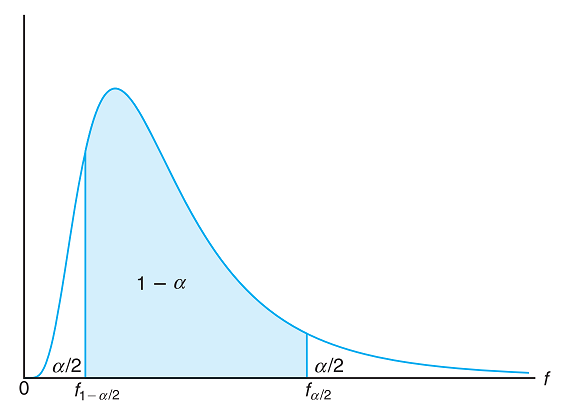

## $F$ Critical Values

Remember the following definitions:

- A **confidence level** is the probability that the confidence interval actually does contain the population parameter, assuming that the estimation process is repeated a large number of times.
- **Alpha $(\alpha)$** is the probability that the confidence interval does not contain the population parameter and is the complement of the confidence level.
- A **critical value** is a number that separates sample statistics that are likely to occur from those that are unlikely to occur in the sampling distribution.

The number $f_{\frac{\alpha}{2}}$ is a specific critical value that is an $F$-value with the property that it separates an area of $\frac{\alpha}{2}$ in the right tail of an $F$ distribution with $\nu_{1}$ and $\nu_{2}$ degrees of freedom.

The number $f_{1-\frac{\alpha}{2}}$ is a specific critical value that is an $F$-value with the property that it separates an area of $1-\frac{\alpha}{2}$ in the right tail of an $F$ distribution with $\nu_{1}$ and $\nu_{2}$ degrees of freedom.

#### Finding $f_{\frac{\alpha}{2}}$:

1. Use the given confidence level to calculate $\alpha$
2. Calculate $\frac{\alpha}{2}$
3. Calculate $\nu_{1}$ and $\nu_{2}$
4. Use [Table A.6](./Resources/Table_A6.pdf) to find $f_{\frac{\alpha}{2}}(\nu_{1},\nu_{2})$

#### Finding $f_{1-\frac{\alpha}{2}}$:

This time, we use the reciprocal property:

1. Use the given confidence level to calculate $\alpha$
2. Calculate $1-\frac{\alpha}{2}$
3. Calculate $\nu_{1}$ and $\nu_{2}$
4. Use [Table A.6](./Resources/Table_A6.pdf) to find $f_{1-\frac{\alpha}{2}}(\nu_{1},\nu_{2})=\frac{1}{f_{\frac{\alpha}{2}}(\nu_{2}.\nu_{1})}$. Notice we switch the degrees of freedom in the denominator

> [!note]
> 
> Using [Table A.6](./Resources/Table_A6.pdf), only critical values for a $98\%$ confidence level ($\frac{\alpha}{2}=0.01$) or a $90\%$ confidence level ($\frac{\alpha}{2}=0.05$) can be identified. Otherwise, one would have to use software to find the critical values.

### Example

**Problem:** Find $f_{\frac{\alpha}{2}}$ and $f_{1-\frac{\alpha}{2}}$ for a $90\%$ confidence interval with $\nu_{1}=4$ and $\nu_{2}=7$ degrees of freedom.

**Solution:**

$f_{\frac{\alpha}{2}}$:

1. $\alpha=1-\mathrm{Confidence~Level}=1-0.90=0.10$
2. $\frac{\alpha}{2}=\frac{0.10}{2}=0.05$
3. $\nu_{1}=4$ and $\nu_{2}=7$
4. Using [Table A.6](./Resources/Table_A6.pdf) with $\alpha=0.05,\nu_{1}=4$, and $\nu_{2}=7$, we find the critical value $4.12$

$f_{1-\frac{\alpha}{2}}$:

1. $\alpha=1-\mathrm{Confidence~Level}=1-0.90=0.10$
2. $\frac{\alpha}{2}=0.10=0.05$ and $1-\frac{\alpha}{2}=1-0.05=0.95$
3. $\nu_{1}=4$ and $\nu_{2}=7$
4. Using [Table A.6](./Resources/Table_A6.pdf) with $\alpha=0.05,\nu_{1}=7$, and $\nu_{2}=4$, we find the critical value $6.09$. To find $f_{0.95}(4,7)$, we need to find $\frac{1}{f_{0.05}(7,4)}=\frac{1}{6.09}=0.164$

Therefore, the critical values are $f_{1-\frac{\alpha}{2}}=0.164$ and $f_{\frac{\alpha}{2}}=4.12$

