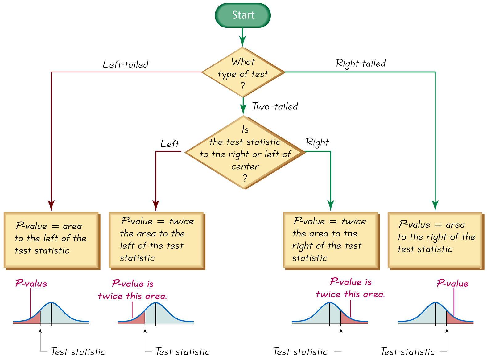

## $p$-values

A tool we can use to evaluate the test statistic is the _$p$-value_. The _$p$-value_ is the probability of getting a value of the test statistic that is at least as extreme as the one representing the sample data, assuming that the null hypothesis is true.

In the case of means, _$p$-values_ correspond to areas under a Standard Normal Distribution curve or a $t$ Distribution curve depending on the specifics of the problem. The $p$-value is the probability of getting that particular value of the test statistic or something even further away from the mean, that is, a test statistic that supports the null hypothesis even less!

The way we find the $p$-value depends on the alternative hypothesis:

- If the alternative is _greater than_, $p$-value = area to the _right_ of the test statistic
- If the alternative is _less than_, $p$-value = area to the _left_ of the test statistic
- If the alternative is _not equal to_, $p$-value = $\times 2$ the area beyond the test statistic (in the direction moving away from the center of the curve).

The figure below summarizes the procedure for finding a $p$-value:

Calculating a $p$-value also depends on the sampling distribution, which for tests concerning means in this module is either a Standard Normal Distribution or a $t$ Distribution. Let's look at a few examples calculating $p$-values for a Standard Normal Distribution.

### Examples

#### Example 1

**Problem:** $H_{1}:\mu >100$ and the test statistic is $Z=2.50$

**Solution:** If we look up $2.50$ in [Table A.3](./Resources/Table_A3.pdf), we see that the associated value is $.9938$ - this represents the area to the left of $Z=2.50$. The $p$-value is is the area to the right of the test statistic, that is, $Z=2.50$ (we use the area to the right because this is a right-tailed test). Therefore, the $p$-value is $1-.9938=.0062$

If the alternative is _less than_, $p$-value = area to the _left_ of the test statistic.

#### Example 2

**Problem:** $H_{1}:\mu < 100$ and the test statistic is $Z=-2.50$

**Solution:** [Table A.3](./Resources/Table_A3.pdf) gives $.0062$ as the area to the left of $Z=-2.50$. We want the area to the left since this is a left-tailed test. The $p$-value is $.0062$.

If the alternative is _not equal to_, $p$-value = $\times 2$ the area beyond the test statistic (in the direction moving farther away from the center of the curve).

#### Example 3

**Problem:** $H_{1}:\mu \neq 100$ and the test statistic is $Z=2.50$

**Solution:** This is a two-tailed test. Since the test statistic is positive, the direction moving away fro the center of the curve is to the right.
- To find the $p$-value, we look up the test statistic in the table, and find the area to the right is $1-.9938=.0062$. 
- Since this is a two-tailed test, we multiply by 2, so the $p$-value = $(2 \times .0062)=.0124$.

We multiply by two to account for both cases involved in the alternative not equals: the true value of the population mean could be greater than the value in the null OR less than the value in the null.
