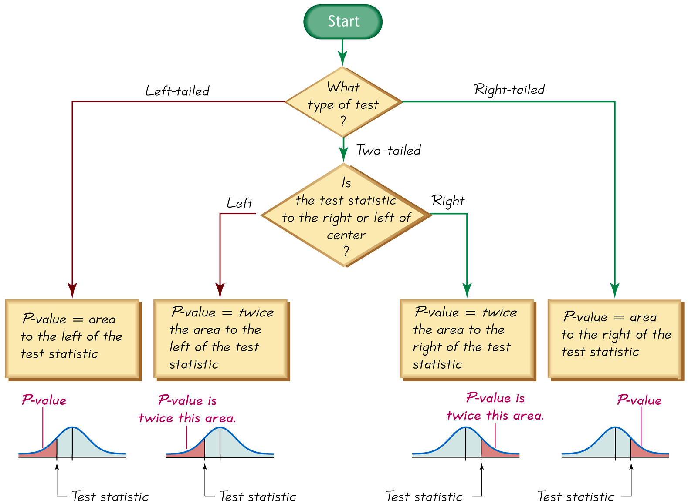

## $p$-values

Similar to critical regions and critical values, since our test statistic has a Standard Normal Distribution, our procedure for calculating $p$-values is the same as in the case for testing a claim concerning a single population mean with the population variance known.

The way we find the $p$-value depends on the alternative hypothesis:
- If the alternative is _greater than_, $p$-value = area to the _right_ of the test statistic.
- If the alternative is _less than_, $p$-value = area to the _left_ of the test statistic.
- If the alternative is _not equal to_, $p$-value = _two times_ the area beyond the tests statistic (in the direction moving away from the center of the curve)

The figure below summarizes the procedure for finding a $p$-value

Calculating a $p$-value for testing a claim concerning a single population proportion uses the Standard Normal Distribution. Let's re-look at a few example calculating $p$-values for a Standard Normal Distribution.

### Examples

#### Example 1 (Less Than, Right-Tailed)

**Problem:** Calculate the $p$-value when $H_{1}:\mu>100$ and the test statistic is $Z=2.50$

**Solution:**
- If we look up $2.50$ in [Table A.3](./Resources/Table_A3.pdf), we see that the associated value is $0.9938$ - this represents the area to the _left_ of $Z=2.50$.
- The $p$-value is the area to the _right_ of the test statistic $Z=2.50$ (we use area to the right since this is a right-tailed test).
- Therefore, the $p$-value is $1-0.9938=0.0062$.

#### Example 2 (Greater Than, Left-Tailed)

**Problem:** Calculate the $p$-value when $H_{1}:\mu<100$ and the test statistic is $Z=-2.50$

**Solution:**
- [Table A.3](./Resources/Table_A3.pdf) gives $0.0062$ as the area to the left of $Z=-2.50$.
- We want the area to the _left_ since this is a left-tailed test.
- Therefore, the $p$-value is $0.0062$.

#### Example 3 (Not Equal, Two-Tailed)

**Problem:** Calculate the $p$-value when $H_{1}:\mu\neq 100$ and the test statistic is $Z=2.50$.

**Solution:** 
- This is two-tailed test. Since the test statistic is positive in the direction moving away from the center of the curve is to the right.
- To find the $p$-value, look up the test statistic $Z=2.50$ in [Table A.3](./Resources/Table_A3.pdf) and find the area to _right_ as $1-0.9938=0.0062$.
- Since this a two-tailed test, we multiply by 2, so the $p$-value is $(2\times{0}.0062)=0.0124$.

In this example, we multiply by two to account for both cases involved in the alternative not equals; the true value of the population mean could be greater than the value in the null OR less than the value in the null.