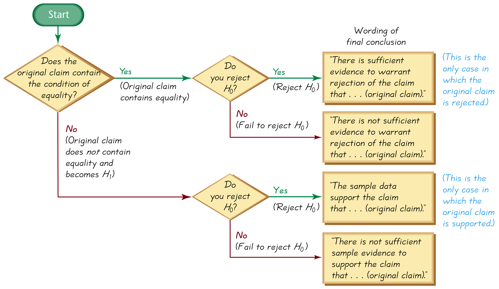

## Wording the Final Conclusion

Once we make the decision to reject or fail to reject the null hypothesis, we still need to state conclusions in the context of the problem. The information below provides a guide on writing the final conclusion:

1. Does the original clam contain the condition of the equality?
2. If YES, do you reject the $H_{0}$?
    - If YES, you reject the $H_{0}$, "there is sufficient evidence to warrant rejection of the claim that...(original claim)." (This is the only case where the original claim is _rejected._)
    - If NO, you fail to reject the $H_{0}$ "there is _not_ sufficient evidence to warrant rejection of the claim that...(original claim)"
3. If NO, do you reject the $H_{0}$? (The original claim does not contain equality and becomes $H_{1}$.
    - If YES, you reject $H_{0}$ "the sample data support the claim that...(original claim)." (This is the only case where the original claim is _supported._)
    - If NO, you fail to reject $H_{0}$ "there is not sufficient sample evidence to support the claim that... (original claim)."

### Example

**Problem:** The Mars Corporation published on their website in 2008 that 24% of M&Ms in each bag were blue. You never seem to have many blue M&M's in your bag, and claim that it is in fact less than 24%. You conduct a hypothesis test to evaluate this claim and fail to reject the null hypothesis. What are the hypotheses tested? What are the conclusions?

**Solution:**

$$H_{0}:p=0.24$$
$$H_{0}:p<0.24$$

In this case, the original claim became the alternative hypothesis (the null always contains equality) and we failed to reject the null hypothesis. Thus, we can say that:

There is not enough sample evidence to support the claim that less than 24% of M&Ms in each bag are blue.
