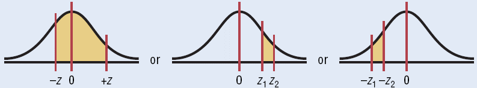
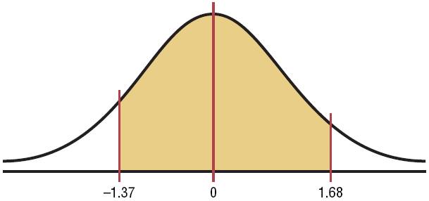
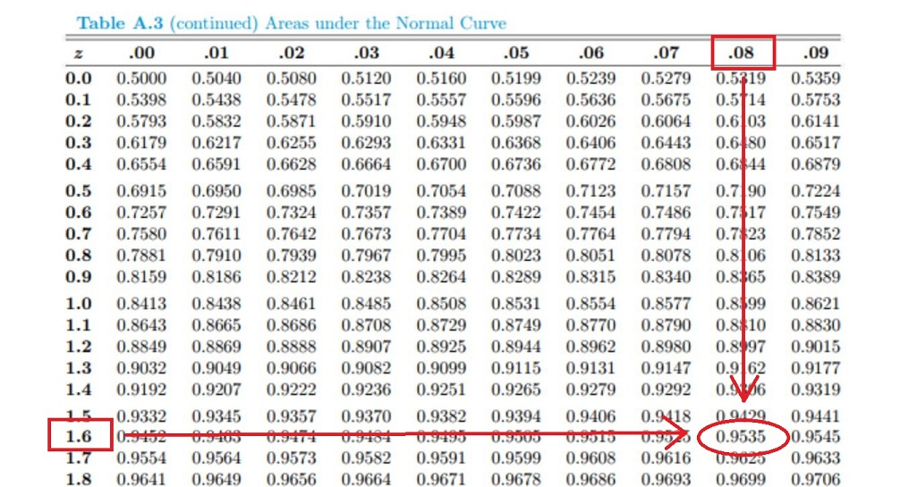
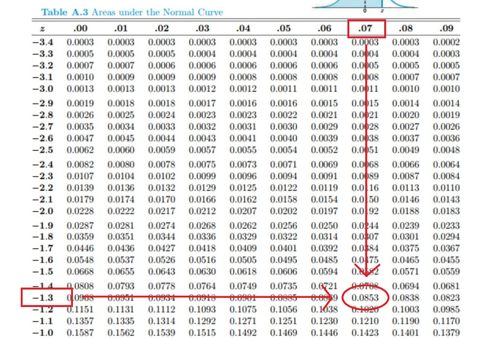

## Areas Between 2 Values

To find the area between 2 $Z$-values using Table A.3, we need to use areas to the left. Specifically, we can find the area to the left of both $Z$-values, then subtract the smaller are to the left from the larger area to the left.

To find the **area to the left** of any $Z$-value, look up both $Z$-values in Table A.3 and subtract the corresponding areas

### Example

Find the area between $Z=1.68$ and $Z=-1.37$

The value in the $1.6$ row and the $.08$ column of Table A.3 is $.9535$

The value in the $-1.3$ row and the $.07$ column of Table A.3 is $.0853$

Thus, the area is the difference of the two values: $.9535-.0853=.8682$