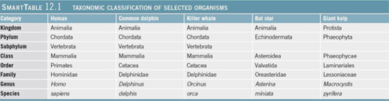

## Marine Life and Environment

### Divisions of the Marine Environment

- **Pelagic** (open sea)
	- Neritic (< 200 meters deep)
	- Oceanic
- **Benthic** (sea floor)

### Pelagic Environment

- Divided into **biozones**
	- **Neritic Province** - from shore seaward
		- All water < 200 meters deep
	- **Oceanic Province**
		- Depth greater than 200 meters
		- Subdivided into four biozones:
			- Epipelagic
			- Mesopelagic
			- Bathypelagic
			- Abyssopelagic

### Oceanic Province

- **Epipelagic**
	- Photosynthesis - O$_{2}$ rich
- **Mesopelagic**
	- Contains dissolved **oxygen minimum layer (OML)**
- **Bathypelagic** 
	- 1000 - 4000 meters
- **Abyssopelagic**
	- Deepest parts of ocean
- **Bioluminescence** common in mesopelagic and deeper
	- Ability to biologically produce light

### Oxygen and Nutrient Variation with Depth

- Dissolved O$_{2}$ minimum layer about 700-1000 m
- Nutrient maximum at about same depths
- O$_{2}$ concentration increases with depth

### Ocean Zones Based on Light Availability

- Most important factor that determines distribution of life in ocean province is availability of **sunlight**
- Classification scheme based on sunlight availability:
	- **Euphotic** - surface to where enough light exists to support photosynthesis
	- **Disphotic** - small but measurable quantities of light
	- **Aphotic** - no light

### Benthic Environments

- **Supralittoral** - above spring high tide line
- **Subneritic** - spring high tide line to 200 m
	- **Littoral** - intertidal zone
	- **Sublittoral** - shallow subtidal zone
		- **Inner** - extends to depth where marine algae no longer grow attached to ocean bottom
		- **Outer** - inner sublittoral to shelf break or 200 m

### Suboceanic Province

- **Bathyal** - continental slope
- **Abyssal**
	- > 80% of benthic environment
	- Animal tracks in abyssal clay
- **Hadal**
	- Below 6000 m
	- Only deep trenches on continental margins

### Classification of Life

- Classification based on physical characteristics
- **Three domains:**
	- **Bacteria** - simple life forms without nuclei
	- **Archaea** - simple, microscopic creatures
	- **Eukarya** - complex, multicellular organisms
		- Plants and animals
		- DNA in discrete nucleus

### Classification of Living Organisms

- Six kingdoms
	- Archaebacteria
	- Eubacteria
	- Protista
	- Fungi
	- Plantae
	- Animalia

### Six Kingdoms of Organisms

- **Archaebacteria**
	- Microscopic, bacteria-like
	- Includes methane producers and sulfur oxidizers of deep-sea vents
	- Most ancient life forms on Earth
- **Eubacteria**
	- Simplest organisms
	- Single celled lacking nuclei
		- Includes cyanobacteria
- **Plantae**
	- Multi-celled photosynthetic plants
		- Surf grass, eelgrass, mangrove, marsh grasses
- **Animalia**
	- Multi-celled animals
		- Range from simple sponges to complex vertebrates
- **Protista**
	- Single- and multi-celled with nucleus
		- Algae, **protozoa**
- **Fungi**
	- Mold, lichen

### Taxonomic Classification

- **Carolus Linnaeus** - 1758
	- Developed basis of modern classification of organisms
- **Taxonomy** - systematic classification of organisms
	- Physical characteristics
	- Genetic information

### Taxonomy

- Kingdom
- Phylum
- Class
- Order
- Family
- Genus
- **Species**
	- Fundamental unit
	- Population of genetically similar, interbreeding individuals

### Taxonomic Classification

### Classification of Marine Organisms

- Classified according to:
	- **Habitat** - where they live
	- **Mobility** - how they move

- **Plankton** (floaters)
- **Nekton** (swimmers)
- **Benthos** (bottom dwellers)

### Types of Plankton

- Most **biomass** on Earth consists of plankton

- **Phytoplankton**
	- **Autotrophic** - can produce on wood
- **Zooplankton**
	- **Heterotrophic** - relies on food produced by others

- **Bacterioplankton**
	- Very small
	- At least half the ocean's photosynthetic biomass
- **Virioplankton** 
	- Smaller than bacterioplankton
	- May limit abundance of other plankton through infection

### Other Ways to Classify Plankton

- **Based on portion of life spent as plankton**
	- **Holoplankton**
		- Entire lives as plankton
	- **Meroplankton**
		- Part of lives as plankton
		- Juvenile or larval stages

- **Based on size:**
	- **Macroplankton**
		- Large floaters such as jellyfish
	- **Picoplankton**
		- Very small floaters such as bacterioplankton

### Nekton

- Independent swimmers
- Most adult fish and squid
- Marine mammals
- Marine reptiles

### Benthos - Bottom Dwellers

- **Epifauna** live on the surface of sea floor
- **Infauna** live buried in sediments
- **Nektobenthods** swim or crawl through water above seafloor
- Most abundant in shallower water
	- Many live in perpetual darkness - deep seafloor

### Hydrothermal Vent Communities

- Abundant and large deep-ocean benthos
- Discovered in 1977
- Associated with hot vents
- Bacteria-like archaeon produce food using heat and chemicals - **chemosynthesis**

### Number of Marine Species

- More land species
- Ocean has relatively uniform conditions
- Less adaptation required, less speciation
- Marine species overwhelmingly **benthic** (98%) rather than **pelagic** (2%)
	- Currently 228,445 documented marine species

### Adaptations of Marine Organisms

- The marine environment is more stable than land
	- Organisms in the ocean are less able to withstand environmental changes
- **Protoplasm** - substance of living matter
	- More than 80% water
- Marine animals do not risk desiccation

- Physical support
	- Buoyancy
	- How to resist sinking
	- Different support structures in cold (fewer) rather than warm (more appendages) seawater
		- Changes in water **viscosity** with temperature
	- Smaller size

- High surface area to volume ratio
- Phytoplankton benefit from being small

- Unusual appendages to increase surface area
- Oil in micro-organisms to increase buoyancy

### Viscosity and Streamlining Adaptations

- **Streamlining** important for larger organisms
	- Shape offers least resistance to fluid flow
- Flattened body
- Tapering back end

### Temperature and Marine Life

- Narrow range of temperature in oceans
- Smaller variations (daily, seasonally, annually)
- Deep ocean is nearly isothermal

### Ocean Temperature

- More stable than land for four reasons
	- Higher heat capacity of water
	- Ocean warming reduced by evaporation
	- Solar radiation penetrates deeply into ocean layers
	- Ocean mixing

### Cold vs. Warm Water Species

- Plankton smaller in warmer seawater
- More appendages in warmer seawater
- Tropical organisms grow faster, live shorter, reproduce more often
- More species in warmer seawater
- More biomass in cooler seawater (upwelling)

### Temperature and Marine Organisms

- **Stenothermal**
	- Organisms withstand small variation in temperature
	- Typically live in open ocean
- **Eurythermal**
	- Organisms withstand large variation in temperature
	- Typically live in coastal waters

### Salinity and Marine Organisms

- **Stenohaline**
	- Organisms withstand only small variation in salinity
	- Typically live in open ocean
- **Euryhaline**
	- Organisms withstand large variation in salinity
	- Typically live in coastal waters, e.g., estuaries

### Salinity Adaptations

- **Extracting minerals from seawater**
	- **Diffusion**
		- High concentration to low concentration
			- Cell membrane permeable to nutrients
			- Waste passes from cell to ocean

### Marine Adaptations - Osmosis

- When water solutions of unequal salinity are separated by semipermeable membrane (e.g. skin, cell wall)
	- Water molecules move from less concentrated to more concentrated solutions

- **Isotonic** - organism's body fluid salinity **same** as ocean
- **Hypertonic** - organism's fluids have **higher** salinity than ocean
- **Hypotonic** - organism's fluids have **lower** salinity than ocean

### Marine Adaptations - Dissolved Gases

- Animals extract dissolved oxygen (O$_{2}$) from seawater through **gills**
- Gills exchange oxygen and carbon dioxide directly with seawater

### Water's Transparency

- Many marine organisms see well
- Some marine organisms are nearly transparent and use it to
	- Elude predators
	- Stalk prey

### Adaptations to Marine Environment

- **Camouflage** through color patterns
- **Countershading** - dark on top, light on bottom
- **Disruptive coloration** - Bold patterns, contrasting colors make animal blend into background

### Deep Scattering Layer (DSL)

- Recorded using sonar
- Dense concentration of organisms
- Daily vertical migration of many marine organisms
- Feed in highly productive surface waters at night to avoid being seen by predators

- Predators feed on organisms within DSL
	- Daytime
	- Crepuscular - twilight
	- Nocturnal - night

### Marine Adaptations - Water Pressure

- Increases about 1 atmosphere (1 kg/cm$^2$) with every 10 meters (33 feet) deeper
- Many marine organisms - no inner air pockets
	- Air compresses; water is nearly incompressible
- Collapsible rib cage (e.g., sperm whale)
	- Forces air out, collapses, lungs, closing air cavity
- Many fish have **swim bladder**
	- Adjusts buoyancy and allows fish to regulate depth