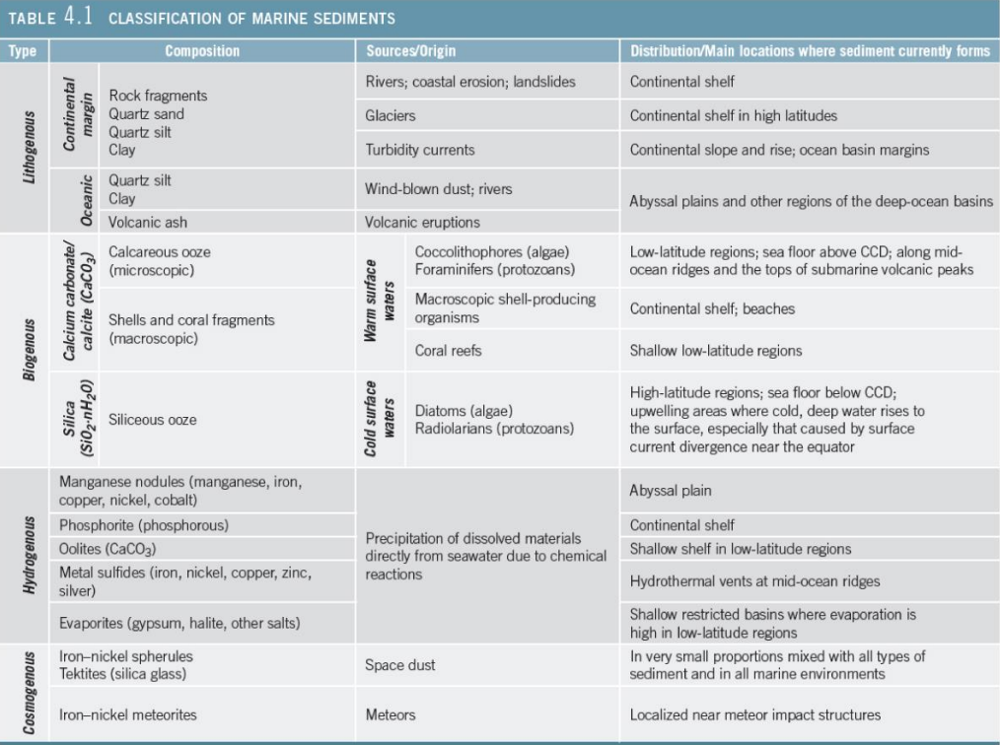
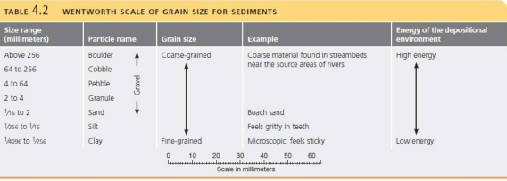
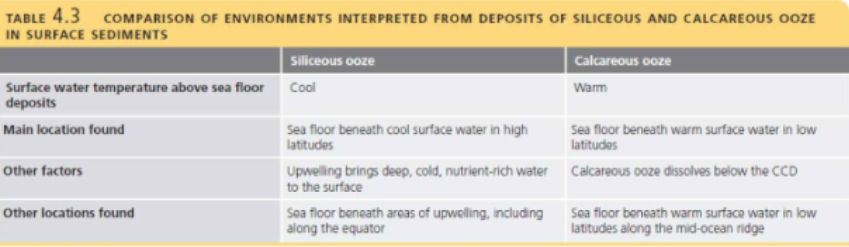

## Marine Sediments

- Provide clues to Earth's history
	- Marine organism distribution
	- Ocean floor movements
	- Ocean circulation patterns
	- Climate change
	- Global extinction events

- Clues to sediment origin found in:
	- **Mineral Composition**
	- **Texture** - size and shape of particles

- Sediment orgins
	- Weathered rock
	- Living organisms
	- Minerals dissolved in water
	- Outer space

- Sediments lithify into sedimentary rock

### Marine Sediment Collection

- Early exploration used dredges

- Modern exploration
	- **Cores** - hollow steel tube collects sediment columns
	- **Rotary drilling** - collects deep ocean sediment cores

- National Science Foundation (NSF) - formed Join Oceanographic Institutions for Deep Earth Sampling (JOIDES) in 1963
	- Scripps Institution of Oceanography
	- Rosenstiel School of Atmospheric and Oceanic Studies
	- Lamont-Doherty Earth Observatory of Columbia University
	- Woods Hole Oceanographic Institution

- **Deep Sea Drilling Project (DSDP)** - 1968
	- _Glomar Challenger_ drilling ship
	- Core collection in deep water
	- Confirmed existence of sea floor spreading
		- Ocean floor age
		- Sediment thickness
		- Magnetic polarity

- **Ocean Drilling Project (ODP)**
	- Replaced DSDP in 1983
	- _JOIDES Resolution_
		- Replaced the _Glomar Challenger_

- **Integrated Ocean Drilling Program (IODP)**
	- Replaced ODP in 2003
	- _Chikyu_
		- New exploration vessel in 2007
		- Expedition to Japan Trench after 2011 earthquake

### Paleoceanography and Marine Sediments

- **Paleoceanography** - study of how ocean, atmosphere, and land interactions have produced changes in ocean chemistry, circulation, biology, and climate
	- Marine sediments provide clues to past changes

- Marine sediments provide clues to past environmental conditions

- Cores of sediment collected from sea floor

### Classification of Marine Sediments

- Classified by origin
	- **Lithogenous** - derived from land
	- **Biogenous** - derived from organisms
	- **Hydrogenous** or **Authigenic** - derived from water
	- **Cosmogenous** - derived from outer space

#### Lithogenous Sediments

- Eroded rock fragments from land
- Also called **terrigenous**
- Reflect composition of rock from which derived
- Produced by **weathering**
	- Breaking of rocks into smaller pieces

- Small particles eroded and transported
- Transported to ocean by
	- Streams
	- Wind
	- Glaciers
	- Gravity
- Greatest quantity around continental margins

- Reflect composition of rock from which derived
- Coarser sediments closer to shore
- Finer sediments farther from shore
- Mainly mineral **quartz** 9 (SiO$_2$)

#### Grain Size

- One of the most important sediment properties
- Proportional to **energy** of transportation and deposition
- Classified by **Wentworth scale of grain size**

#### Texture and Environment

- Texture indicates environmental energy
- High energy (strong wave action)
	- Larger particles
- Low energy
	- Smaller particles

- Larger particles closer to shore

#### Sorting

- Measure of grain size uniformity
	- Well-sorted - all same sized particle
	- Poorly sorted - different sized particles

- Indicates selectively of transportation process

### Sediment Distribution

- **Neritic**
	- Shallow-water deposits
	- Close to land
	- Dominantly lithogenous
	- Typically deposited quickly

- **Pelagic**
	- Deeper-water deposits
	- Finder-grained sediments
	- Deposited slowly

#### Neritic Lithogenous Sediments

- **Beach deposits**
	- Mainly wave-deposited quartz-rich sands

- **Continental shelf deposits**
	- Relict sediments 3000-7000 years old
		- Current river deposition in estuaries

- **Turbidite deposits**
	- Graded bedding

- **Glacial deposits**
	- High-latitude continental shelf
	- Currently forming by **ice rafting**

#### Pelagic Deposits

- Fine-grained material
- Accumulates slowly on deep ocean floor
- Pelagic lithogenous sediment from
	- Volcanic ash
	- Transported by deep ocean currents
	- Wind-blown dust

- **Abyssal Clay**
	- At least 70% clay sized particles from continents
	- **Red clays** from oxidized iron (Fe)
	- Abundant if other sediments absent

#### Biogenous Sediment

- Hard remains of once-living organisms

- Two major types:
	- **Macroscopic**
		- Visible to naked eye
		- Shells, bones, teeth
	- **Microscopic**
		- Tiny shells or **tests**
		- Biogenic **ooze**

- Mainly algae and protozoans

#### Biogenous Sediment Composition

- Two most common chemical compounds:
	- **Silica** (SiO$_2$ or SiO${_2}~\cdot$nH$_2$O)
	- **Calcium carbonate** (CaCO$_3$)

#### Silica in Biogenous Sediments

- **Diatoms**
	- Photosynthetic algae
	- Planktonic

- **Radiolarians**
	- Protozoans
	- Use external food
	- Planktonic

- **Tests** - shells of microscopic organisms
- Tests from diatoms and radiolarians generate **siliceous ooze**

### Diatomaceous Earth

- Siliceous ooze lithifies into **diatomaceous earth**
- Diatomaceous earth has many commercial uses
	- Filter
		- Swimming pool
	- Mild abrasive
		- Toothpaste
		- Facial scrub
	- Absorbent
		- Cat litter

### Calcium Carbonate in Biogenic Sediments

- **Coccolithophores**
	- **Nannoplankton**
	- Photosynthetic algae
	- **Coccoliths**
		- Individual plates from dead organism
	- Rock Chalk
		- Lithified coccolith-rich ooze

- **Foraminifera**
	- Protozoans
	- Use external food
	- Calcareous ooze

### Distribution of Biogenous Sediments

- Depends on three processes:
	- Productivity
		- Number of organisms in surface water
	- Destruction
		- Skeletal remains (tests) dissolve at depth
	- Dilution
		- Deposition of other sediments decreases percentage of biogenous sediments

### Pelagic Deposits Pt. 2

- Siliceous ooze
- Accumulates in areas of high productivity
- Silica tests no longer dissolved by seawater when buried by other tests

### Neritic Deposits Pt. 2

- Dominated by lithogenous sediment, may contain biogenous sediment
- **Carbonate Deposits**
	- Carbonate minerals containing CO$_3$
	- Marine carbonates primarily **limestone**
		- CaCO$_3$
	- Most limestones contain fossil shells
		- Suggests biogenous origin
	- Ancient marine carbonates constitute 25% of all sedimentary rocks on Earth

### Carbonate Deposits

- **Stromatolites**
	- Fine layers of carbonate
	- Warm, shallow-ocean, high salinity
	- Cyanobacteria
- Lived billions of years ago
	- Modern stromatolites live near Shark Bay, Australia

### Calcareous Ooze

- Warm, shallow ocean saturated with CaCO$_3$

- Cool, deep ocean undersaturated with CaCO$_3$
	- **Lysocline** - depth at which a _significant_ amount of CaCO$_3$ begins to dissolve rapidly

- CCD - **Calcite compensation depth**
	- Depth where CaCO$_3$ readily dissolves
	- Rate of supply = rate shells dissolve
	- ~4500 meters

#### Calcareous Ooze and the CCD

- Scarce calcareous ooze below 5000 meters (16,400 feet) in modern ocean
- Ancient calcareous oozes at greater depths if moved by sea floor spreading
	- AND covered by abyssal clay or SiO$_2$ ooze

### Hydrogenous Marine Sediments

- Minerals **precipitate** directly from seawater
	- **Manganese nodules**
	- **Phosphates**
	- **Carbonates**
	- **Metal sulfides**
	- **Evaporites**

- Small proportion of marine sediments

- Distributed in diverse environments

#### Manganese Nodules

- Fist-sized lumps of manganese, iron
- Very slow accumulation rates
- Many commercial uses
- Unsure why they are not buried by sediments

#### Phosphates and Carbonates

- **Phosphates**
	- Phosphorus-bearing
	- Occur beneath areas in surface ocean of very high biological productivity
	- Economically useful as fertilizer
- **Carbonates**
	- Aragonite and calcite
	- Oolites

#### Metal Sulfides

- **Metal sulfides**
	- Contain:
		- Iron
		- Nickel
		- Copper
		- Zinc
		- Silver
		- Other metals

- Associated with hydrothermal vents

#### Evaporites

- Minerals that form when seawater evaporates
- Restricted open ocean circulation
- High evaporation rates
- Halite (common table salt) and gypsum

### Cosmogenous Marine Sediments

- Macroscopic meteor debris
- Microscopic iron-nickel and silicate spherules (small globular masses)
	- **Tektites**
	- Space dust
- Insignificant proportion of marine sediments

### Marine Sediment Mixtures

- Usually mixture of different sediment types
- Typically one sediment type dominates in different areas of the sea floor

### Pelagic and Neritic Sediment Distribution

- Neritic sediments cover ~ $\frac{1}{4}$ of the sea floor
- Pelagic sediments cover ~ $\frac{3}{4}$ of the sea floor

- Distribution controlled by
	- Proximity to sources of lithogenous sediments
	- Productivity of microscopic marine organisms
	- Sea floor features
	- Depth of water

### Rates of Deposition

- Microscopic tests sink slowly from surface ocean to sea floor
	- 10-50 years
- Tests could be moved horizontally
- Biogenous tests clump together in fecal pellets
	- Fecal pellets sink quickly
		- 10-15 days

### Resources from Marine Sediments

- Both mineral and organic resources
- Not easily accessible
	- Technological challenges
	- High costs

### Energy Resources

- **Petroleum**
	- Ancient remains of microscopic organisms
	- 95% of economic value of oceanic _non-living_ resources
- 30% of world's oil from offshore resources
- Future offshore exploration intense
	- Potential for oil spills

- **Gas Hydrates**
	- High pressures squeeze chilled water and gas into ice-like solid
	- Resembles ice but burns when lit
	- May form on sea floor
		- Supports rich community of organisms
	- **Methane hydrates**
		- Most common

- Release of methane may alter global climate
	- Greenhouse gas

- Warmer waters may release more methane

- Methane release may cause underwater slope failure
	- Tsunami hazard

- Gas hydrates may be largest shore of usable energy in organic carbon form
- Rapidly decompose at surface pressures and temperatures

- **Sand and gravel**
	- Aggregate in concrete
	- Some is mineral-rich

- **Evaporative salts**
	- Form **salt deposits**
	- Gypsum - used in drywall
	- Halite - table salt

- **Phosphorite** - phosphate minerals
	- Fertilizer for plants

- **Manganese nodules and crusts**
	- Lumps of metal
	- Contain manganese, iron, copper, nickel, cobalt
	- Economically useful

- Rare Earth elements
	- Assortment of 17 chemically similar metals
	- Used in technology
		- e.g., cell phones, television screens, etc.

- Sea floor may hold more rare Earth element deposits than found on land