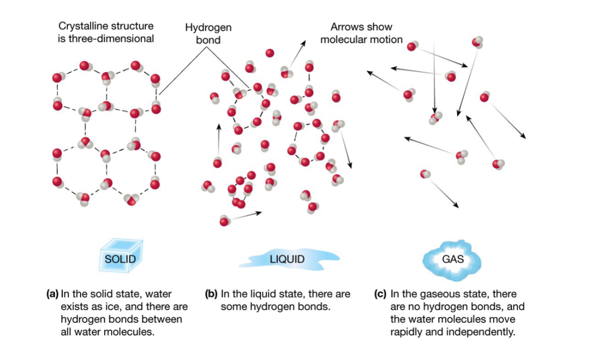
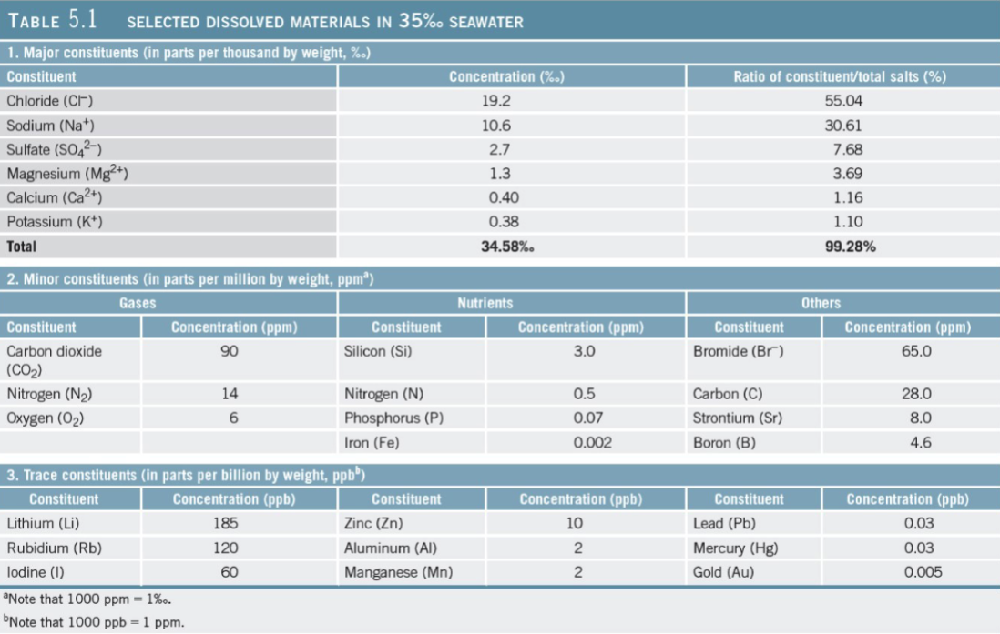
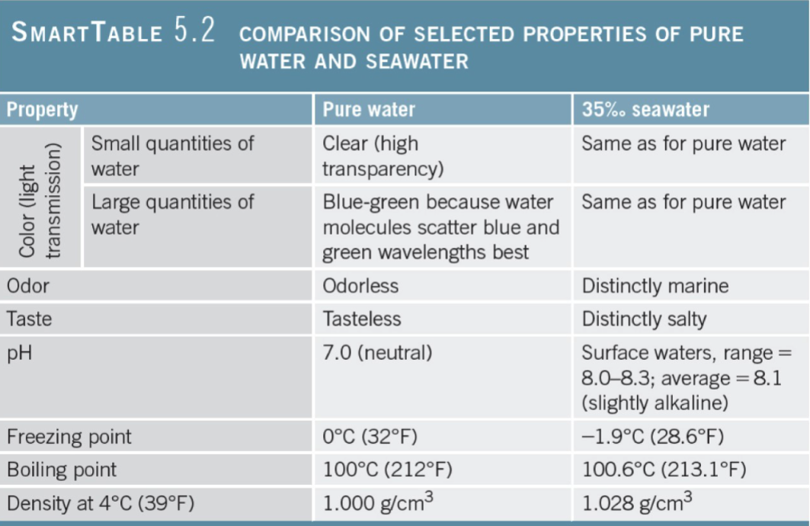
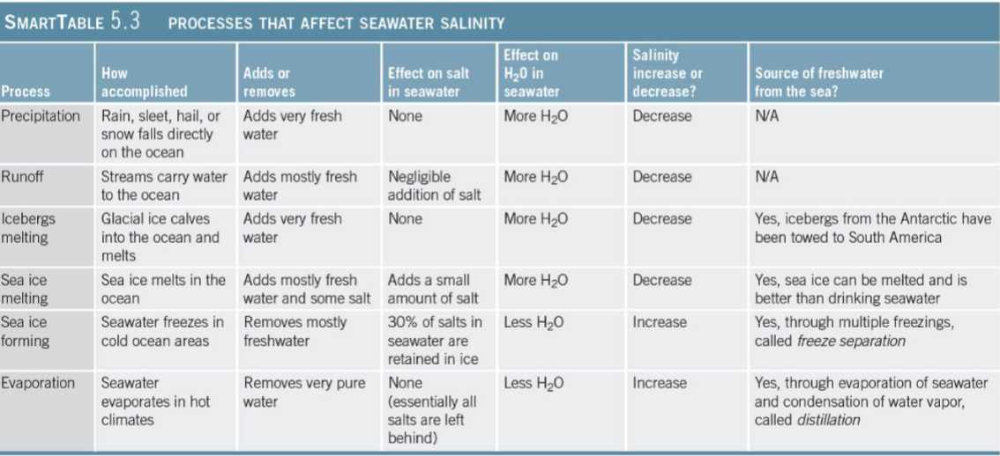

## Water and Seawater

### Water on Earth

- Presence of water on Earth makes life possible
- Organisms are mostly water

### Atomic Structure

- **Atoms** - building blocks of all matter
- Subatomic particles
	- **Protons**
	- **Neutrons**
	- **Electrons**
- **Molecule** - two or more atoms held together shared electrons

### Water Molecule

- Strong **covalent bonds** between two hydrogen (H) and one oxygen (O)
- Both H atoms on same side of O atom
	- Bent molecule shape gives water its unique properties
- **Dipolar**

### Hydrogen Bonding

- Polarity means:
	- Small negative charge at Oxygen end
	- Small positive charge at Hydrogen end
- Attraction between positive and negative ends of water molecules to:
	- Other water molecules
	- Other ions

- Hydrogen bonds are weaker than covalent bonds but still strong enough to contribute to
	- **Cohesion** - molecules sticking together
	- High water **surface tension**
	- High solubility of chemical compounds in water
	- Unusual thermal properties of water
	- Unusual density of water

### Water as Solvent

- **Electronic attraction** produces **ionic bond**
- Water molecules stick to other polar molecules
- Water can dissolve almost anything - **universal solvent**

### Water's Thermal Properties

- Three states of matter at Earth's surface - solid, liquid, gas

### Heat and Temperature

- **Heat** - transfer of both **kinetic** and **potential energy** from one object to another due to temperature differences
- **Temperature** - average kinetic energy of molecules in a substance
- **Calorie** is the amount of heat needed to raise the temperature of 1 gram of water by 1$^o$C.

### Freezing and Boiling Points

- **Freezing point = melting point**: 0$^o$C (32$^o$F)
- **Boiling point = condensation point**: 100$^o$C (212$^o$F)
- Freezing and boiling points of water unusually high
	- Because of dipolar geometric configuration

### Water's Heat Capacity and Specific Heat

- **Heat Capacity** - amount of heat required to raise the temperature of 1 gram of any substance by 1$^o$C
- **Water has a high heat capacity** - can take in or lose much heat without changing temperature

### Latent heat

- Water has high **latent heats**
	- Heat _absorbed_ or _released_ during change of state
- Related to high heat capacity

- **Latent Heat of Melting**
	- Energy needed to break intermolecular bonds that hold water molecules rigidly in place in ice crystals (80 calories/gram)

- **Latent Heat of Vaporization**
	- Amount of heat that must be _added_ to a substance at its boiling point to break ALL hydrogen bonds and change state from liquid to vapor (540 calories/gram)

- **Latent Heat of Evaporation**
	- **Evaporation** = conversion of liquid to gas below the boiling point (585 calories/gram)
	- Lower temperature of surface water not at boiling point means more hydrogen bonds to break

- **Latent Heat of Condensation**
	- Cooled water vapor turns to liquid and _releases_ heat to the environment
	- Identical to latent heat of vaporization

- **Latent Heat of Freezing**
	- Heat _released_ when water freezes
	- Identical to latent heat of melting

### Water and Hydrogen Bonds in Three States of Matter

### Global Thermostatic Effects

- Water's properties moderate temperature on Earth's surface
	- Equatorial oceans do not boil
	- Polar oceans do not freeze solid
- Heat energy exchanged in evaporation-condensation cycle
 
- **Marine Effect** - Oceans moderate temperature changes from day to night and during different seasons
- **Continental Effect** - Land areas have greater range of temperatures from day to night and during different seasons

### Water Density

- Density = mass/unit volume
- Density of water _increases_ as temperature _decreases_
	- **Thermal contraction** - shrinkage of most substances caused by cold temperatures

- HOWEVER, from 4$^o$C to 0$^o$C the density of water _decreases_ as temperature decreases
	- Unique property of water

- Ice is less dense than liquid water
	- Changes in molecular packing
	- Water expands as it freezes
	- Makes ice float

- Increasing pressure or adding dissolved substances decreases maximum density temperature

- Dissolved solids also reduce freezing point of water
	- Most seawater never freezes

### Salinity

- Total amount of dissolved solids in water including dissolved gases
	- Excludes dissolved organics
- Ratio of mass of dissolved substances to mass of water sample

- Expressed in parts per thousand (ppt)
- Typical ocean salinity is 35 ppt ($\frac{^o}{_{oo}}$)

### Seawater

### Determining Salinity

- **Salinometer**
	- Measures water's electrical conductivity
	- More dissolved substances increase conductivity

- **Principle of Constant Proportions**
	- Major dissolved constituents in same proportion regardless of total salinity
	- Easiest to measure accurately is chloride ion, CL-(chlorinity)
	- Salinity = 1.80655 * **Chlorinity*** (ppt)
		- Seawater constant is agreed upon approximation representing total salinity

### Pure Water vs. Seawater

### Salinity Variations

- Open-ocean salinity is 33-38 $\frac{^o}{_{oo}}$
- In coastal areas salinity varies more widely
	- **Brackish**
		- Influx of fresh water from rivers or rain lowers salinity
	- **Hypersaline**
		- High evaporation conditions
			- Great Salt Lake salinity = 280 $\frac{^o}{_{oo}}$
			- Dead Sea salinity = 330 $\frac{^o}{_{oo}}$
- Salinity may vary with seasons (dry/rain)

### Processes Affecting Salinity

- Decreasing salinity - adding fresh water to ocean
	- Precipitation
	- Runoff
	- Melting icebergs
	- Melting sea ice

- Increasing salinity - removing water from ocean
	- Sea ice formation
	- Evaporation

### Earth's Hydrologic Cycle

- Processes that affect seawater salinity
- Recycles water - ocean, atmosphere, and continents
- Water

### Earth's Water

- 97.2% in the world ocean
- 2.15% frozen in glaciers and ice caps
- 0.62% in groundwater and soil moisture
- 0.02% in streams and lakes
- 0.001% as water vapor in the atmosphere

### Residence Time

- **Residence time** - average length of time a substance remains dissolved in seawater
	- Ions with long residence time = high concentration
	- Ions with short residence time = low concentration

- Steady state condition - average amounts of various elements remains constant

### Acidity and Alkalinity

- **Acid** releases a hydrogen ion (H+) when dissolved in water
- **Alkaline** (or **base**) releases a hydroxide ion (OH-) in water

### pH Scale

- Measures hydrogen ion concentration
	- pH value $\lt$ 7 = **acid**
	- pH $\gt$ 7 = base (**alkaline**)
	- pH $=$ 7 = **neutral**
		- Pure water

### Ocean pH

- Seawater is slightly alkaline
	- Surface water average pH 8.1
- pH decreases with depth

### Carbonate Buffering System

- **Buffering** keeps the ocean from becoming too acidic or too basic
- Precipitation or dissolution of calcium carbonate, CaCO$_{3}$, buffers ocean pH
- Oceans can absorb CO$_{2}$ from the atmosphere without much change in pH

### Surface Salinity Variation

- **High latitudes**
	- Low salinity
		- Abundant sea ice melting
		- Precipitation and runoff

- **Low latitudes near equator**
	- low salinity
		- High precipitation and runoff

- **Mid latitudes**
	- High salinity
		- Warm, dry, descending air increases evaporation

### Salinity Variation with Depth

- Low latitudes - salinity decreases with depth
- High latitudes - salinity increases with depth
- Deep ocean salinity fairly consistent globally
- **Halocline** - abrupt change in salinity
	- Separates ocean layers of different salinity

### Seawater Density

- Freshwater density = 1.000 g/cm$^3$
- Ocean surface water = 1.022 to 1.030 g/cm$^3$
- Ocean layered according to density

- _Decrease_ in temperature = _increase_ in density
	- Temperature is greatest influence on density
- _Increases_ in salinity = _increase_ in density
- _Increase_ in pressure = _increase_ in density
	- Does not affect surface waters

### Temperature and Density Variations with Depth

- **Thermocline** - abrupt change of temp. with depth
- **Pycnocline** - abrupt change of density with depth
- High latitude oceans - "-clines" rarely develop
	- **Isothermal**
	- **Isopycnal**

### Layered Ocean

- Three distinct water masses based on density:
	- **Mixed surface layer** - above thermocline
	- **Upper water** - thermocline/pycnocline
	- **Deep water** - below thermocline to ocean floor

### Desalinization

- Removing salt from seawater
- Human need for fresh water increasing
	- Water supply decreasing
- Energy-intensive and expensive
- Most desalinization plants in arid regions
	- Provide less than 0.5% of human water needs

- **Distillation**
	- Most common process
	- Water boiled and condensed
	- **Solar distillation** in arid climates

- **Electrolysis**
	- Electrode-containing freshwater
	- Membrane between fresh and saltwater tanks

- **Reverse osmosis**
	- Salt water forced through membrane into fresh water

- **Freeze separation**
	- Water frozen and thawed multiple times

1.
- Golden Beach, Portugal
- White Page, 7.5YR_/1, white
- 710-1000$\mu$, Coarse
- Well
- Subangular
- N/A
- N/A