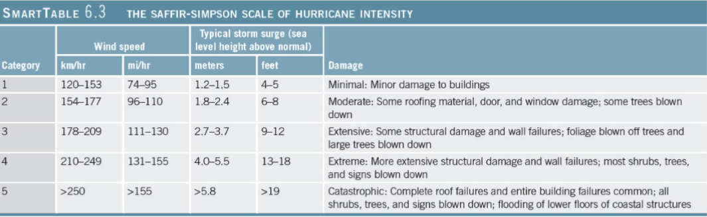

## Air-Sea Interaction

### Why Study Air-Sea Interaction?

- Solar energy heats Earth, generates winds
- Winds drive ocean currents
- Extreme weather event may related to ocean
- Global warming affects oceans

### Earth's Seasons

- Earth's axis of rotation is tiled $23.5\degree$
- Earth's orbit is slightly elliptical

- Earth's tilt, not orbit, causes seasons

- **Summer solstice**
	- About June 21
	- Sun directly above **Tropic of Cancer** ($23~\frac{1}{2}\degree$ N latitude)

- **Winter solstice**
	- About December 21
	- Sun directly above **Tropic of Capricorn** ($23 \frac{1}{2} \degree$ S latitude)

- **Vernal (spring) equinox**
	- About March 21
	- Sun directly above equator ($0\degree$ latitude)

- **Autumnal equinox**
	- About September 23
	- Sun directly above equator ($0\degree$ latitude)

### Distribution of Solar Energy

- Concentrated solar radiation at low latitudes
	- High angle of incidence

- Solar radiation more diffuse at higher latitudes
	- Low angle of incidence

- Atmosphere absorbs radiation
	- Thickness varies with latitude

- **Albedo** - 0-100%
	- Reflectivity of a surface
	- Average for Earth is 30%

### Sun Elevation and Solar Absorption

- Angle of sun on sea surface
	- High angle at lower latitude
		- Greater absorption
	- Lower angle at higher latitude
		- Greater reflection

Reflection and absorption of solar energy relative to the angle of incidence on a flat sea:

| Elevation of the Sun above the horizon | $90\degree$ | $60\degree$ | $30\degree$ | $15\degree$ | $5\degree$ |
| -------------------------------------- | ----------- | ----------- | ----------- | ----------- | ---------- |
| Reflected radiation (%)                | 2           | 3           | 6           | 20          | 40         |
| Absorbed radiation (%)                 | 98          | 97          | 94          | 80          | 80         |

### Oceanic Heat Flow

- **High latitudes - more heat lost than gained**
	- Ice has high albedo
	- Low solar ray incidence
- **Low latitudes - more heat gained than lost**

- Circulation in ocean and atmosphere transfers heat from equator toward

### Physical Properties of the Atmosphere

- Air is mixture of discreet gases
- Major components of clean, dry air
	- Nitrogen - 78%
	- Oxygen - 21%
	- Argon and other gases
	- Carbon Dioxide
		- 0.039% 

### Temperature Variation in the Atmosphere

- **Troposphere** - lowest layer of atmosphere
	- Where all weather occurs
	- Temperature decreases with altitude
	- Extends from surface to ~12 km (7 miles) up

### Atmospheric Water Vapor Content

- Partly dependent upon air temperature
	- Warm air typically moist
		- Think "muggy" summers
	- Cool air typically dry
		- Think static electricity in winter
- Influences density of air

### Density Variations in the Atmosphere

- **Convection cell** - rising and sinking air
- Warm air rises
	- Less dense
- Cool air sinks
	- More dense
- Moist air rises
	- Less dense
- Dry air sinks
	- More dense

### Atmosphere Pressure

- Thick column of air at sea level
	- High surface pressure equal to 1 **atmosphere** (14.7 pounds per square inch)
- Think column of air = lower surface pressure
- Cool, dense air sinks
	- Higher surface pressure
- Warm, moist air rises
	- Lower surface pressure

### Movement of the Atmosphere

- **Wind** - horizontal movement of air
	- always flows from areas of high to areas of low pressure

- Controls of wind
	- Pressure gradient force
		- **Isobars** - lines of equal air pressure
		- **Pressure gradient** - pressure change over distance

### Wind

- Controls of wind
	- **Coriolis effect**
		- Apparent deflection in wind direction due to Earth's rotation
		- Deflection is:
			- To the right in the Northern Hemisphere
			- To the left in the Southern Hemisphere
	- **Friction**
		- Only important near the surface
		- Acts to slow air's movement

### Global Atmospheric Circulation

- Circulation cells - one in each hemisphere
	- **Hadley Cell:** 0-30 degrees latitude
	- **Ferrel Cell:** 30-60 degrees latitude
	- **Polar Cell:** 60-90 degrees latitude
- Descending air = high pressure zone
- Rising air = law pressure zone

- High pressure zones - descending air
	- **Subtropical highs** - 30 degrees latitude
	- **Polar highs** - 90 degrees latitude
	- Clear skies

- Low pressure zones - rising air
	- **Equatorial low** - equator
	- **Subpolar lows** - 60 degrees latitude
	- Overcast skies with abundant precipitation

### Global Wind Belts

- Portion of global circulation cells closest to surface generate winds
- **Trade winds** - from subtropical highs to equator
	- **Northeast trade winds** in Northern Hemisphere
	- **Southeast trade winds** in Southern Hemisphere

- **Prevailing westerly wind belts**
	- From 30-60 degrees latitude
- **Polar easterly wind belts**
	- 60-90 degrees latitude

- Boundaries between wind belts
	- **Doldrums** or **Intertropical Convergence Zone (ITCZ)** - at equator
	- **Horse latitude** - 30 degrees latitude
	- **Polar fronts** - 60 degrees latitude

### Idealized Three-Cell Model

- More complex in reality due to
	- Tilt of Earth's axis and seasons
	- Lower heat capacity of continental rock vs. seawater
	- Uneven distribution of land and ocean

### Weather vs. Climate

- **Weather** - conditions of atmosphere at particular time and place
- **Climate** - long-term average of weather
- Ocean influences weather and climate patterns

### Winds

- **Cyclonic flow**
	- Counterclockwise around a low in Northern Hemisphere
	- Clockwise around a low in Southern Hemisphere
- **Anticyclonic flow**
	- Clockwise around a high in Northern Hemisphere
	- Counterclockwise around a high in Southern Hemisphere

### Winds Associated with Surface Cyclones and Anticyclones

- Weather maps pattern of wind flow relative to high and low pressure regions

### Sea and Land Breezes

- Differential solar heating is due to different heat capacities of land and water
- **Sea breeze**
	- From ocean to land
- **Land breeze**
	- From land to ocean

### Air Masses

- **Air masses** - large volumes of air with distinct temperature and moisture conditions
- Temperature
	- Tropical = warm
	- Polar = cold
- Moisture
	- Continental = dry
	- Maritime = moist
- Continental arctic
	- Very cold and dry

### Fronts

- **Fronts** - boundaries between air masses
- **Warm front** - contact where warm air mass moves to colder
- **Cold front** - contact where cold air mass moves to warmer area

- Storms typically develop at fronts
	- Characterized by strong winds, precipitation
		- Thunder and lightning

- **Jet Stream**
	- Fast-moving, eastward upper air flow at middle latitudes just below the top of the troposphere
	- May cause unusual weather by steering air masses

### Tropical Cyclones (Hurricanes)

- Large rotating masses of low pressure
- Strong winds, torrential rain
- Classified by maximum sustained wind speed
	- **Typhoons** - alternate name in North Pacific
	- **Cyclones** - name in Indian Ocean

### Hurricane Origins

- Low pressure cell
- Winds feed water vapor
	- Latent heat of condensation
- Air rises
- Storm develops

### Hurricane Development

- **Tropical Depression**
	- Winds less than 61 km/hour (38 mph)

- **Tropical Storm**
	- Winds  61-120 km/hour (38-74 mph)

- **Hurricane (or tropical cyclone)**
	- Winds above 120 km/hour (74 mph)

### Saffir-Simpson Scale of Hurricane Intensity

### Hurricanes

- About 100 worldwide per year
- Require
	- Ocean water warmer than $25\degree$C ($77\degree$F)
- Hurricane season is June 1 - November 30

### Historical Storm Tracks

- Initiate in lower latitudes
	- Move from east to west across ocean basins

### Hurricane Anatomy

- Diameter typically less than 200 km (124 miles)
	- Larger hurricanes can be 800 km (500 miles)
- **Eye of the hurricane**
	- Low pressure center
- Spiral rain bands with intense rainfall and thunderstorms

### Hurricane Destruction

- High winds
- Intense rainfall
- **Storm surge** - increase in shoreline sea level
	- "hill of water" beneath hurricane

### Storm Destruction

- Historically destructive storms are
	- Galveston, TX, 1900
	- Andrew, 1992
	- Irene, 2011

### 2005 Atlantic Hurricane Season

- Most active season on record
	- 27 named storms
	- 15 became hurricanes
- Seasons extended into January 2006
- Five category 4 or 5 storms
	- Dennis, Emily, Katrina, Rita, Wilma

### Hurricane Katrina

- August 2005
	- Costliest and deadliest U.S. hurricane
- Category 3 at landfall
	- Largest hurricane of its strength to make landfall in U.S. history
- Flooded New Orleans

### Hurricanes Rita and Wilma

- Rita - September 2005
	- Most intense Gulf of Mexico tropical cyclone
	- Extensive damage in Texas and Louisiana
- Wilma - October 2005
	- Most intense hurricane ever in Atlantic basin
	- Multiple landfalls
	- Affected 11 countries

### Hurricane Sandy, 2012

- Cat 1
- Largest Atlantic hurricane on record
- Storm surge coincided with peak high tides in heavily populated New York and New Jersey
- Severe coastal erosion
- Extreme flooding
- 233 deaths, more than $68 billion in damages
	- Second costliest hurricane after Katrina

### Historic Hurricane Destructions

- Most hurricanes in North Pacific
- Bangladesh regularly experiences hurricanes
	- 1970 - massive destruction from storm
- Southeast Asia affected often
- Hawaii
	- Dot in 1959
	- Iwa in 1982

### Future Hurricane Threats

- Loss of life decreasing due to better forecasts and evacuation
- More property loss because of increased coastal habitation

### Ocean's Climate Patterns

- Ocean's climate regions parallel to latitude lines
	- May be modified by surface ocean currents

### Ocean's Climate Zones

- **Equatorial**
	- Rising air
	- Weak wins
	- Doldrums
- **Tropical**
	- North and south of equatorial zone
	- Extend to Tropics of Cancer and Capricorn
	- Strong winds, little precipitation, rough seas
- **Subtropical**
	- High pressure, descending air
	- Weak winds, sluggish currents
- **Temperate**
	- Strong westerly winds
	- Severe storms common
- **Subpolar**
	- Extensive precipitation
	- Summer sea ice
- **Polar**
	- High pressure
	- Sea ice most of the year

### Sea Ice Formation

- Needle-like crystals become slush
- Slush becomes disk-shaped **pancake ice**
- Pancake ice coalesces to form **ice floes**

### Sea Ice Formation

- Rate of formation depends on temperature
- Calm waters allow pancake ice to form sea ice
- Ice floes thicken and form thick pressure ridges

### Iceberg Formation

- Glaciers form on land
- **Icebergs** break off of glaciers
	- Floating bodies of ice
	- Different from sea ice

- Arctic icebergs calve from western Greenland glaciers
- Carried by currents
- Navigational hazards

### Shelf Ice

- Antarctica - glaciers cover continent
	- Edges break off
	- Plate-like icebergs called **shelf ice**

### Wind Power

- Uneven solar heating of Earth generates winds
- Turbines harness wind energy
- Offshore wind farms generate electricity