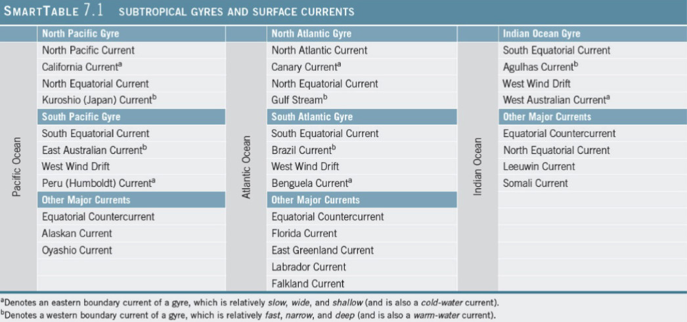

## Ocean Circulation

### Types of Ocean Currents

- **Surface currents**
	- Wind-driven
	- Primarily horizontal motion

- **Deep currents**
	- Driven by differences in density caused by differences in temperature and salinity
	- Vertical and horizontal motions

### Measuring Surface Currents

- **Direct methods**
	- Floating device tracked through time
	- Fixed current meter

- **Indirect methods**
	- Pressure gradients
	- Radar altimeters
	- Doppler flow meter

### Measuring Deep Currents

- Chemical tracers
	- Tritium
	- Chlorofluorocarbons
- Characteristic temperature and salinity
- **Argo**
	- Global array of free-drifting profiling floats
	- Floating device tracked through time

### Surface Currents

- Occur above pycnocline
	- Affect only 10% of ocean water on Earth
- Friction between wind and ocean surface
	- 2% of wind energy transferred to ocean surface
	- Surface currents slower than corresponding winds
- Generally follow Earths wind belt pattern

- Distribution of continents
	- Influences flow in each ocean basin
- Other current influences
	- Gravity
	- Friction
	- Coriolis effect

### Subtropical Gyres and Currents

- **Gyres** - large, circular loops of moving water
	- Clockwise in northern hemisphere
	- Counterclockwise in southern hemisphere

- **Subtropical gyres** centered around $30 \degree$ latitude
- Bounded by
	- Equatorial current
	- Western Boundary currents
	- Northern or Southern Boundary currents
	- Eastern Boundary currents

### Gyres and Boundary Currents

### Subtropical Gyre Currents

- **Equatorial Currents**
	- Both Hemispheres
	- Travel westward along
- **Western Boundary currents**
	- Warm waters from equatorial regions
- **Northern** or **Southern Boundary Currents**
	- Easterly water flow across ocean basin
	- Northern boundary currents in Northern Hemisphere
	- Southern boundary currents in Southern Hemisphere
- **Eastern Boundary currents**
	- Cool waters from poles

### Other Surface Currents

- **Equatorial Countercurrents**
	- Eastward flow between N & S Equatorial Currents
	- Due to minimal Coriolis effect at equator
- **Subpolar Gyres**
	- Rotate opposite subtropical gyres

### Ekman Spiral and Ekman Transport

- Observation: Icebergs and ships in surface currents move at angle to wind
	- Northern hemisphere movement to the right of the wind
	- Southern hemisphere movement to the left of the wind

### Ekman Spiral

- **Ekman spiral**
	- Balance between friction and Coriolis effect
	- Describes direction and flow of surface waters at different depths
	- Each successive layer moves increasingly
		- Right in N hemisphere
		- Left in S hemisphere

### Ekman Transport

- **Ekman transport**
	- Average movement of surface waters under influence of wind
	- $90\degree$ to right in Northern Hemisphere
	- $90\degree$ to left in Southern Hemisphere

### Geostrophic Currents

- Ekman transport generates rotational flow in basin
- **Subtropical Convergence** - piling up of water in middle of gyre
- Surface water _flows downhill_ and is deflected
	- Right in Northern Hemisphere
	- Left in Southern Hemisphere

- **Geostrophic current**
	- Balance of Coriolis effect and gravity forces
	- Moves in circular path downhill

### Western Intensification

- Top of hill of water displaced toward west due to Earth's rotation
	- Coriolis effect contributes to **western intensification**
- Western boundary currents intensified in both hemispheres
	- Faster
	- Narrow
	- Deep
	- _Warm_

### Eastern Boundary Currents

- Eastern side of ocean basins
- Tend to have the opposite properties of Western Boundary Currents
	- Slow
	- Wide
	- Shallow
	- _Cold_

### Ocean Currents and Climate

- Warm ocean currents warm the air at the coast
	- Warm, humid air
	- Humid climate on adjoining landmass
- Cool ocean currents cool the air at the coast
	- Cool, dry air
	- Dry climate on adjoining landmass

### Upwelling and Downwelling

- **Upwelling** - Vertical movement of cold, deeper, nutrient-rich water to surface
	- High biological **productivity** - an abundance of algae at the base of the food web
- **Downwelling** - Vertical movement of surface water downward in the water column

### Diverging Surface Water

- Surface waters move away from area
- **Equatorial upwelling**
	- Divergence of currents at equator generates
		- Upwelling
		- High productivity

### Converging Surface Water

- Surface waters move toward each other
- Water piles
- **Downwelling**
	- Low biological productivity

### Coastal Upwelling and Downwelling

- Ekman transport moves surface seawater
	- Offshore (upwelling)
	- Onshore (downwelling)

### Other Causes of Upwelling

- Offshore winds
- seafloor obstruction
- Coastal geometry change
- Lack of pycnocline
	- High latitude oceans

### Antarctic Circulation

- **Antarctic Circumpolar Current**
	- Also called **West Wind Drift** and Penguin Gyre
	- Only current to completely encircle Earth
	- Moves more water than any other current

### Atlantic Ocean Circulation

- North Atlantic Subtropical Gyre
	- **North Equatorial Current**
	- **Gulf Stream**
	- **North Atlantic Current**
	- **Canary Current**
- Surrounds Sargasso Sea

- South Atlantic Subtropical Gyre
	- **South Equatorial Current**
	- **Brazil Current**
	- **Benguela Current**
	- **Antarctic Circumpolar Current**

### Gulf Stream

- Meanders or loops
	- **Warm-core rings** - warmer Sargasso Sea water trapped in loop surrounded by cool water
	- **Cold-core rings** - cold water trapped in loop surrounded by warmer water
- Unique biological populations

### Loop Current

- Warm ocean surface current in Gulf of Mexico
- Generates warm loop current eddies
- Hurricanes intensify when passing over warm cores

### Climate Effects of North Atlantic Currents

- North-moving currents - **warm**
	- Gulf Stream warms east coast of U.S. and North Europe
	- North Atlantic and Norwegian Currents warm NW Europe

- South-moving currents - **cool**
	- Labrador Current cools eastern Canada
	- Canary Current cools north African coast

### Indian Ocean Circulation

- **Monsoons** - seasonal reversal of winds over northern Indian Ocean
- Northeast monsoon - winter
- Southwest monsoon - summer

### Indian Ocean Monsoon

- Affect seasonal land weather
- Affects seasonal Indian Ocean current circulation
- Affects phytoplankton productivity

### Pacific Ocean Circulation

- North Pacific Subtropical Gyre
	- **North Equatorial Current**
	- **Kuroshio Current**
	- **North Pacific Current**
	- **California Current**
	- **Alaskan Current**

- South Pacific Subtropical Gyre
	- **Antarctic Circumpolar Current**
	- **East Australian Current**
	- **South Equatorial Current**
	- **Peru Current**
	- **Equatorial Counter Current**

### Atmospheric-Ocean Connections in the Pacific Ocean

- **Walker Circulation Cell** - normal conditions
	- Air pressure across equatorial Pacific is higher in eastern Pacific
	- Strong southeast trade winds
	- **Pacific warm pool** on western side of ocean
	- Upwelling off the coast of Peru

### El Nino - Southern Oscillation (ENSO)

- Walker Cell Circulation disrupted
	- High pressure in east Pacific weakens
	- Weaker trade winds
	- Warm pool migrates eastward
	- Downwelling along Peru coast
	- Lower biological productivity
		- Fishing suffers

### La Nina - ENSO Cool Phase

- "Super normal"
- Stronger trade winds
- Stronger upwelling in east Pacific
- Cooler than normal seawater
- Higher biological productivity

### Occurrence of ENSO Events

- El Nino warm phase about every 2-10 years
	- Highly irregular
- Phases usually last 12-18 months
- ENSO may be part of **Pacific Decadal Oscillation**
	- Long-term natural climate cycle
	- Lasts 20-30 years

### Notable ENSO Events

- 1982-1983
- 1997-1998
- Flooding, drought, erosion, fires, tropical storms, harmful effects on marine life
- Unpredictable

### Deep-Ocean Currents

- **Thermohaline Circulation**
- Below pycnocline
- 90% of all ocean water
- Slow velocity
- Movement driven by differences in density
	- Temperature
		- Cooler seawater is denser
	- Salinity
		- Saltier seawater is denser

### Thermohaline Circulation

- Originates in high latitude surface ocean
- Cold, now dense surface water sinks
	- Changes little after sinking
- Deep-water masses identified on **temperature-salinity (T-S) diagram**
	- Identifies deep water masses based on temperature, salinity, and resulting density

- Some deep-water masses
	- **Antarctic Bottom Water**
	- **North Atlantic Deep Water**
	- **Antarctic Intermediate Water**
- Cold surface seawater sinks at polar regions, moves equator-ward

### Conveyer Belt Circulation

- Combination surface and deep ocean currents

### Important of Thermohaline Circulation

- Life needs oxygen and nutrients
- Thermohaline circulation
	- Cold, oxygen-rich surface water sinks to deep
	- Deep water become nutrient enriched due to decomposition of organism on bottom
	- Upwelling of cold, nutrient rich water
		- Feeds base of food chain
- Interruption of thermohaline circulation would significantly change distribution of ocean life
	- Not enough oxygen in deep water
	- Not enough nutrients in surface water

### Power from Currents

- Currents carry more energy than winds
- Florida-Gulf Stream Current System
- Underwater turbines
	- Expensive
	- Difficult to maintain
	- Hazard to boating