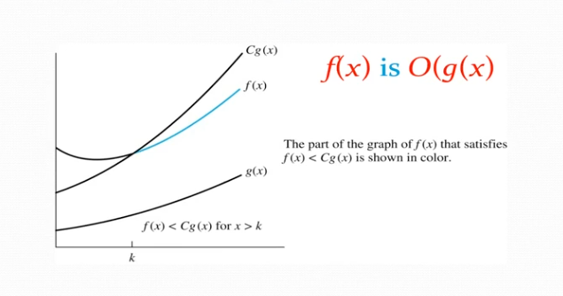

- - -
### The Growth of Functions
- Usually we want to understand how quickly an algorithm can solve a problem as the size of the input grows, but why?
	- It will enable us to:
		- Compare the efficiency of two different algorithms for solving the same problem
		- Determine whether it is practical to use a particular algorithm as the input grows

- - -
### Big-O Notation
**Definition:** Let $f$ and $g$ be functions from the set of integers or the set of real numbers to the set of real number. We say that $f(x)$ is $O(g(x))$ if there are constants $C$ and $k$ such that
$$|f(x)| ~ ~ ~\leq~ ~ ~ C|g(x)|$$
whenever $x>k$ 

- This is read as "$f(x)$ is **big-O** of $g(x)$" or "$g$ **asymptotically** dominates $f$."
- The constants $C$ and $k$ are called **witnesses** to the relationship $f(x)$ is $O(g(x))$. Only one pair of witnesses is necessary.

- - -
## Examples
### Example 1
Using the definition of Big-O Notation, show that $f(x)=x^2+2x+1$ is $O(x^2)$

### Solution 
Since $x<x^2$ and $1<x^2$ when $x>1$,
$$0\leq x^2+2x+1~ ~ ~\leq ~ ~ ~x^2+2x^2+x^2=4x^2$$
- Can take $C=4$ and $k=1$ as witnesses to show that $f(x)$ is $O(x^2)$

> [!info] Alternative Solution
Alternatively, when $x>2$, we have $2x\leq x^2$ and $1<x^2$.
>
> Hence, $0\leq x^2+2x+1~ ~ ~\leq~ ~ ~ x^2+x^2+x^2=3x^2$ when $x>2$
> - Can take $C=3$ and $k=2$ as witnesses instead

- - -
### Example 2
Show that $7x^2$ is $O(x^3)$

### Solution
When $x>7$, $7x^2<x^3$. Take $C=1$ and $k=7$ as witnesses to establish that $7x^2$ is $O(x^3)$.

- - -
### Example 3
Show that $n^2$ is not $O(n)$

### Solution
- Suppose there are constants $C$ and $k$ for which $n^2 \leq Cn$, whenever $n>k$
- Then, by diving both sides of $n^2\leq Cn$ by $n$, then $n\leq C$ must hold for all $n>k$. (This is a contradiction)

- - -

### Big-O Estimates for Polynomials
**Example:** Let $f(x)=a_{n}x^n+a_{{n-1}}x^{n-1}+\dots+a_{1}x+a_{o}$ where $a_{0},a_{1},\dots,a_{n}$ are real numbers with $a_{n}\neq 0$

To make a Big-O estimate, we must identify what the most dominating term is.

In this example, we notice that the biggest power, $x^n$, is our dominate term; it will be the most effective term in the polynomial in the long run. 

So, $f(x)$ is $O(x^n)$

- - -
### Big-O Estimates for Some Important Functions
**Example 1:** Use Big-O notation to estimate the sum of the first $n$ positive integers

**Solution:** $$1+2+\dots+n~ ~ ~\leq~ ~ ~ n+n+\dots+n=n^2$$
$1+2+\dots+n$ is $O(n^2)$ taking $C=1$ and $k=1$

**Example 2:** Use Big-O notation to estimate the factorial function $f(n)=n! =1 \times 2 \times\dots\times n$.

**Solution:** $$n! =1 \times_{2}\times\dots\times n~~~\leq~~~ n\times n\times\dots\times n=n^n$$
$n!$ is $O(n^n)$ taking $C=1$ and $k=1$

**Example 3:** Use Big-O notation to estimate log(n!)

**Solution:** Given that $n!<n^n$ (last example), then $$\log(n!)~ ~ ~\leq~ ~ ~n \times \log(n)$$.

Hence, $\log(n!)$ is $O(n\times \log(n))$ taking $C=1$ and $k=1$.

- - -
### Display of Growth of Functions

![[growth_of_functions_graph.png]]

> [!note]
> This figure will be helpful on quizzes and tests that mention topics from this module

- - -
### Combinations of Functions
- If $f_{1}(x)$ is $O(g_{1}(x))$ and $f_{2}(x)$ is $O(g_{2}(x))$ then $f_{1}+f_{2})(x)$ is $O(~ |g_{1}(x)~|,~|~ g_{2}(x)~|))$.
- If $f_{1}(x)$ and $f_{2}(x)$ are both $O(g(x))$ then $f_{1}+f_{2}(x)$ is $O(g(x))$.
- If $f_{1}(x)$ is $O(g_{1}(x))$ and $f_{2}(x)$ is $O(g_{2}(x))$ then $f_{1}f_{2}(x)$ is $O(g_{1}(x)g_{2}(x))$.

